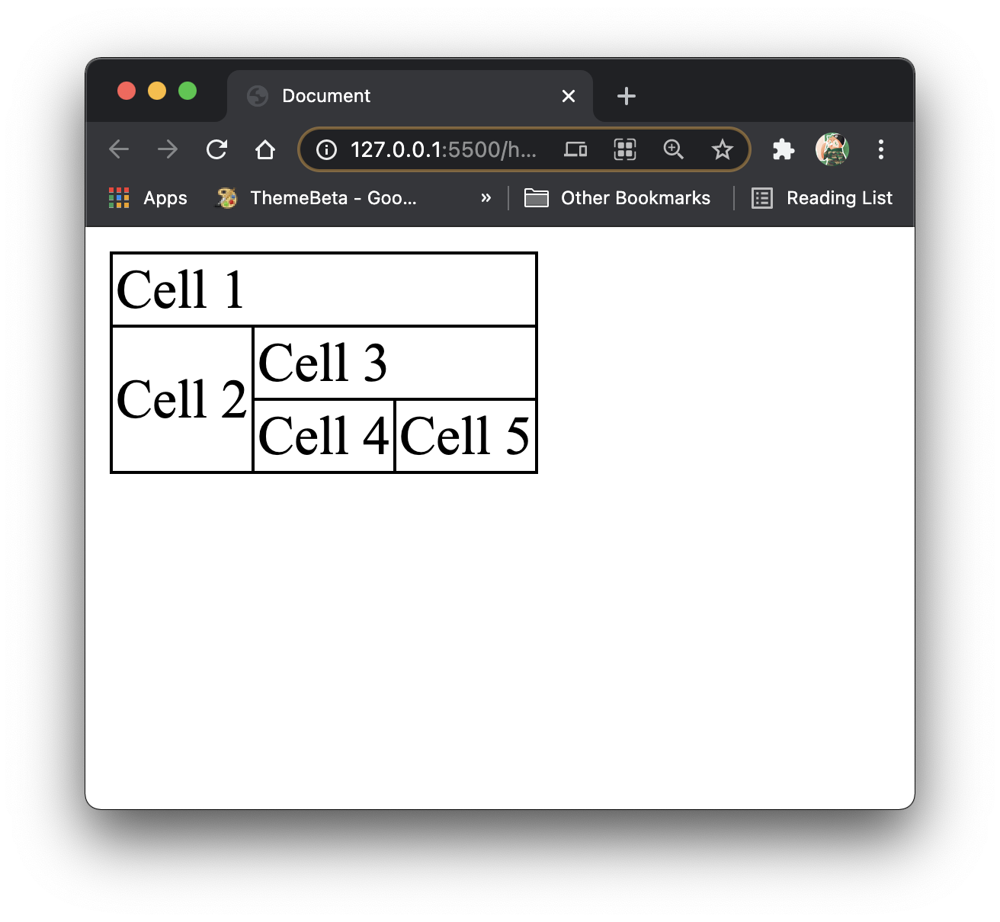

# Practical 01: Getting Started with HTML

This practical will serve as a starting point to learning how to create web pages. You may have come across some of the tags used here in previous encounters, but be aware of deprecated tags! See [Getting Started](#getting-started) for more information.

## Task

Develop a web page that contains a self-introduction of yourself. Your web page should contain at least the following content:

- a picture of yourself (or your online avatar or a goat, whatever rocks your boat)
- a short paragraph of yourself (use paragraph element)
- hobbies and interests (unordered list)
- favorite subjects in school (or college, you decide) (ordered list)

At the bottom of the webpage, include a table element that replicates the following in terms of row and column span:



What else would you put into a introduction page?

::: details EXTRA TASK

Publish your web page on GitHub Pages.
There are numerous sources that can help you to get a head start with GitHub Pages, and it's all free!
The simplest method is to use GitHub Desktop.

:::

<!-- ::: warning SUBMISSION
**Complete the given practical and submit it as your lecture attendance for Week 2.**
::: -->

## Getting Started

HTML files typically have the `.html` extension.
One can create a HTML file named `index.html` where `index` is the name designated to the page.

Files with the name `index` are often treated as home pages in web sites.
For example, when one visits [TIMeS](https://times.taylors.edu.my), the browser would immediately look for a file whose name is `index` if the name of the file is not specified.

Let's just say TIMeS has a page called `login.html`. One may visit that page instead of `index.html` by specifying the filename after the URL, namely:

    https://times.taylors.edu.my/login.html

::: danger TAKE NOTE
Going forward, **DO NOT** name any of your project folders or files with spaces.
This can inevitably complicate things when we start going through referencing files in your project directory.

For example, if a web site with domain `www.example.com` has a file named `page 1.html`, the address bar in a web browser will have to interpret the link to that page as:

    www.example.com/page%201.html

The best practice is to clump the words making up the file name together without spaces (i.e., `page1.html`), or to add a hyphen (`-`) or underscore (`_`) to separate each word (i.e., `page-1.html`, `page_1.html`).
:::

Your HTML file should take a form like as follows:

```html
<!DOCTYPE html>
<html lang="en">
	<head>
		<!-- To contain stylesheets and various web page information (i.e., Tab Name) -->
	</head>
	<body>
		<!-- Browser viewable content should be placed here -->
	</body>
</html>
```

### Avoid Deprecated Tags!

Web developers are now expected to follow the HTML 5 standard when developing web pages.
With this standard comes the fact that some tags/elements/attributes which were prevalently used in prior versions of HTML should no longer be applicable - they are what we call **deprecated**.
In most cases, CSS is strongly recommended to be used as the ultimate alternative.

For instance, rather than using the `<u></u>` element to denote underlined text, implement CSS like as follows:

```html
<!-- In <head> section: -->
<style type="text/css">
	.underlined {
		text-decoration: underline;
	}
</style>

<!-- In <body> section: -->
<span class="underlined">Underlined text</span>
```

Using CSS rather than resorting to deprecated tags has its upsides.
For one, you can implement one style ruling to be shared across multiple HTML elements in multiple HTML documents.
We will delve more into CSS stylings in the next practical.
