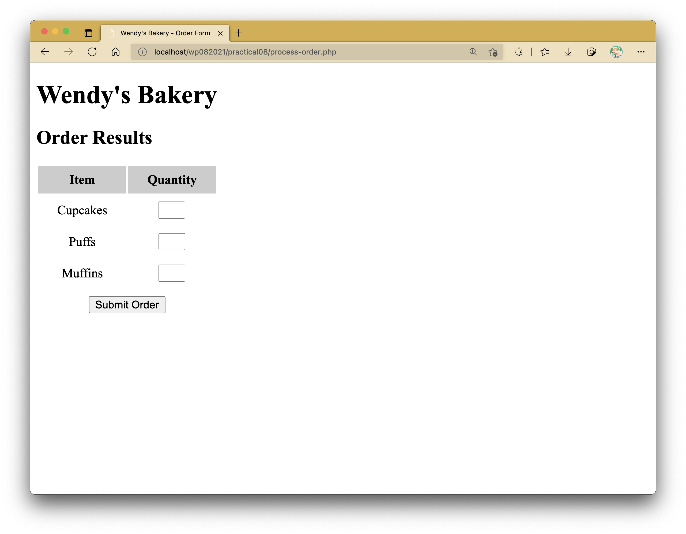
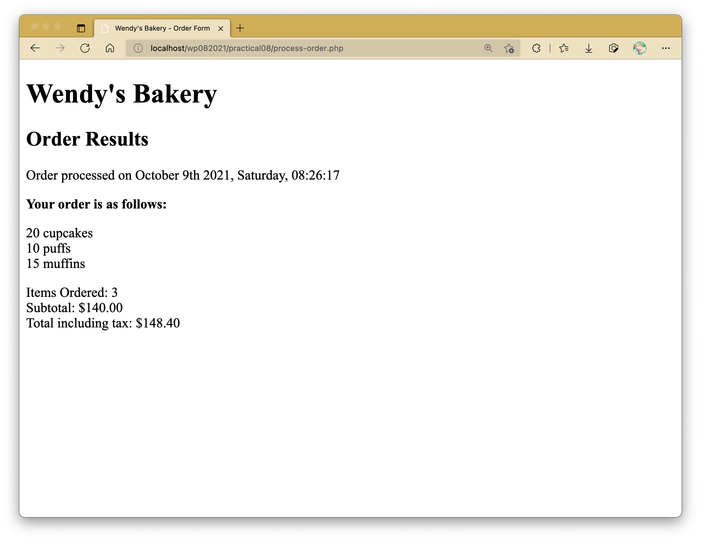
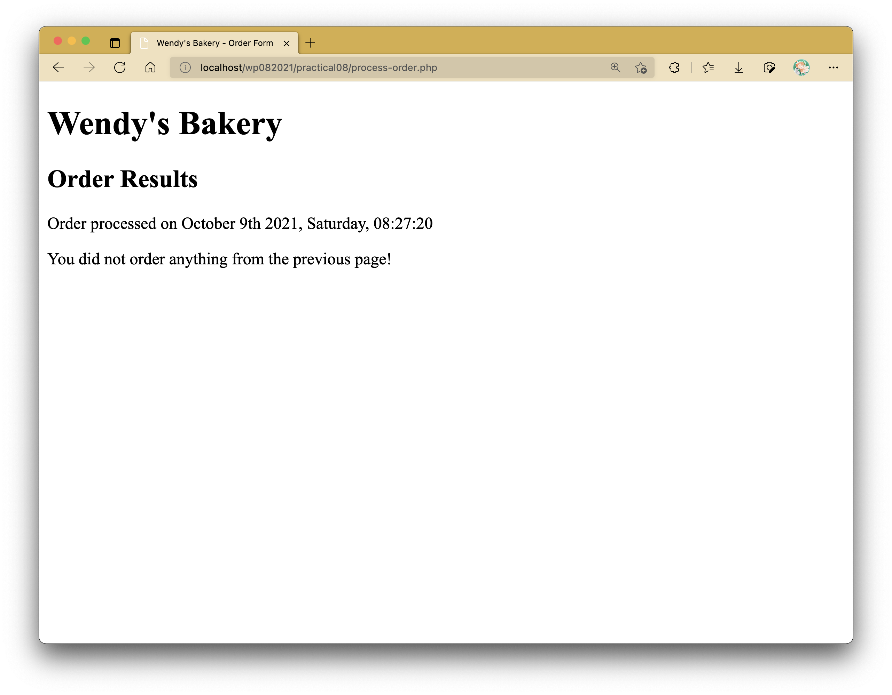

# Practical 08: Introducing PHP into Forms

TIn this practical activity, we will be implementing an order form for Wendy's Bakery, a fictional bakery company.
Right now, Wendy's HTML programmer has gotten as far as setting up an order for for the cakes Wendy sells.
The order form is shown as in the figurebelow.
This is a relatively simple order form, similar to many which you hve probably seen while surfing.
The first thing Wendy would like to be able to do is to know what her customer ordered, work out the total of the customer's order, and how much sales tax is payable on the order.
Part of the HTML for this is shown in Listing 1.
In the form, we have set the form's action to be the name of the PHP script that will process the customer's order and also the name of the form fields.

### Listing 1

```html
<form action="process-order.php" method="post">
	<table>
		<tr>
			<th>Item</th>
			<th>Quantity</th>
		</tr>
		<tr>
			<td>Cupcakes</td>
			<td>
				<input type="text" name="cupcakeqty" size="3" maxlength="3" />
			</td>
		</tr>
		<tr>
			<td>Puffs</td>
			<td>
				<input type="text" name="puffqty" size="3" maxlength="3" />
			</td>
		</tr>
		<tr>
			<td>Muffins</td>
			<td>
				<input type="text" name="muffinqty" size="3" maxlength="3" />
			</td>
		</tr>
		<tr>
			<td colspan="2">
				<input type="submit" value="Submit Order" />
			</td>
		</tr>
	</table>
</form>
```



We'll proceed to create our PHP file surrounding this form element.

<!-- ## Tasks -->

## Task 1: Embedding PHP in HTML

To process the form, we'll need to create the script mentioned in the `action` attribute of the `<form>` tag called `process-order.php`.
Prepare `process-order.php` starting off with the following HTML code:

```html{40}
<!DOCTYPE html>
<html>
	<head>
		<meta charset="UTF-8" />
		<meta name="viewport" content="width=device-width, initial-scale=1.0" />
		<title>Wendy's Bakery - Order Form</title>

		<style>
			.font-bold {
				font-weight: bold;
			}

			thead tr {
				/* table tr:first-of-type { */
				background-color: #cccccc;
			}

			th,
			td {
				padding: .5rem 1.5rem;
			}

			form td {
				text-align: center;
			}

			#freight-table tbody td {
				text-align: right;
			}

			#order-details {
				margin-bottom: 1rem;
			}
		</style>
	</head>
	<body>
		<h1>Wendy's Bakery</h1>
		<h2>Order Results</h2>

		<!-- Listing 1 goes here -->
	</body>
</html>
```

## Task 2: Conditional Display of Information

Modify `process-order.php` such that it displays the following when the order form is filled and the **Submit** button is clicked on.

```php
<?php
	if ($_SERVER['REQUEST_METHOD'] == 'POST') {
		// If a form with POST superglobal variable is sent, display this message
		echo "<p>Order processed</p>";
	} else {
		/**
		 * NOTE:
		 * You can break through to HTML in the middle of a PHP block,
		 * especially if you have a lot of HTML elements to display under
		 * set conditions.
		 */
		?>
		<!-- Listing 1 goes here -->
		<?php
	}
?>
```


## Task 3: Adding Dynamic Content

Modify `process-order.php` to display the date and time when the form was submitted.

```php{4}
<?php
	if ($_SERVER['REQUEST_METHOD'] == 'POST') {
		// If a form with POST superglobal variable is sent, display this message
		echo "<p>Order processed on " . <?= date("F jS Y, l, H:i:s"); ?> . "</p>";
	} else {
		?>
		<!-- Listing 1 goes here -->
		<?php
	}
?>
```


::: details DateTime in PHP
Read more here:

[PHP DateTime](https://www.php.net/manual/en/datetime.format.php)
:::

## Task 4: Accessing Variables

Within the same PHP script, add some lines to display the customer's order list.

```php{6-14}
<?php
	if ($_SERVER['REQUEST_METHOD'] == 'POST') {
		// If a form with POST superglobal variable is sent, display this message
		echo "<p>Order processed on " . date("F jS Y, l, H:i:s"); . "</p>";

		?>
		<p class="font-bold">Your order is as follows:</p>

		<p>
			20 cupcakes<br>
			10 puffs<br>
			15 muffins
		</p>
		<?php
	} else {
		?>
		<!-- Listing 1 goes here -->
		<?php
	}
?>
```


## Task 5: Assigning Values to Variables

On Wendy's site, we want to work out the total number of items ordered and the total amount payable.

Assume the prices of each item are as follows:

Cupcake = $2.50
Puff = $3.00
Muffin = $4.00
Sales Tax = 6% of the total amount

Within the same script, add some lines to display the following additional output:

```php{15-19}
<?php
	if ($_SERVER['REQUEST_METHOD'] == 'POST') {
		// If a form with POST superglobal variable is sent, display this message
		echo "<p>Order processed on " . <?= date("F jS Y, l, H:i:s"); ?> . "</p>";

		?>
		<p class="font-bold">Your order is as follows:</p>

		<p>
			20 cupcakes<br>
			10 puffs<br>
			15 muffins
		</p>

		<p>
			Items Ordered: 3<br>
			Subtotal: $140.00<br>
			Total including tax: $148.40<br>
		</p>
		<?php
	} else {
		?>
		<!-- Listing 1 goes here -->
		<?php
	}
?>
```



## Task 6: Making Decisions with Conditionals

Modify the script such that it alerts if the customer has not ordered anything from Wendy.

```php{6-27}
<?php
	if ($_SERVER['REQUEST_METHOD'] == 'POST') {
		// If a form with POST superglobal variable is sent, display this message
		echo "<p>Order processed on " . date("F jS Y, l, H:i:s") . "</p>";

		if($_POST["cupcakeqty"] === "" && $_POST["puffqty"] === "" && $_POST["muffinqty"] === ""):
			// Display message if nothing has been ordered
			?>
			<p>You did not order anything from the previous page!</p>
			<?php
		else:
			?>
			<p class="font-bold">Your order is as follows:</p>

			<p>
				20 cupcakes<br>
				10 puffs<br>
				15 muffins
			</p>

			<p>
				Items Ordered: 3<br>
				Subtotal: $140.00<br>
				Total including tax: $148.40<br>
			</p>
			<?php
		endif;
	} else {
		?>
		<!-- Listing 1 goes here -->
		<?php
	}
?>
```



Otherwise, the script should display the items the customer ordered from Wendy.

```php{11-35}
<?php
	if ($_SERVER['REQUEST_METHOD'] == 'POST') {
		// If a form with POST superglobal variable is sent, display this message
		echo "<p>Order processed on " . date("F jS Y, l, H:i:s") . "</p>";

		if($_POST["cupcakeqty"] === "" && $_POST["puffqty"] === "" && $_POST["muffinqty"] === ""):
			// Display message if nothing has been ordered
			?>
			<p>You did not order anything from the previous page!</p>
			<?php
		else:
			$qty = array();
			if ($_POST["cupcakeqty"] !== "") $qty["cupcake"] = (int)($_POST["cupcakeqty"]);	// cupcake quantity
			if ($_POST["puffqty"] !== "") $qty["puff"] = (int)($_POST["puffqty"]);	// puff quantity
			if ($_POST["muffinqty"] !== "") $qty["muffin"] = (int)($_POST["muffinqty"]); // muffin quantity
			?>
			<p class="font-bold">Your order is as follows:</p>

			<p>
				<?= $qty["cupcake"]; ?> cupcakes<br>
				<?= $qty["puff"]; ?> puffs<br>
				<?= $qty["muffin"]; ?> muffins
			</p>

			<p>
				Items Ordered: <?= sizeof($qty); ?>
				<?php
					$price = ["cupcake" => 2.50, "puff" => 3, "muffin" => 4];

					$subtotal = $qty["cupcake"] * $price["cupcake"] + $qty["puff"] * $price["puff"] + $qty["muffin"] * $price["muffin"];
					$total = $subtotal * 1.06;
					?>
				Subtotal: $<?= number_format($subtotal, 2); ?><br>
				Total including tax: $<?= number_format($total, 2); ?><br>
			</p>
			<?php
		endif;
	} else {
		?>
		<!-- Listing 1 goes here -->
		<?php
	}
?>
```

:::warning NOTE
You may have noticed that there are some errors when you only fill up the form partially (to make it such that you only want some of the items, not all).
Try to find a way to circumvent this issue (i.e., by placing an if statement, modifying the form input element, etc.).

See if you can find any loopholes in the web application at this point and look to see if you can fix them as much as possible.
:::

## Task 7: `elseif` Statements

Wendy provides discounts for large orders of cupcakes.

- _Less than 10 cupcakes: no discount_
- _10-49 cupcakes: 5% discount_
- _50-99 cupcakes: 10% discount_
- _≥100 cupcakes: 20% discount_

Modify `process-order.php` such that it calculates the discount using conditions and if-else and elseif statements.

## Task 8: `switch` Statements

Wendy wants to know what forms of advertising are working for her.
Insert a `<select>` element to the form to retrieve that information.

```html
<tr>
	<td colspan="2">
		<p><label for="find">How did you find Wendy's?</label></p>
		<select name="find" id="find">
			<option disabled selected>Select option</option>
			<option value="a">I am a regular customer.</option>
			<option value="b">TV Advertising</option>
			<option value="c">Phone Directory</option>
			<option value="d">Word of Mouth</option>
		</select>
	</td>
</tr>
```

Use the appropriate selection statements to handle the variables and display the information in `process-order.php`.

## Task 9: Iteration and Repeating Actions

Wendy wants a table displaying the freight cost that is to be added to the customer's order.
With the courier Wendy's uses, the cost of freight depends on the distance the parcel is being shipped.
We want our freight table to resemble the following:

Generate the same freight table using loop structures.

```php
<table id="freight-table">
	<thead>
		<tr>
			<th>Distance</th>
			<th>Cost</th>
		</tr>
	</thead>
	<tbody>
		<?php
			$freight = [
				["distance" => 50, "cost" => 5],
				["distance" => 100, "cost" => 10],
				["distance" => 150, "cost" => 15],
				["distance" => 200, "cost" => 20],
				["distance" => 250, "cost" => 25],
			];
			// var_dump($freight);
			foreach ($freight as $f) {
		?>
		<tr>
			<td><?= $f["distance"]; ?></td>
			<td><?= $f["cost"]; ?></td>
		</tr>
		<?php
			}
		?>
	</tbody>
</table>
```


<!-- ::: warning SUBMISSION
**Complete the given practical and submit it as your lecture attendance for Week 9.**
::: -->
