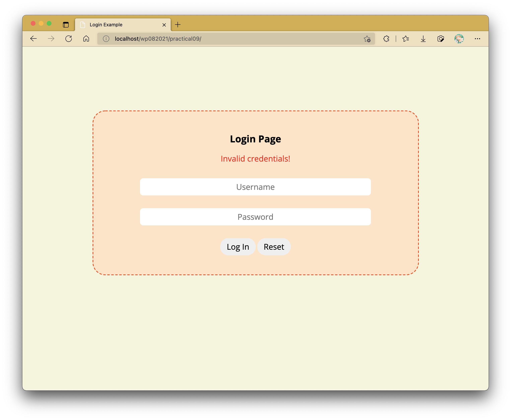
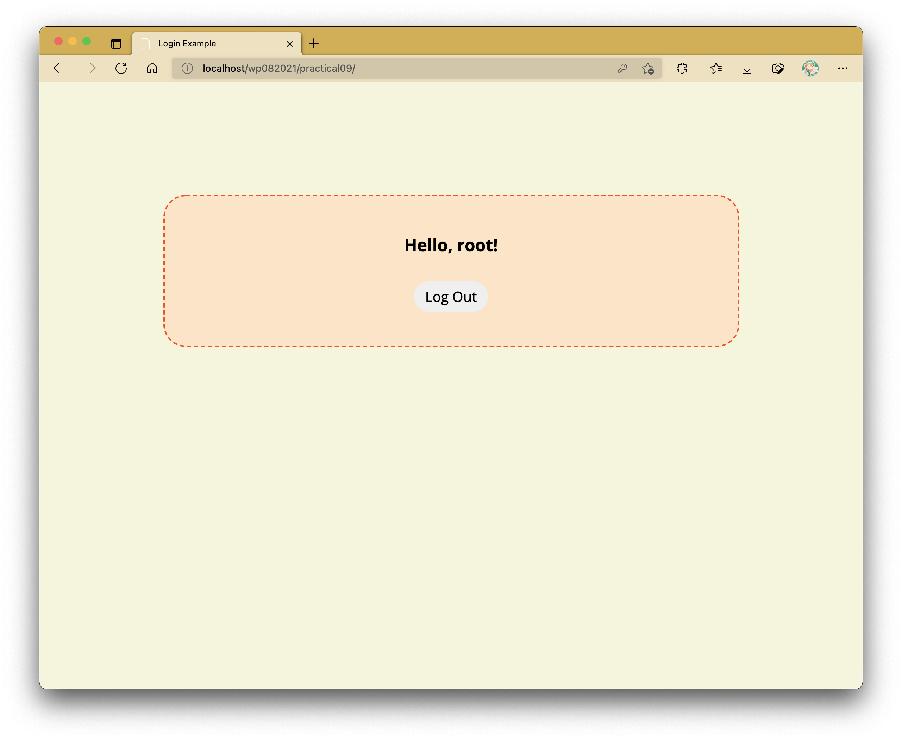

# Practical 09: PHP Forms and Sessions

In this practical activity, we will be creating a dummy login system that utilizes sessions.
This will not utilize database connectivity just yet, but you should be able to piece them together once the lessons on those start next week.

## Preparation

CSS and JS files are to be kept in their own separate subfolders.

### css/style.css

```css
@import url("https://fonts.googleapis.com/css2?family=Open+Sans:ital,wght@0,300;0,400;0,500;0,600;0,700;0,800;1,300;1,400;1,500;1,600;1,700;1,800&display=swap");

:root {
	--form-size: 400px;
	--normal-text-size: 20px;
}

* {
	font-family: "Open Sans", sans-serif;
}

body {
	background-color: beige;
}

button,
input {
	border: none;
	font-size: var(--normal-text-size);
	margin: 1rem 0;
}

#container {
	background-color: bisque;
	border: 2px dashed orangered;
	border-radius: 2rem;
	margin: 10rem auto 0;
	max-width: 750px;
	min-width: var(--form-size);
	padding: 2rem;
	text-align: center;
}

p#error {
	color: red;
	font-size: var(--normal-text-size);
}

input#username,
input[type="password"] {
	border-radius: 0.5rem;
	max-width: 100%;
	min-width: var(--form-size);
	padding: 0.5rem;
	text-align: center;
	width: 75%;
}

button#logout,
input[type="submit"],
input[type="reset"] {
	border-radius: 2rem;
	padding: 0.5rem 1rem;
}

input#username:hover,
input[type="password"]:hover {
	box-shadow: 0 0 1rem orange, 0 0 2rem lightsalmon;
}

input#username:focus,
input[type="password"]:focus,
input[type="button"]:hover,
input[type="submit"]:hover,
input[type="reset"]:hover {
	box-shadow: 0 0 1rem orange, 0 0 2rem lightsalmon, 0 0 4rem darkorange;
}

button#logout:hover {
	background-color: rgba(220, 20, 60, 0.75);
	box-shadow: 0 0 1rem red, 0 0 2rem lightcoral, 0 0 4rem maroon;
	color: white;
	font-weight: bold;
}
```

### js/script.js

```js
if (document.querySelector("#logout")) {
	document.querySelector("#logout").addEventListener("click", () => {
		const response = confirm("Confirm logout?");

		if (response) window.location.href = "logout.php";
	});
}
```

### credentials.php

```php
<?php
	$username = "root";
	$pw = "Welovepasswords123";
?>
```

### index.php

```html
<!DOCTYPE html>
<html lang="en">
	<head>
		<meta charset="UTF-8" />
		<meta http-equiv="X-UA-Compatible" content="IE=edge" />
		<meta name="viewport" content="width=device-width, initial-scale=1.0" />
		<title>Login Example</title>

		<link rel="stylesheet" href="css/style.css" />
	</head>

	<body>
		<section id="container">
			<h1>Login Page</h1>

			<form action="." method="post">
				<p id="error"></p>
				<input type="text" name="username" id="username" placeholder="Username" /><br />
				<input type="password" name="password" id="password" placeholder="Password" /><br />

				<input type="submit" value="Log In" />
				<input type="reset" value="Reset" />
			</form>
		</section>

		<script src="js/index.js"></script>
	</body>
</html>
```


## Task 1: Checking Credentials

Our credentials are kept in a separate file named `credentials.php`.
We can append it to `index.php` by introducing the following on top:

```php
<?php
require_once "credentials.php";
?>
```

`require_once` is a command that appends contents of a HTML or PHP file to wherever it is called.
In this case, `credentials.php` is appended at the beginning of the web page.

There are other variants of this command:

- `include_once` is the same as `require_once`, but it does not halt the other web page items from being loaded if the file doesn't exist.
- `include` and `require` are different from `include_once` and `require_once` respectively in the sense of how many times they are allowed to be appended to the page.

Now that we have our credentials appended at the top, we can now proceed to carry out form validation.

```php
<?php
session_start();
require_once "credentials.php";

// flag to indicate whether credentials match (i.e., false) or not (i.e., TRUE)
$invalid_login = false;

if ($_SERVER["REQUEST_METHOD"] == "POST") {
	// check credentials first
	if ($_POST["username"] === $username && $_POST["password"] === $pw) {
		$_SESSION["username"] = $_POST["username"];
	} else $invalid_login = true;
}

// var_dump($_SESSION);
?>
```

`var_dump` is useful if you would like to test if your credential checking is working as intended or not based on your `$_POST` superglobal variables.
Uncomment the `var_dump` line if you would like to carry out this checking, but its output should not be visible in the end result.

We are adding the `sessions_start()` line on top to introduce session variables if the credentials match.
This will be worked on more in the next task, but what's important now is that we create a new session variable called `$_SESSION["username"]` which will contain the username value entered into the form.

As for when the credentials do not match, we have a flag variable named `$invalid_login` which indicates if the credentials match or not.
We will utilize this to display a message in our `p#error` element in the form to alert users if the credentials do not match.

```php{2-10}
<form action="." method="post">
	<p id="error">
	<?php
		if ($invalid_login) :
			?>
			Invalid credentials!
			<?php
		endif;
	?>
	</p>
	<input type="text" name="username" id="username" placeholder="Username" /><br />
	<input type="password" name="password" id="password" placeholder="Password" /><br />

	<input type="submit" value="Log In" />
	<input type="reset" value="Reset" />
</form>
```

The if statement syntax used here is different from that of most languages, but it works especially if you plan on printing large and/or complex lines of HTML.
Your page should now display a paragraph containing the alert message like as follows:



Now, let's replace the contents inside `section#container` to display something else if the credentials are correct (and consequently giving the illusion that you're logged in).
We will carry this out through utilizing an if-else statement.

```php{2-11,30-32}
<section id="container">
	<?php
		if (isset($_SESSION["username"])) :
		?>
	<h1>Hello, <?= $_SESSION["username"]; ?>!</h1>

	<p id="time"></p>

	<button id="logout">Log Out</button>
	<?php
		else : ?>
	<h1>Login Page</h1>

	<form action="." method="post">
		<p id="error">
			<?php
			if ($invalid_login) :
				?>
				Invalid credentials!
				<?php
				endif;
			?>
		</p>
		<input type="text" name="username" id="username" placeholder="Username"><br>
		<input type="password" name="password" id="password" placeholder="Password"><br>

		<input type="submit" value="Log In">
		<input type="reset" value="Reset">
	</form>
	<?php
		endif;
	?>
</section>
```

Depending on whether `$_SESSION["username"]` has been defined or not, either the form or the following gets displayed:



Here, when the user is "logged in", we now have a greeting on display with the entered username.
At the bottom of that greeting line, we also have a log out button.

## Task 2: Implementing Logout Feature

Session variables get carried across multiple web pages, so long as they have the line `session_start()` on top of the page - this is compulsory.
In the end, however, all good things have to come to an end - this also includes logged-in sessions.

The logout button included has an `onclick` attribute which redirects the browser to another page called `logout.php`.
`logout.php` will contain a simple script to log a user out.
The contents of this script are as follows:

```php
<?php
	session_start();

	session_unset();

	session_destroy();

	header("Location: .");
?>
```

The simple logout process works in 3 steps:

1. Start the session with `session_start()`.
2. Unset all session variables with `session_unset()`.
3. Destroy the session using `session_destroy()`.

One main reason why `session_destroy()` does not settle everything without `session_unset()` is that it only destroys the session, but any session data is still kept around.
Think of it as a job not completely done properly in such case.

The fourth line (i.e., `header("Location: .");`) redirects the user immediately back to `index.php`.
This can also be achieved if you were to type in `header("Location: index.php");`.
Using a period punctuation here points to the current directory, and browsers will automatically search for any file named `index.php` or `index.html` by default.
With this, you will find that you will immediately be sent back to `index.php` without viewing anything in `logout.php`.. not that it contains any visual content to be displayed in the browser to begin with.

## Extra Activity: Timeout

Modify the web application such that it will log you out upon refreshing the page after 5 minutes of inactivity.

<!-- ::: warning SUBMISSION
**Complete the given practical and submit it as your lecture attendance for Week 10.**
::: -->
