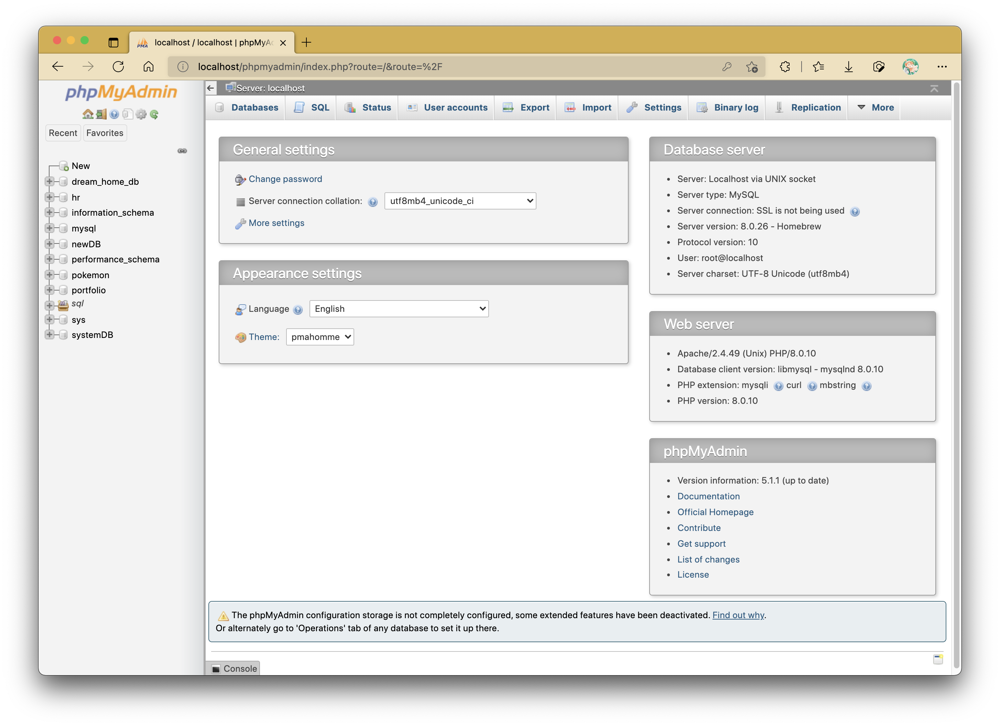
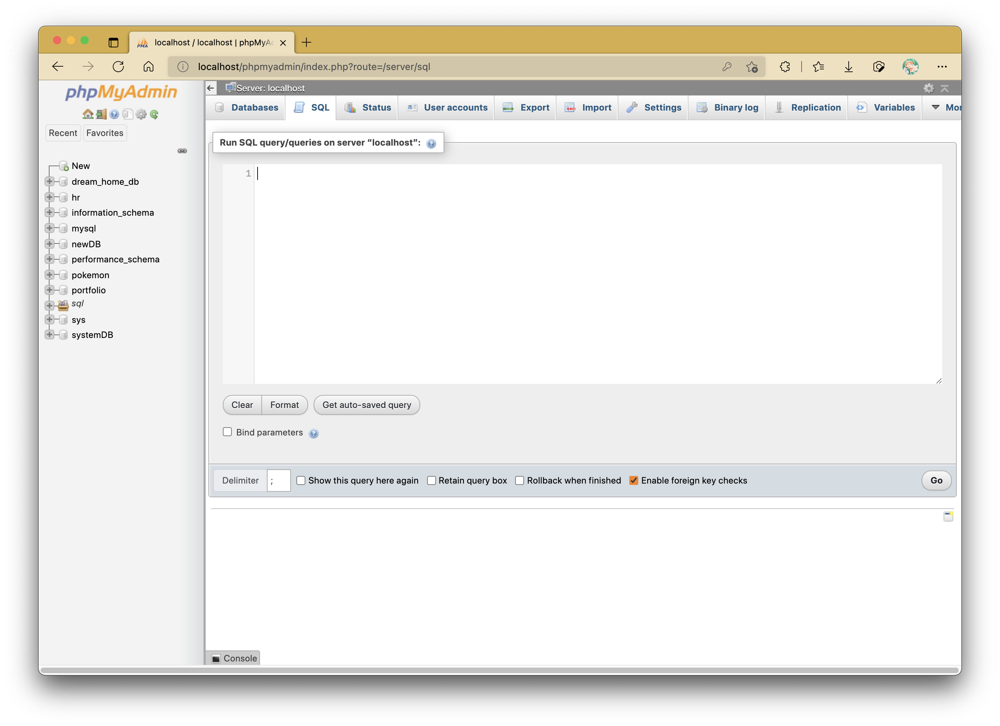
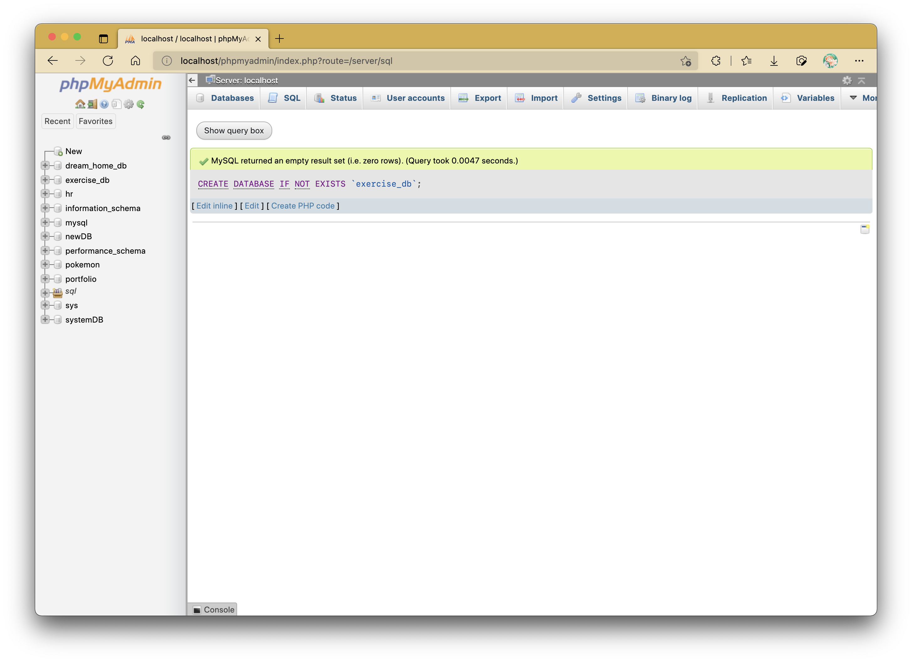
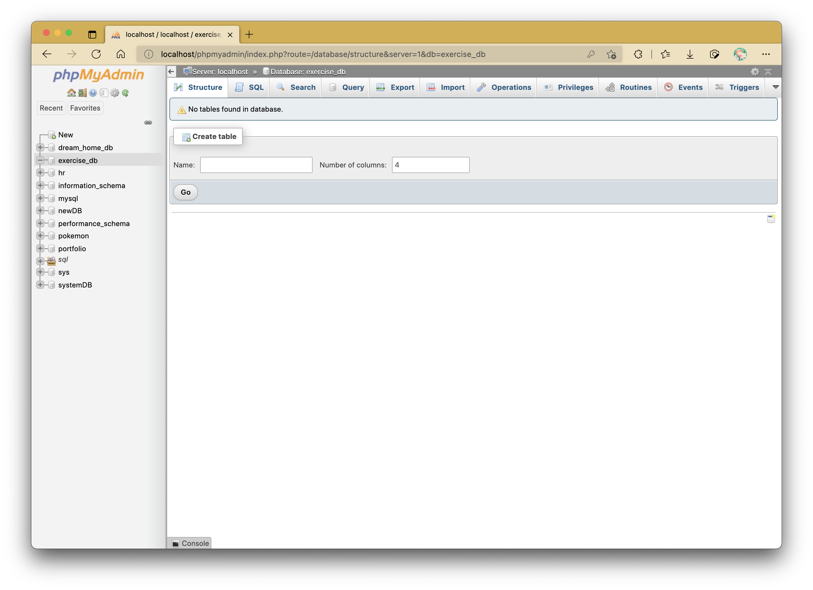
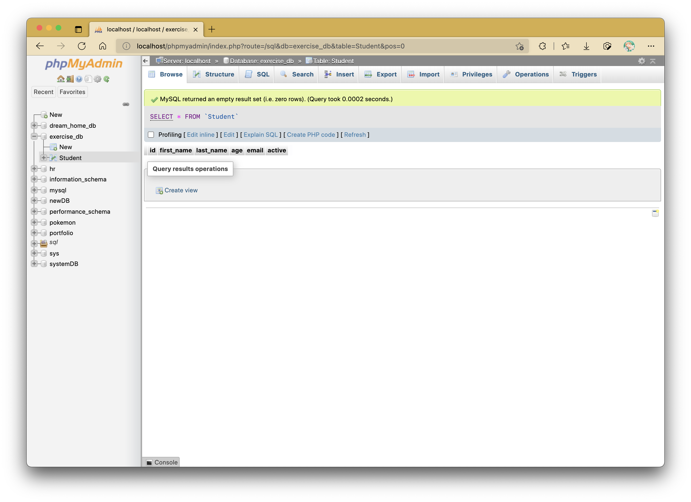
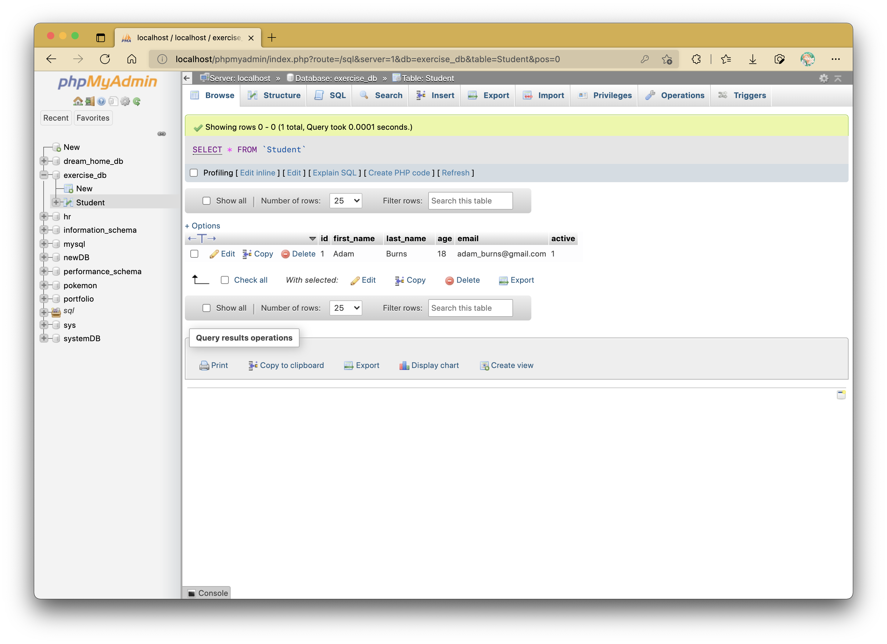
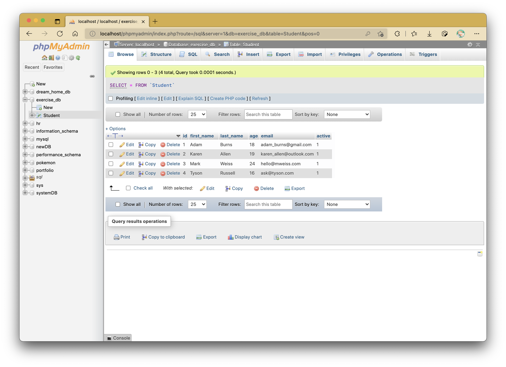

# Practical 10: Understanding MySQL Commands

We will go through a small series of exercises to create tables in a MySQL/MariaDB database.
For the purpose of this exercise, we will carry out everything in phpMyAdmin, but the SQL scripts can be run on a typical MySQL console.

To access phpMyAdmin, type in `localhost/phpmyadmin` in your web browser's address bar.

!!! warning "NOTE"

    For those who installed each component of the LAMP stack individually including the MySQL database, ensure you remember your root user password.

## Starting Out in phpMyAdmin



On the top menu bar, select "SQL".
You should see an interface like as follows:



This will be where we will be typing in our SQL scripts for today's practical exercise.

## Creating a New Database

The basic syntax to create a new database is as follows:

```sql
CREATE DATABASE <database_name>;
```

Let's create a database named `exercise_db`.
We will create the database by entering the following script:

```sql
CREATE DATABASE IF NOT EXISTS `exercise_db`;
```

Note that throughout my demo, I will be using backticks (\`) to surround any names given to the database, tables and columns.
This is completely optional.

Upon running this command, you can only run it once as you can only create a database with a stated name if it already does not exist.
The `IF NOT EXISTS` clause will make it such that the statement can be run multiple times instead of spititng out an error each time, but it also does nothing as a result.

Select the "Go" button to execute the SQL statement, and a message from the database server should be displayed like as shown below:



By now, the database should now be available to use - the database name should appear on the left hand side of the window.

??? info "DROP DATABASES"

    The opposite act of creating a database is referred as dropping a database.
    If you wish to drop the database, you have to use the following command script:

    ```sql
    DROP DATABASE IF EXISTS `exercise_db`;
    ```

    The `IF EXISTS` clause works the same way as how the `IF NOT EXISTS` clause works for the `CREATE TABLE` statement - you can only drop a database if it actually exists in the database server.

    The general syntax for dropping a database is as follows:

    ```sql
    DROP DATABASE <database_name>;
    ```

## Create a Table



Right now, the database does not have any tables inside of it.
Let's create a new table called `Student` that has the following columns:

- id: INT, AUTO_INCREMENT, NOT NULL, Primary Key
- first_name: VARCHAR(50), NOT NULL
- last_name: VARCHAR(50), NOT NULL
- age: INT(3), NOT NULL
- email: VARCHAR(255)
- active: BOOL, NOT NULL, DEFAULT is TRUE(1)

Note:

1. `INT`: integer value (default size 7); `VARCHAR(50)`: max 50 alphanumeric characters, `BOOLEAN`: boolean value
2. We set `id` as our **`PRIMARY KEY`** of the table - this is a unique column which distinguishes each record/row from each other.
3. `AUTO_INCREMENT` is often used with primary key columns so that they need not be defined when entering records.
4. `NOT NULL` constraint makes a column unable to be empty in any record.

The script to create this table is as follows.

```sql
CREATE TABLE IF NOT EXISTS `Student` (
	`id`				INT NOT NULL AUTO_INCREMENT,
	`first_name`		VARCHAR(50) NOT NULL,
	`last_name`			VARCHAR(50) NOT NULL,
	`age`				INT(3) NOT NULL,
	`email`				VARCHAR(255),
	`active`			BOOLEAN NOT NULL DEFAULT TRUE,

	PRIMARY KEY(`id`)
);
```

You can view the database table contents by selecting the table name from the left-hand side menu in the browser window.



???+ info "Multiple Tables in Databases"

    Yes, you are allowed to have multiple tables in your database (unless it's a SQLite database).
    In fact, there are mechanisms to simplify tables so that they don't require so many columns (i.e., normalization) and/or so that tables are linked together with **foreign keys**.
    We will not cover them in this module, but feel free to look up on how they work if you are curious!

???+ info "Dropping Tables"

    Just like dropping databases, you can also drop a table if you want to recreate the table from scratch.

    ```sql
    DROP TABLE IF EXISTS `Student`;
    ```

## Populating the Database Table

Let's populate the table with some data.
The following command script adds in one record of data in the database.

```sql
INSERT INTO `Student` (`first_name`, `last_name`, `age`, `email`, `active`) VALUES
("Adam", "Burns", 18, "adam_burns@gmail.com", 1);
```

After running the given command, you should see the table being populated like as follows:



Take note that with `id` being set to `AUTO_INCREMENT`, there's no need to specify the `id` value when adding new records (it will automatically start from 1 by default).
However, you are still allowed to put in a custom `id` value if you so desire.

Also, note that the `active` value is set to `TRUE` or 1 by default.
In this case, you can shorten your SQL command to be like as follows and it should give the same result:

```sql
INSERT INTO `Student` (`first_name`, `last_name`, `age`, `email`) VALUES
("Adam", "Burns", 18, "adam_burns@gmail.com");
```

### Task

Populate the table with more records:

| `id` | `first_name` | `last_name` | `age` | `email`                 | `active` |
| :--: | ------------ | ----------- | :---: | ----------------------- | :------: |
|  2   | Karen        | Allen       |  19   | karen_allen@outlook.com |    1     |
|  3   | Mark         | Weiss       |  24   | hello@mweiss.com        |    0     |
|  4   | Tyson        | Russell     |  16   | ask@tyson.com           |    1     |

## Updating Records in a Table

Let's update Mark's record to say that he is now no longer inactive (i.e., `active` = 1).

```sql
UPDATE `Student`
SET `active` = 1
WHERE `id` = 3;
```

Mark's record is indicated with `id` 3.
As mentioned prior, we can make utilize this column to uniquely identify one record from the others.
However, this is not restricted to just primary keys or unique columns like `id`.
When feasible, one may also utilize other columns that are not unique to easily modify multiple records at once.
Also, you can also have multiple conditions in your SQL script to further specify those columns to consider as well.

The table contents should now look like the following:



### Task

Run SQL commands to make the following changes:

1. Adam has recently changed his e-mail to **adam@burnings.com**.

2. Tyson is no longer an active student.

3. Karen's age is to be updated to 20 instead of 19.

## Selecting Records from a Table

By now, you should see the given SQL command script appear upon selecting the table in phpMyAdmin:

```sql
SELECT * FROM `Student`;
```

`*` is representative of "ALL".
The above syntax simply means to select all available records in `Student`.

You can specify which records/rows to select by adding conditions.
The following example will select the row(s) where the `id` value is equal to 2:

```sql
SELECT * FROM `Student`
WHERE `id` = 2;
```

You can also make comparison conditions too when selecting columns.
The following example will select only the first and last names of the row(s) where the `age` is greater than 21:

```sql
SELECT `first_name`, `last_name`
FROM `Student`
WHERE `age` > 21;
```

### Task

Populate the `Student` table with 4 more records.

1. Select all students whose age is not greater than 20.
2. Select all active students, displaying only the `first_name`, `last_name`, and `email`.

## Deleting Records from a Table

Deleting records works the same as updating and selecting records - you can utilize IDs as indicators of which record(s) to delete.
For example, if we want to delete Tyson's record, we can use the following command script:

```sql
DELETE FROM `Student`
WHERE `id` = 4; 	# Tyson's record id value is 4
```

The same rules for selecting which type of records based on what column(s) to update also apply to what column(s) to delete.

!!! danger "Note about `id` Progression"

    Now that we've deleted Tyson's record, if you are to add another record after, the `id` will not reassume as 4, but will continue after the number of the last record instead.
    Previously occupied `id` values that were used and deleted will not be used under `AUTO_INCREMENT`, but can be added manually if not occupied.
