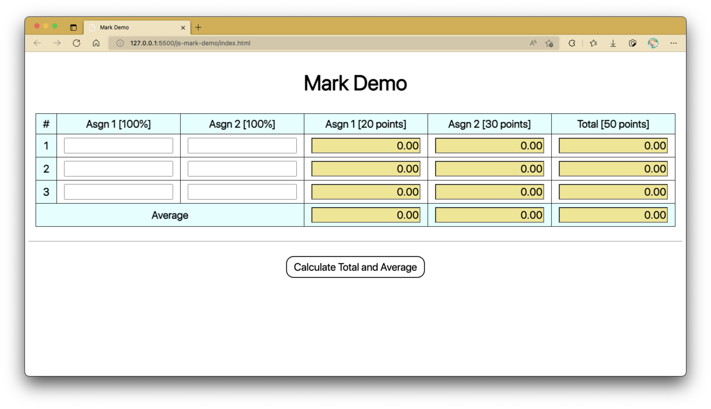

# Practical 07 (Activity 2): Mark Demo

!!! question "The original Practical 7 has moved!"

    _For instructions on installing XAMPP for the upcoming lessons, click [HERE](xampp.md)._

## Preparation

You'll require the following font file to be kept in a subfolder called `fonts` in your project directory: [SF Pro Display](./props/lab07_font.zip)

Additionally, CSS and JS files are to be kept in their own separate subfolders.

```css linenums="1" title="style.css"
@font-face {
	font-family: "SF Pro Display";
	src: url("../fonts/SF-Pro-Display-Regular.otf");
}

* {
	font-family: "SF Pro Display", sans-serif;
}

h1 {
	font-size: 48px;
}

hr {
	margin: 2rem 0;
}

button {
	background-color: transparent;
	border-radius: 1rem;
	font-size: 24px;
	padding: 0.5rem 1rem;
}

button:hover {
	box-shadow: 0 0 1rem yellowgreen, 0 0 5rem lemonchiffon;
	cursor: pointer;
}

button:active {
	background-color: lemonchiffon;
}

.text-center {
	text-align: center;
}
```

```css linenums="1" title="style_input.css"
input[type="number"] {
	text-align: right;
}

input:read-only {
	background-color: khaki;
}

/* For Chrome, Safari, Edge, Opera */
input::-webkit-outer-spin-button,
input::-webkit-inner-spin-button {
	-webkit-appearance: none;
	margin: 0;
}

/* For Firefox */
input[type="number"] {
	-moz-appearance: textfield;
}
```

```css linenums="1" title="style_table.css"
table {
	border-collapse: collapse;
	margin: 0 auto;
}

table * {
	font-size: 24px;
}

th,
td {
	border: 1px solid black;
	padding: 0.5rem 1rem;
}

th {
	background-color: lightcyan;
}

tr:not(:first-of-type):not(:last-of-type):hover {
	background-color: greenyellow;
}
```

```html linenums="1" title="index.html"
<!DOCTYPE html>
<html lang="en">
	<head>
		<meta charset="UTF-8" />
		<meta http-equiv="X-UA-Compatible" content="IE=edge" />
		<meta name="viewport" content="width=device-width, initial-scale=1.0" />
		<title>Mark Demo</title>

		<link rel="stylesheet" href="css/style.css" />
		<link rel="stylesheet" href="css/style_input.css" />
		<link rel="stylesheet" href="css/style_table.css" />
	</head>
	<body>
		<section class="text-center">
			<h1>Mark Demo</h1>
		</section>
		<!-- /section.text-center -->

		<table>
			<tr class="text-center">
				<th>#</th>
				<th>Asgn 1 [100%]</th>
				<th>Asgn 2 [100%]</th>
				<th>Asgn 1 [20 points]</th>
				<th>Asgn 2 [30 points]</th>
				<th>Total [50 points]</th>
			</tr>
			<tr>
				<th>1</th>
				<td><input type="number" name="stu1_asgn1" id="stu1_asgn1" /></td>
				<td><input type="number" name="stu1_asgn2" id="stu1_asgn2" /></td>
				<td><input type="number" name="stu1_asgn1_points" id="stu1_asgn1_points" readonly /></td>
				<td><input type="number" name="stu1_asgn2_points" id="stu1_asgn2_points" readonly /></td>
				<td><input type="number" name="stu1_total_points" id="stu1_total_points" readonly /></td>
			</tr>
			<tr>
				<th>2</th>
				<td><input type="number" name="stu2_asgn1" id="stu2_asgn1" /></td>
				<td><input type="number" name="stu2_asgn2" id="stu2_asgn2" /></td>
				<td><input type="number" name="stu2_asgn1_points" id="stu2_asgn1_points" readonly /></td>
				<td><input type="number" name="stu2_asgn2_points" id="stu2_asgn2_points" readonly /></td>
				<td><input type="number" name="stu2_total_points" id="stu2_total_points" readonly /></td>
			</tr>
			<tr>
				<th>3</th>
				<td><input type="number" name="stu3_asgn1" id="stu3_asgn1" /></td>
				<td><input type="number" name="stu3_asgn2" id="stu3_asgn2" /></td>
				<td><input type="number" name="stu3_asgn1_points" id="stu3_asgn1_points" readonly /></td>
				<td><input type="number" name="stu3_asgn2_points" id="stu3_asgn2_points" readonly /></td>
				<td><input type="number" name="stu3_total_points" id="stu3_total_points" readonly /></td>
			</tr>
			<tr>
				<th colspan="3">Average</th>
				<th><input type="number" name="avg1" id="avg1" readonly /></th>
				<th><input type="number" name="avg2" id="avg2" readonly /></th>
				<th><input type="number" name="avg_total" id="avg_total" readonly /></th>
			</tr>
		</table>

		<!-- /table -->

		<hr />

		<section class="text-center">
			<button onclick="calculate();">Calculate Total and Average</button>
			<button onclick="clearTable();">Clear Table</button>
		</section>
		<!-- /section.text-center -->

		<script src="js/script.js"></script>
	</body>
</html>
```

```js linenums="1" hl_lines="13" title="script.js"
function calculate() {
	// Variables to contain total values
	let asgn1_total = 0,
		asgn2_total = 0,
		grand_total = 0;

	// We'll use a constant to referece the <table> element to try to shorten the code.
	const TABLE = document.querySelector("table");

	// Calculate number of rows in between top and bottom row
	const NUMBER_OF_STUDENTS = TABLE.rows.length - 2;

	// we will be adding code from here
}

function clearTable() {
	// Initialize Asgn 1 & Asgn 2 (100% each) to 0
	document.querySelectorAll(`input:not(:read-only)`).forEach((inputField) => (inputField.value = "0"));
	// Initialize Asgn & Total Points to 0.00
	document.querySelectorAll(`input:read-only`).forEach((inputField) => (inputField.value = "0.00"));
}

window.onload = clearTable();
```

You should be able to see the following in your web browser:

<figure markdown>
  
  <figcaption>Multiplication Box Page</figcaption>
</figure>

## Motivation

This intermediate-level activity will provide a guide as to how you can effectively use program control structures to skillfully loop through the same calculation process with different sets of inputs at a time.

Here, each row represents a student's record.
Each student would have had 2 assessment components graded on a 0 to 100 percent scale.
When the button at the bottom of the page (i.e., Calculate Total and Average) is selected, each student's Assignment 1 and 2's respective point weightage is calculated based on the input marks.
This is followed up by the calculation of points obtained by each student, along with the cumulative average of each point component.

The button has an `onclick` attribute that invokes the `calculate()` function when clicked on.
Another button to clear the table is present alongside while having its functionality tied in with the `clearTable()` function.

## Understanding the `clearTable()` Function

The `clearTable()` function contains two statements.
The first statement targets all input fields not set to `read-only` to "0", whilst the second statement sets the remaining input fields' `value` attribute to "0.00".
Both statements use the `forEach()` method, but a regular for loop will also suffice here.
The `forEach()` method retrieves each related input field and autonomously sets their `value` attributes accordingly.

## Step 1: Obtaining Values from Input Fields

The starting point in `script.js` should give some light onto the function of concern: the `calculate()` function.
At first, we initialize variables `asgn1_total`, `asgn2_total` and `grand_total` to contain the total sum of all points.
We will revisit them later, but for now we initialize all of them with the value 0.

We will also make reference to the `<table>` element a lot here.
In order to shorten the code as to simplify the process, we declare a constant variable named `TABLE` referencing this `<table>` element.
In addition, we refer to the number of student records to be put in as `TABLE.rows.length - 2`.
Of course, we can immediately take it as just 3 since there isn't any functionality to add more rows that'll question whether the number of records will stay put.
Not only that, the way you calculate the number of students will depend on whether you semantic tags within your `<table>` element; if so, the value of `NUMBER_OF_STUDENTS` constant should be calculated differently.

```js linenums="1" hl_lines="2-11" title="script.js"
function calculate() {
	// Variables to contain total values
	let asgn1_total = 0,
		asgn2_total = 0,
		grand_total = 0;

	// We'll use a constant to referece the <table> element to try to shorten the code.
	const TABLE = document.querySelector("table");

	// Calculate number of rows in between top and bottom row
	const NUMBER_OF_STUDENTS = TABLE.rows.length - 2;

	// we will be adding code from here
}

function clearTable() {
	// Initialize Asgn 1 & Asgn 2 (100% each) to 0
	document.querySelectorAll(`input:not(:read-only)`).forEach((inputField) => (inputField.value = "0"));
	// Initialize Asgn & Total Points to 0.00
	document.querySelectorAll(`input:read-only`).forEach((inputField) => (inputField.value = "0.00"));
}

window.onload = clearTable();
```

## Step 2: Catering for Unfilled Input Fields

Now here's the bit that would take many lines if done without any program control structures in place.
We mitigate needing to write numerous lines of code by introducing a for loop that will iterate over each row while obtaining values from each of its associated input fields.
The `id` attribute values for each input field referencing the total marks (100%) for each student is named in a fashion similar to this: `#stu${i}_asgn1` and `#stu${i}_asgn2`.
More specifically, you will find input fields with the following `id` attribute values:

- Student 1: `#stu1_asgn1`, `#stu1_asgn2`
- Student 2: `#stu2_asgn1`, `#stu2_asgn2`
- Student 3: `#stu3_asgn1`, `#stu3_asgn2`

Notice a pattern in how the `id` attribute values are aptly named?
By iterating an iterator variable (we'll be using `i` here), we can run this in a for loop to write out each required statement once!

The first order of action in this for loop is to check whether there are any unfilled input fields in any of the six input fields with the aforementioned `id` attribute values.
Should there be any, they will be automatically filled with `"0"`.
This will help prevent errors during the calculation of total and average points.

```js linenums="1" hl_lines="13-26" title="script.js"
function calculate() {
	// Variables to contain total values
	let asgn1_total = 0,
		asgn2_total = 0,
		grand_total = 0;

	// We'll use a constant to referece the <table> element to try to shorten the code.
	const TABLE = document.querySelector("table");

	// Calculate number of rows in between top and bottom row
	const NUMBER_OF_STUDENTS = TABLE.rows.length - 2;

	for (let i = 1; i <= NUMBER_OF_STUDENTS; ++i) {
		/**
		 * Check if #stu?_asgn1 and #stu?_asgn2 are empty
		 * If empty, place in 0 values.
		 */
		if (document.querySelector(`#stu${i}_asgn1`).value == "") {
			document.querySelector(`#stu${i}_asgn1`).value = "0";
		}
		if (document.querySelector(`#stu${i}_asgn2`).value == "") {
			document.querySelector(`#stu${i}_asgn2`).value = "0";
		}

		// we will be adding code from here
	}
}

function clearTable() {
	// Initialize Asgn 1 & Asgn 2 (100% each) to 0
	document.querySelectorAll(`input:not(:read-only)`).forEach((inputField) => (inputField.value = "0"));
	// Initialize Asgn & Total Points to 0.00
	document.querySelectorAll(`input:read-only`).forEach((inputField) => (inputField.value = "0.00"));
}

window.onload = clearTable();
```

!!! bug "A Check"

    The procedure above doesn't cater for negative marks.
    Assuming that the marks entered should be nonnegative, how would you go about catering for this requirement?

## Step 3: Generating Total Points

Now we get to calculating the total points obtained from the entered Assignment 1 and 2 marks.
From the table, we can probably guess that the total points obtained for the

- Assignment 1 component is to be scaled from 100% to 20 points (i.e., multiply by 0.2)
- Assignment 2 component is to be scaled from 100% to 30 points (i.e., multiply by 0.3)

During each for loop iteration, we store the points obtained for Assignment 1 and Assignment 2 into `asgn1_points` and `asgn2_points` respectively.
Then from here, we display them in `#stu${i}_asgn1_points` and `#stu${i}_asgn2_points`, where `i` still represents the iteration number/row count/student count.
These point values are displayed in 2 decimal places using an appended `.toFixed()` function, which takes in 2 as the parameter denoting the number of decimal places to be shown.

After both `asgn1_points` and `asgn2_points` have been calculated, we proceed with adding both of them to `stu_total` before displaying them in a similar fashion in `#stu${i}_total_points` with the same number of decimal places shown.

Also, during each iteration,

- the value of `asgn1_points` is added to `asgn1_total`,
- the value of `asgn2_points` is added to `asgn2_total`, and
- the value of `grand_points` is added to `grand_total`.

```js linenums="1" hl_lines="25-40 42-43" title="script.js"
function calculate() {
	// Variables to contain total values
	let asgn1_total = 0,
		asgn2_total = 0,
		grand_total = 0;

	// We'll use a constant to referece the <table> element to try to shorten the code.
	const TABLE = document.querySelector("table");

	// Calculate number of rows in between top and bottom row
	const NUMBER_OF_STUDENTS = TABLE.rows.length - 2;

	for (let i = 1; i <= NUMBER_OF_STUDENTS; ++i) {
		/**
		 * Check if #stu?_asgn1 and #stu?_asgn2 are empty
		 * If empty, place in 0 values.
		 */
		if (document.querySelector(`#stu${i}_asgn1`).value == "") {
			document.querySelector(`#stu${i}_asgn1`).value = "0";
		}
		if (document.querySelector(`#stu${i}_asgn2`).value == "") {
			document.querySelector(`#stu${i}_asgn2`).value = "0";
		}

		// calculate the marks from total percentage
		let asgn1_points = parseFloat(document.querySelector(`#stu${i}_asgn1`).value) * 0.2;
		let asgn2_points = parseFloat(document.querySelector(`#stu${i}_asgn2`).value) * 0.3;
		document.querySelector(`#stu${i}_asgn1_points`).value = asgn1_points.toFixed(2);
		document.querySelector(`#stu${i}_asgn2_points`).value = asgn2_points.toFixed(2);

		// calculate total marks for given student
		let stu_total =
			parseFloat(document.querySelector(`#stu${i}_asgn1_points`).value) +
			parseFloat(document.querySelector(`#stu${i}_asgn2_points`).value);
		document.querySelector(`#stu${i}_total_points`).value = stu_total.toFixed(2);

		// add to respective totals
		asgn1_total += asgn1_points;
		asgn2_total += asgn2_points;
		grand_total += stu_total;
	}
	// Note: use parseFloat() to get number with decimal places, and parseInt() to get Integer values (non-decimal)
	// we will be adding code from here
}

function clearTable() {
	// Initialize Asgn 1 & Asgn 2 (100% each) to 0
	document.querySelectorAll(`input:not(:read-only)`).forEach((inputField) => (inputField.value = "0"));
	// Initialize Asgn & Total Points to 0.00
	document.querySelectorAll(`input:read-only`).forEach((inputField) => (inputField.value = "0.00"));
}

window.onload = clearTable();
```

## Step 4: Generating Average Points

Finally, we get to calculating the average points obtained among all students for Assignment 1, Assignment 2, and accumulatively.
The averages for each component are stored in `asgn1_avg`, `asgn2_avg`, and `grand_avg` respectively.
These averages are calculated by dividing their respective totals by the number of students (i.e., `NUMBER_OF_STUDENTS`).

The last course of action is to display them in the input fields with `id` attribute values `#avg1`, `#avg2`, `#avg_total`.

```js linenums="1" hl_lines="44-53" title="script.js"
function calculate() {
	// Variables to contain total values
	let asgn1_total = 0,
		asgn2_total = 0,
		grand_total = 0;

	// We'll use a constant to referece the <table> element to try to shorten the code.
	const TABLE = document.querySelector("table");

	// Calculate number of rows in between top and bottom row
	const NUMBER_OF_STUDENTS = TABLE.rows.length - 2;

	for (let i = 1; i <= NUMBER_OF_STUDENTS; ++i) {
		/**
		 * Check if #stu?_asgn1 and #stu?_asgn2 are empty
		 * If empty, place in 0 values.
		 */
		if (document.querySelector(`#stu${i}_asgn1`).value == "") {
			document.querySelector(`#stu${i}_asgn1`).value = "0";
		}
		if (document.querySelector(`#stu${i}_asgn2`).value == "") {
			document.querySelector(`#stu${i}_asgn2`).value = "0";
		}

		// calculate the marks from total percentage
		let asgn1_points = parseFloat(document.querySelector(`#stu${i}_asgn1`).value) * 0.2;
		let asgn2_points = parseFloat(document.querySelector(`#stu${i}_asgn2`).value) * 0.3;
		document.querySelector(`#stu${i}_asgn1_points`).value = asgn1_points.toFixed(2);
		document.querySelector(`#stu${i}_asgn2_points`).value = asgn2_points.toFixed(2);

		// calculate total marks for given student
		let stu_total =
			parseFloat(document.querySelector(`#stu${i}_asgn1_points`).value) +
			parseFloat(document.querySelector(`#stu${i}_asgn2_points`).value);
		document.querySelector(`#stu${i}_total_points`).value = stu_total.toFixed(2);

		// add to respective totals
		asgn1_total += asgn1_points;
		asgn2_total += asgn2_points;
		grand_total += stu_total;
	}
	// Note: use parseFloat() to get number with decimal places, and parseInt() to get Integer values (non-decimal)

	// calculate average
	const asgn1_avg = asgn1_total / NUMBER_OF_STUDENTS;
	const asgn2_avg = asgn2_total / NUMBER_OF_STUDENTS;
	const grand_avg = grand_total / NUMBER_OF_STUDENTS;

	// assign average to correct input fields
	document.querySelector(`#avg1`).value = asgn1_avg.toFixed(2);
	document.querySelector(`#avg2`).value = asgn2_avg.toFixed(2);
	document.querySelector(`#avg_total`).value = grand_avg.toFixed(2);
	// Note: toFixed(2) sets number values to display 2 decimal places
}

function clearTable() {
	// Initialize Asgn 1 & Asgn 2 (100% each) to 0
	document.querySelectorAll(`input:not(:read-only)`).forEach((inputField) => (inputField.value = "0"));
	// Initialize Asgn & Total Points to 0.00
	document.querySelectorAll(`input:read-only`).forEach((inputField) => (inputField.value = "0.00"));
}

window.onload = clearTable();
```

This is the end - you've successfully completed the Mark Demo page.. congrats!!
Hopefully, this would have given you an idea or two on how to go about the similarly structured problem in your second assignment! 😊
