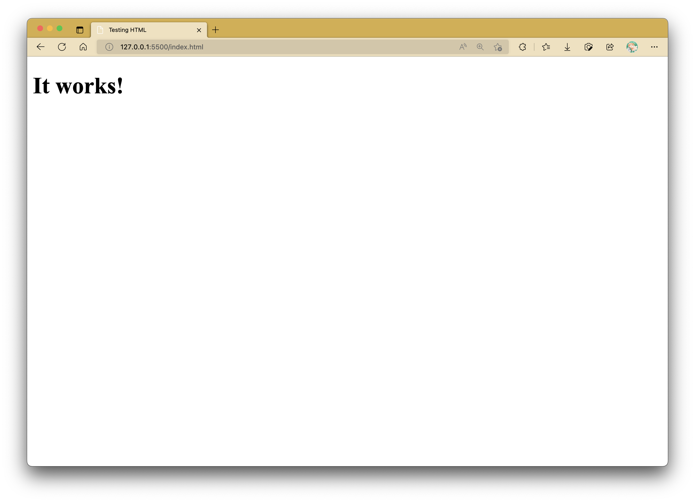

# Visual Studio Code Setup

Going forward, I will be using Visual Studio Code as my code editor of choice during demos.
However, this is not the only choice available - some good alternatives include Atom, Sublime Text, and Notepad++ (for Windows users only).
Of course, you are not forbidden to use a different code editor you're already familiar with, as long as you are able to make web scripts with it.

## Visual Studio Code Extensions

Visual Studio Code has plenty of extensions which can either make your code editor appear more visually appealing, or help ease your workflow with some useful fixes.

The ones I will be using prevalently are as follows:

- **Highlight Matching Tag** by _vincaslt_ (`vincaslt.highlight-matching-tag`) - This is helpful especially for checking if your tag pairs are correctly placed or omitted by mistake.
- **Live Server** by _Ritwich Dey_ (`ritwickdey.liveserver`) - Up until we learn PHP, this will be the quick way to view our webpages without digging into our file directory to display our webpages in our web browser.
- **Prettier - Code formatter** by _Prettier_ (`esbenp.prettier-vscode`) - This will be our code formatter in order to have our web files properly indented and formatted (hence the name).

Also, do take note that I also have this extension installed in my instance of Visual Studio Code:

- **IntelliJ IDEA Keybindings** by _Keisuke Kato_ (`k--kato.intellij-idea-keybindings`)

This extension makes it such that some of my shortcut keys are different from what is initially set by Microsoft themselves.
You may choose not to install this extension, this one should do absolutely nothing to your workflow especially if you're not the type to use complex shortcut keys aside from your
++ctrl+x++/++ctrl+c++
and
++ctrl+v++
combo (
++cmd+x++/++cmd+c++
and
++cmd+v++
for macOS
).
However, if I mention any keyboard shortcut that does not translate on your end, you may want to do due diligence and find out what the original keybindings are.

You will be able to install your extensions by clicking on the Extensions tab on the left hand side (the shortcut is
++shift+cmd+x++
on macOS or
++ctrl+shift+x++
on Windows). You can find out more about what these extensions do when you select and find them from there.

!!! question "Note"

    	Do be aware that you are not required to download these extensions in order for you to carry on with the class.
    	These extensions are only meant to help with easing your web scripting/programming experiences with Visual Studio Code.

## Testing Visual Studio Code Out

To open a project directory, you can click on "Open..." from the Getting Started page or from the top menu bar and locate it that way.
Alternatively, you can click and drag your project folder from your File Explorer/Finder window and into the Visual Studio Code interface - this is a pretty quick way to get started and should be applicable in most code editors.

Create a webpage file named `index.html` your project directory.
After that, copy and paste the following into your webpage:

```html linenums="1" title="index.html"
<!DOCTYPE html>
<html>
	<head>
		<title>Testing HTML</title>
	</head>
	<body>
		<h1>It works!</h1>
	</body>
</html>
```

If you downloaded the **Live Server** extension, you should be able to view a link that says "Go Live".
Click that link and it will open up your webpage in a small web server with the IP address `127.0.0.1:5500`.
The port `5500` may not apply depending on what is currently running inside your machine.

The output should be as follows:



Any change you make to your webpage right after upon saving will immediately refresh what is shown on the web browser automatically - this means you won't need to instinctively refresh your browser each time you make a change.
Click the link again to stop the Live Server from refreshing.

Alternatively, in the Explorer side bar, you can right click on the HTML file you're working on and select "Open with Live Server".

!!! attention

    The **Live Server** extension only works when you have your project folder as an active workspace inside Visual Studio Code.
    It will not work as intended with loose files that are simply opened from other foreign folders.
