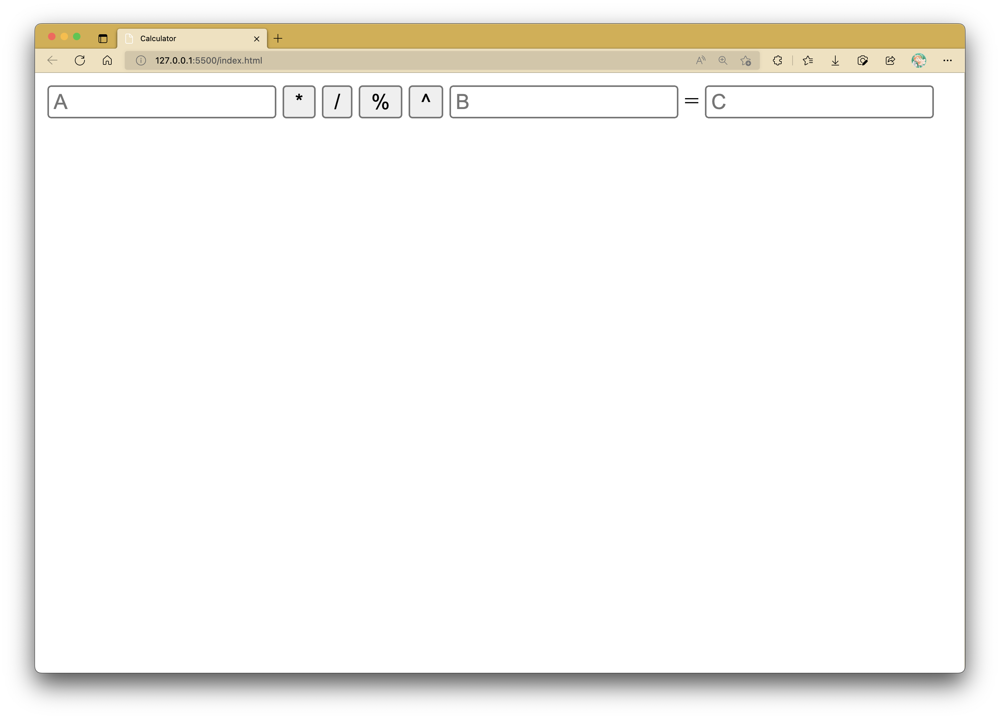

# Practical 06: JavaScript Functions & HTML DOM Manipulation

This rather challenging practical activity exposes how functions can be used within JavaScript, and how it can interact with web elements in the HTML Document Object Model (DOM).
Should you require more guidance, there are plenty of online tutorials detailing multiple solutions - it's best if you can explore and test them out to the best of your ability.

## Getting Started

Functions can be tricky to understand in JavaScript, as unlike some languages like Java or C++, the urgency as to when a function needs to return a value or not is never explicitly stated.

Function declarations in JavaScript follow the given syntax:

```javascript
function functionNameHere(param_1, param_2, ..., param_n) {

}
```

The items you include in the round parentheses are referred to as parameters.
Sometimes, parameters are required to carry out a function's intended purpose(s).
For example, the following function makes use of two number values with intentions to produce the sum after totalling them up.

```javascript
function addition(number1, number2) {
	// number addition logic here
}
```

The following function, however, does not require any parameter values to display a greeting message, and thus has no parameters associated with it.

```javascript
function greeting() {
	console.log("Hello World!");
}
```

It is imperative to know that there is no such rule that states how many parameters EVERY function needs to have.
The number of parameters any function should contain solely lies on any need to depend on any external value(s) to properly carry out its.. well, function.

Sometimes, functions can also be used to return values as the last step in completing their purpose(s).
In such cases, a `return` statement is invoked from the function (not necesarily at the end all the time, but merely a traditional thing).
For instance, let's refer to the addition function from earlier again.
Upon calculating the sum of the two numbers, depending on how you are to present your output, you can choose to have the function just print the sum out or return it out of the function as a form of output at the line that spawned its use.

Here's how it will look like if the main idea is to solely print out the sum of the two numbers from within the function:

```javascript
function addition(number1, number2) {
	let sum = number1 + number2;

	console.log(`The sum of the two numbers is ${sum}.`);
}
```

Here's another variation of the same function, with the main difference being that it returns the sum at the end.

```javascript
function addition(number1, number2) {
	let sum = number1 + number2;

	return sum; // return statement
}
```

Admittedly, this may seem relatively confusing as compared to implementing functions in other programming languages like C or Java where one can tell if a function is to return a value or not.
For instance, in these two languages the data type of the intended return value is to be explicitly stated in the function declaration itself, or `void` if it's supposed to not return anything at all.
However, just by knowing how you want to craft your function based on the set requirements should be able to provide enough information to keep you going here.

### Warm-up

For each of the following purposes, determine if the function to be created to simulate such should make use of any parameters or not.
If so, name them and describe how they will be used in your supposed function.
As practice, you may also consider developing these functions with these plans in mind to be used with a HTML page.
You may name your parameter(s) and/or function(s) as you please, but preferably with respect to their meaningfulness.

1.  This function delivers a greeting based on a provided language from a list of available languages.

    ??? question "Model Answer"

        ```js
        function greeting(language)
        ```

        This can be interpreted in many ways - the language can be provided by being passed into the function (e.g., via a prompt box), or the function can have a mechanism in it that will obtain that language value from a drop-down list element, for instance.
        In the latter case, we can safely omit the `language` parameter from the function declaration.

2.  This function prints out the first 20 numbers in a sequence dictated by an already preset Maclaurin series expression.

    For testing purposes, you can use the common Maclaurin function:

    $$ \frac{1}{1-x} = 1 + x + x^2 + x^3 + x^4 + ... $$

    Use `x = 1` to `x = 20` in this function.

    ??? question "Model Answer"

        ```js
        function printMaclaurin()
        ```

        The description states a preset number of terms to be printed (i.e., 20), so this value need not be put in as a parameter to the function.

3.  This function gathers two strings to check if the first letter in each one match regardless of case.

    ??? question "Model Answer"

        ```js
        function firstLetterMatch(string1, string2)
        ```

        Two strings are needed from the user, so it only seems right to have them provided as parameters in this case.

4.  This function retrieves the user input from a HTML `<input>` field to prepare an array of distinct characters used in said input.

    ??? question "Model Answer"

        ```js
        function userInputToArray()
        ```

        The description mentions that the user input is to be retrieved from a HTML `<input>` field, so there is no need to pass it in as a function parameter.

5.  This function calculates the age of a person, place, or object by using its year of origin/date of birth/etc. and the current year during use.

    ??? question "Model Answer"

        ```js
        function calculateAge(year)
        ```

        Just like the first one, this description does not make clear of how the year of origin/date of birth/etc. is to be obtained from the user.
        You can have the function read the HTML element's value from within the function, or get the user to enter it from a prompt box.
        In the earlier case, you don't need the year to be passed in as a parameter.

## Tasks: HTML DOM

### Task 1

Drivers who are 16 years of age and older can apply for driving a license online.
The government webpage code requires applicants to enter their age and then checks if they are old enough to apply.

The following code captures the applicant's age. When the applicant clicks the 'Check now' button the age is first checked to ensure that it is numeric.
The age is then checked to see if the applicant is old enough.
Suitable messages are displayed as a result of the checks.

**Part 1:** Create an empty webpage with the following HTML scripts inside the `<body>` section.

```html linenums="1" hl_lines="11-13"
<p>You can apply for a license to drive when you are 16 years old.</p>
<p>To check if you are old enough to drive, input your age and click the button:</p>

<input type="number" id="ageNow" />
<button onclick="checkAgeFunction()">Check now</button>

<p id="ageCheck"></p>

<script type="text/javascript">
	function checkAgeFunction() {
		/* ---- INSERT CODE HERE ---- */

		/* ---- END INSERT CODE ---- */

		document.getElementById("ageCheck").innerHTML = canApply;
	}
</script>
```

**Part 2:** Complete the code for `checkAgeFunction()` that checks the age entered by the applicant and displays an appropriate response.

<!-- ### Task 2 -->

## Tasks: Functions

### Task 1

Create a HTML file that uses embedded JavaScript to carry out the following.

Create a function called `arrayFromRange()` which creates an array of integers between and including the two numbers that are passed into the function.

Example:

```js
arrayFromRange(5, 10); // this should return [5, 6, 7, 8, 9, 10]
arrayFromRange(-10, -4); // this should return [-10, -9, -8, -7, -6, -5, -4];
```

After creating the function, add another line of JavaScript code at the very end of the `<script>` element to invoke the created function.

### Task 2

Create a HTML file that uses embedded JavaScript to carry out the following.
You are required to only use the **browser's inspector console** to generate outputs.

#### Part 1

Create a function that takes two numbers and returns the maximum of the two. (**NOTE:** If the two numbers are the same, the function should return the same
number.)

#### Part 2

Create a function that takes in a circle's radius value and returns the area of the circle with that radius.

### Task 3

#### Part 1

Create a HTML file using **external JavaScript** that has the following interface.
Do **NOT** use the `<form>` element to encapsulate the `input` elements.



**_NOTE:_** You may assume A, B and C as the `id`s of the input fields.
Do **NOT** put these letters as default values.
Applying them as placeholder text is permissible.

#### Part 2

In the external JavaScript file, create a function called `multiply()` which will multiply the values of A and B (i.e., $A \times B$), and then display the return value at C once the `*` button is clicked.

#### Part 3

In the same external JavaScript file, create a function called `divide()` which will divide the values of A and B (i.e., $A \div B$), and then display the return value at C once the `/` button is clicked.

#### Part 4

In the same external JavaScript file, create a function called `modulo()` which will retrieve the **_remainder_** after dividing the values of A and B, and then display the return value at C once the `%` button is clicked.

#### Part 5

In the same external JavaScript file, create a function called `exp()` which will produce the value of $A^B$, and then display the return value at C once the `^` button is clicked.

## Challenge Tasks

### Challenge Task 1

Create a HTML file that uses external JavaScript to carry out the following.

**Part 1:** In the `<body>` section, create a single paragraph `<p>` element with an `id` value `"result"` containing the text: "The FizzBuzz Test".

**Part 2:** Add a `<script>` tag referencing a JavaScript file called `fizzbuzz.js`.

**Part 3:** Create the `fizzbuzz.js` JavaScript file. It should contain the following code snippet:

```js
function fizzBuzz(input) {
	/* ---- CONTINUE CODE FROM HERE ---- */
}

const number = 15; // edit this constant value to test fizzBuzz()
document.getElementById("result").innerHTML = fizzBuzz(number);
```

The last line makes it such that the value obtained from the `fizzBuzz()` function is appended into the `<p>` element with id `"result"`.

**Part 4:** Complete the `fizzBuzz()` function such that it return "Fizz" if the number is divisible by 3, and "Buzz" if it is divisible by 5.

- If the number is divisible by both 3 and 5, `fizzBuzz()` should return "FizzBuzz".
- If the number is not divisible by 3 or 5, `fizzBuzz()` should return the value stored in the used `input` parameter.

```js
// Examples
fizzBuzz(3); // it should return "Fizz"
fizzBuzz(10); // it should return "Buzz"
fizzBuzz(30); // it should return "FizzBuzz"
fizzBuzz(31); // it should return 31
```

!!! warning "Note"

    Do **NOT** use `document.write()` or `console.log()` in the function. You are required to use the `return` statement instead.

**Part 5:** Implement a check to see if `input` is a number or not.
If the input is not a number (e.g. string, Boolean), it should print "Not a number".
This needs to be checked first before determining its divisibility.

```js
// these should return "Not a number"
fizzBuzz("3");
fizzBuzz(false);
```

??? hint

    Use the `typeof` operator to check the variable's type.

### Challenge Task 2

Create a HTML file that uses embedded JavaScript to carry out the following.

**Part 1:** Create a `<script>` element located in the `<head>` section containing the following code snippet:

```js linenums="1" hl_lines="4"
function showPrimes(limit) {
	for (let number = 2; number <= limit; ++number) {
		let isPrime = true;
		/* ---- CONTINUE CODE FROM HERE ---- */
	}
}
```

The given code snippet depicts a function named `showPrimes` which takes in a parameter value called `limit`.

**Part 2:** In the `<body>` section, create another `<script>` element containing the following line:

```js
showPrimes(20);
```
