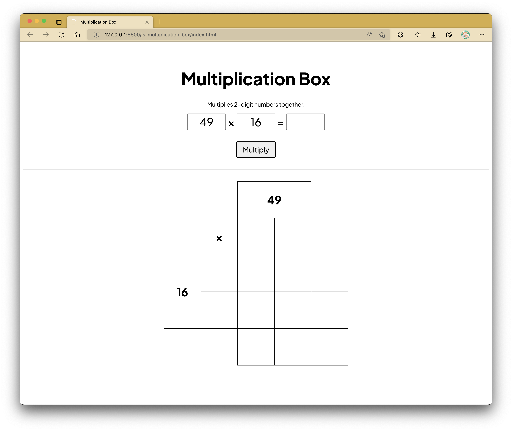

# Practical 07: Extra JavaScript Activities

_For instructions on installing XAMPP for the upcoming lessons, click [HERE](xampp.md)._

Under construction, check back later!

This practical contains two intermediate-level activities that will hopefully help you strengthen your understanding with JavaScript.
Don't worry, these two activities are merely code-alongs; you'll be guided every step of the way from preparations to the end.
Similar to the format of your consequent practical sessions themed after PHP and Databases, you may be asked to prepare beforehand by having a few files on the ready.
These files are not the main focus of the activity, but rather a common starting point can be ensured before starting with the code-along walkthrough.

## Multiplication Table

### Preparation

CSS and JS files are to be kept in their own separate subfolders.

```css linenums="1" title="css/style.css"
@import url("https://fonts.googleapis.com/css2?family=Plus+Jakarta+Sans:ital,wght@0,200;0,300;0,400;0,500;0,600;0,700;0,800;1,200;1,300;1,400;1,500;1,600;1,700;1,800&display=swap");

:root {
	--table-cell-dimension: 100px;
	--text-size: 32px;
}

* {
	font-family: "Plus Jakarta Sans", sans-serif;
}

body {
	padding-top: 2rem;
	text-align: center;
}

h1 {
	font-size: 48px;
}

#num_entry,
#num_entry input[type="number"] {
	font-size: var(--text-size);
	margin-bottom: 1rem;
}

#num_entry input[type="number"] {
	text-align: center;
	width: var(--table-cell-dimension);
}

input[type="number"]:disabled {
	background-color: white;
	border: 2px solid black;
	cursor: not-allowed;
}

/* For Chrome, Safari, Edge, Opera */
input::-webkit-outer-spin-button,
input::-webkit-inner-spin-button {
	-webkit-appearance: none;
	margin: 0;
}

/* For Firefox */
input[type="number"] {
	-moz-appearance: textfield;
}

input[type="button"] {
	font-size: 20px;
	padding: 0.5rem 1rem;
}

hr {
	margin: 2rem 0;
}

table#multiplication-box {
	/* border: 1px solid black; */
	border-collapse: collapse;
	display: inline-block;
	margin-left: auto;
}

table#multiplication-box th,
table#multiplication-box td:not(.td-hidden) {
	border: 1px solid black;
	font-size: var(--text-size);
	height: var(--table-cell-dimension);
	width: var(--table-cell-dimension);
}
```

```html linenums="1" title="index.html"
<!DOCTYPE html>
<html lang="en">
	<head>
		<meta charset="UTF-8" />
		<meta http-equiv="X-UA-Compatible" content="IE=edge" />
		<meta name="viewport" content="width=device-width, initial-scale=1.0" />
		<title>Multiplication Box</title>

		<link rel="stylesheet" href="css/style.css" />
	</head>
	<body>
		<h1>Multiplication Box</h1>

		<p>Multiplies 2-digit numbers together.</p>

		<section id="num_entry">
			<input type="number" name="num1" id="num1" min="10" max="99" />
			&times;
			<input type="number" name="num2" id="num2" min="10" max="99" />
			=
			<input type="number" name="answer" id="numAns" min="10" max="99" readonly />
		</section>
		<!-- /section#num_entry -->

		<input type="button" value="Multiply" onclick="multiply();" />

		<hr />

		<table id="multiplication-box">
			<tr>
				<td class="td-hidden"></td>
				<td class="td-hidden"></td>
				<th id="num1_show" colspan="2"></th>
			</tr>
			<tr>
				<td class="td-hidden"></td>
				<th>&times;</th>
				<th id="num1a"></th>
				<th id="num1b"></th>
			</tr>
			<tr>
				<th id="num2_show" rowspan="2"></th>
				<th id="num2a"></th>
				<td id="m1"></td>
				<td id="m2"></td>
				<td id="m1_m2"></td>
			</tr>
			<tr>
				<th id="num2b"></th>
				<td id="m3"></td>
				<td id="m4"></td>
				<td id="m3_m4"></td>
			</tr>
			<tr>
				<td class="td-hidden" colspan="2"></td>
				<td id="m1_m3"></td>
				<td id="m2_m4"></td>
				<th id="m_total"></th>
			</tr>
		</table>

		<!-- /table#multiplication-box -->

		<script src="js/times-box.js"></script>
	</body>
</html>
```

```js linenums="1" title="times-box.js"
function multiply() {
	// to include code here
}
```

You should be able to see the following in your web browser:

<figure markdown>
  
  <figcaption>Multiplication Box Page</figcaption>
</figure>

### Motivation

School teachers are often advised to look for creative methods into their lessons in order to help engage with students better or help students learn concepts easier with different methods.
The multiplication box is one of many creative methods concocted by elementary school math teachers to help students understand multiplication between two-digit numbers (i.e., integer values).

This method involves separating both numbers into tens and units, and then multiplying them separately before adding their horizontal and vertical totals up.
The cell at the bottom right denotes the eventual product between the two numbers.
For instance, with \(49 \times 16\), both numbers are separated as the pairs (40, 9) and (10, 6) respectively.
The following multiplication operations are then carried out first:

- \(40 \times 10 = 400\)
- \(40 \times 6 = 240\)
- \(9 \times 10 = 90\)
- \(9 \times 6 = 54\)

The numbers are populated as shown in the figure below, where their horizontal totals and vertical totals are calculated and displayed.
Between both sets of totals, they produce the same correct product after being added together (i.e., \(490 + 294 = 640 + 144 = 784\)).

<figure markdown>
  
  <figcaption>Multiplication Box Page</figcaption>
</figure>

Take note that the only input fields of concern are the three which make up the equation on top of the multiply button, which is associated with the JavaScript `multiply()` function we will be completing in this activity.
Only the first two are allowed to be populated manually by the user.
The third representing the calculated product is set to be `read-only`.

### Step 1: Obtaining Values from Input Fields

Let's work on obtaining the values entered into the first two input fields.

```js linenums="1" hl_lines="2-3" title="times-box.js"
function multiply() {
	let num1 = parseInt(document.querySelector("#num1").value);
	let num2 = parseInt(document.querySelector("#num2").value);
}
```

(mention about value property to be used when getting text out of input fields)

```js linenums="1" hl_lines="5-22" title="times-box.js"
function multiply() {
	let num1 = parseInt(document.querySelector("#num1").value);
	let num2 = parseInt(document.querySelector("#num2").value);

	// replace num1 and num2 with parsed integer (if not integers)
	// alert user when number is replaced
	if (parseFloat(document.querySelector("#num1").value) !== parseInt(document.querySelector("#num1").value)) {
		if (document.querySelector("#num1").value == "") {
			alert("First number input is empty.");
		} else {
			alert("First number isn't an integer. Replacing value at input field with parsed integer value instead.");
			document.querySelector("#num1").value = num1;
		}
	}
	if (parseFloat(document.querySelector("#num2").value) !== parseInt(document.querySelector("#num2").value)) {
		if (document.querySelector("#num2").value == "") {
			alert("Second number input is empty.");
		} else {
			alert("Second number isn't an integer. Replacing value at input field with parsed integer value instead.");
			document.querySelector("#num2").value = num2;
		}
	}
}
```

<figure markdown>
  
  <figcaption>Alert box pop-up if first number has not been entered.</figcaption>
</figure>

<figure markdown>
  
  <figcaption>Alert box pop-up if second number has not been entered.</figcaption>
</figure>

<figure markdown>
  
  <figcaption>Alert box pop-up if first number is not an integer.</figcaption>
</figure>

<figure markdown>
  
  <figcaption>Alert box pop-up if second number is not an integer.</figcaption>
</figure>

### Step 2: Checking Validity of Input Integers

```js linenums="1" hl_lines="24-43" title="times-box.js"
function multiply() {
	let num1 = parseInt(document.querySelector("#num1").value);
	let num2 = parseInt(document.querySelector("#num2").value);

	// replace num1 and num2 with parsed integer (if not integers)
	// alert user when number is replaced
	if (parseFloat(document.querySelector("#num1").value) !== parseInt(document.querySelector("#num1").value)) {
		if (document.querySelector("#num1").value == "") {
			alert("First number input is empty.");
		} else {
			alert("First number isn't an integer. Replacing value at input field with parsed integer value instead.");
			document.querySelector("#num1").value = num1;
		}
	}
	if (parseFloat(document.querySelector("#num2").value) !== parseInt(document.querySelector("#num2").value)) {
		if (document.querySelector("#num2").value == "") {
			alert("Second number input is empty.");
		} else {
			alert("Second number isn't an integer. Replacing value at input field with parsed integer value instead.");
			document.querySelector("#num2").value = num2;
		}
	}

	// check if num1 and num2 is between 10 and 99 (inclusive)
	if (num1 >= 10 && num1 <= 99 && num2 >= 10 && num2 <= 99) {
		// show number in num?_show
		document.querySelector("#num1_show").innerHTML = num1;
		document.querySelector("#num2_show").innerHTML = num2;

		// to continue more here
	} else {
		// if first number is not between 10 and 99 (inclusive)
		if (num1 < 10 || num1 > 99) {
			alert("First number should be between 10 and 99!");
			document.querySelector("#num1").value = ""; // empty first input field
		}

		// if secondnumber is not between 10 and 99 (inclusive)
		if (num2 < 10 || num2 > 99) {
			alert("Second number should be between 10 and 99!");
			document.querySelector("#num2").value = ""; // empty second input field
		}
	}
}
```

<figure markdown>
  
  <figcaption>Alert box pop-up if first number is not between 10 and 99 (inclusive).</figcaption>
</figure>

<figure markdown>
  
  <figcaption>Alert box pop-up if second number is not between 10 and 99 (inclusive).</figcaption>
</figure>

### Step 3: Populating the Table: Tens and Units Split

```js linenums="1" hl_lines="30-39" title="times-box.js"
function multiply() {
	let num1 = parseInt(document.querySelector("#num1").value);
	let num2 = parseInt(document.querySelector("#num2").value);

	// replace num1 and num2 with parsed integer (if not integers)
	// alert user when number is replaced
	if (parseFloat(document.querySelector("#num1").value) !== parseInt(document.querySelector("#num1").value)) {
		if (document.querySelector("#num1").value == "") {
			alert("First number input is empty.");
		} else {
			alert("First number isn't an integer. Replacing value at input field with parsed integer value instead.");
			document.querySelector("#num1").value = num1;
		}
	}
	if (parseFloat(document.querySelector("#num2").value) !== parseInt(document.querySelector("#num2").value)) {
		if (document.querySelector("#num2").value == "") {
			alert("Second number input is empty.");
		} else {
			alert("Second number isn't an integer. Replacing value at input field with parsed integer value instead.");
			document.querySelector("#num2").value = num2;
		}
	}

	// check if num1 and num2 is between 10 and 99 (inclusive)
	if (num1 >= 10 && num1 <= 99 && num2 >= 10 && num2 <= 99) {
		// show number in num?_show
		document.querySelector("#num1_show").innerHTML = num1;
		document.querySelector("#num2_show").innerHTML = num2;

		// split number into digits based on tens and units value
		let arr_num1 = [Math.floor(num1 / 10) * 10, num1 % 10];
		let arr_num2 = [Math.floor(num2 / 10) * 10, num2 % 10];

		// show digits in num?a or num?b
		document.querySelector("#num1a").innerHTML = arr_num1[0];
		document.querySelector("#num1b").innerHTML = arr_num1[1];
		document.querySelector("#num2a").innerHTML = arr_num2[0];
		document.querySelector("#num2b").innerHTML = arr_num2[1];
		// to continue more here
	} else {
		// if first number is not between 10 and 99 (inclusive)
		if (num1 < 10 || num1 > 99) {
			alert("First number should be between 10 and 99!");
			document.querySelector("#num1").value = ""; // empty first input field
		}

		// if secondnumber is not between 10 and 99 (inclusive)
		if (num2 < 10 || num2 > 99) {
			alert("Second number should be between 10 and 99!");
			document.querySelector("#num2").value = ""; // empty second input field
		}
	}
}
```

<figure markdown>
  
  <figcaption>Your function should now produce this result after clicking the button.</figcaption>
</figure>

### Step 4: Populating the Table: Calculating Intermediary Products

```js linenums="1" hl_lines="40-59" title="times-box.js"
function multiply() {
	let num1 = parseInt(document.querySelector("#num1").value);
	let num2 = parseInt(document.querySelector("#num2").value);

	// replace num1 and num2 with parsed integer (if not integers)
	// alert user when number is replaced
	if (parseFloat(document.querySelector("#num1").value) !== parseInt(document.querySelector("#num1").value)) {
		if (document.querySelector("#num1").value == "") {
			alert("First number input is empty.");
		} else {
			alert("First number isn't an integer. Replacing value at input field with parsed integer value instead.");
			document.querySelector("#num1").value = num1;
		}
	}
	if (parseFloat(document.querySelector("#num2").value) !== parseInt(document.querySelector("#num2").value)) {
		if (document.querySelector("#num2").value == "") {
			alert("Second number input is empty.");
		} else {
			alert("Second number isn't an integer. Replacing value at input field with parsed integer value instead.");
			document.querySelector("#num2").value = num2;
		}
	}

	// check if num1 and num2 is between 10 and 99 (inclusive)
	if (num1 >= 10 && num1 <= 99 && num2 >= 10 && num2 <= 99) {
		// show number in num?_show
		document.querySelector("#num1_show").innerHTML = num1;
		document.querySelector("#num2_show").innerHTML = num2;

		// split number into digits based on tens and units value
		let arr_num1 = [Math.floor(num1 / 10) * 10, num1 % 10];
		let arr_num2 = [Math.floor(num2 / 10) * 10, num2 % 10];

		// show digits in num?a or num?b
		document.querySelector("#num1a").innerHTML = arr_num1[0];
		document.querySelector("#num1b").innerHTML = arr_num1[1];
		document.querySelector("#num2a").innerHTML = arr_num2[0];
		document.querySelector("#num2b").innerHTML = arr_num2[1];

		/**
		 * Calculate intermediary multiplication values
		 *
		 * Key:
		 * m1 = num1a * num2a
		 * m2 = num1b * num2a
		 * m3 = num1a * num2b
		 * m4 = num1b * num2b
		 */
		const m1 = arr_num1[0] * arr_num2[0];
		const m2 = arr_num1[1] * arr_num2[0];
		const m3 = arr_num1[0] * arr_num2[1];
		const m4 = arr_num1[1] * arr_num2[1];

		// Display intermediary multiplication values
		document.querySelector("#m1").innerHTML = m1;
		document.querySelector("#m2").innerHTML = m2;
		document.querySelector("#m3").innerHTML = m3;
		document.querySelector("#m4").innerHTML = m4;
		// to continue more here
	} else {
		// if first number is not between 10 and 99 (inclusive)
		if (num1 < 10 || num1 > 99) {
			alert("First number should be between 10 and 99!");
			document.querySelector("#num1").value = ""; // empty first input field
		}

		// if secondnumber is not between 10 and 99 (inclusive)
		if (num2 < 10 || num2 > 99) {
			alert("Second number should be between 10 and 99!");
			document.querySelector("#num2").value = ""; // empty second input field
		}
	}
}
```

<figure markdown>
  
  <figcaption>Each of the four separate products should now populate the center table cells.</figcaption>
</figure>

### Step 5: Populating the Table: Obtaining Horizontal and Vertical Totals

```js linenums="1" hl_lines="60-67" title="times-box.js"
function multiply() {
	let num1 = parseInt(document.querySelector("#num1").value);
	let num2 = parseInt(document.querySelector("#num2").value);

	// replace num1 and num2 with parsed integer (if not integers)
	// alert user when number is replaced
	if (parseFloat(document.querySelector("#num1").value) !== parseInt(document.querySelector("#num1").value)) {
		if (document.querySelector("#num1").value == "") {
			alert("First number input is empty.");
		} else {
			alert("First number isn't an integer. Replacing value at input field with parsed integer value instead.");
			document.querySelector("#num1").value = num1;
		}
	}
	if (parseFloat(document.querySelector("#num2").value) !== parseInt(document.querySelector("#num2").value)) {
		if (document.querySelector("#num2").value == "") {
			alert("Second number input is empty.");
		} else {
			alert("Second number isn't an integer. Replacing value at input field with parsed integer value instead.");
			document.querySelector("#num2").value = num2;
		}
	}

	// check if num1 and num2 is between 10 and 99 (inclusive)
	if (num1 >= 10 && num1 <= 99 && num2 >= 10 && num2 <= 99) {
		// show number in num?_show
		document.querySelector("#num1_show").innerHTML = num1;
		document.querySelector("#num2_show").innerHTML = num2;

		// split number into digits based on tens and units value
		let arr_num1 = [Math.floor(num1 / 10) * 10, num1 % 10];
		let arr_num2 = [Math.floor(num2 / 10) * 10, num2 % 10];

		// show digits in num?a or num?b
		document.querySelector("#num1a").innerHTML = arr_num1[0];
		document.querySelector("#num1b").innerHTML = arr_num1[1];
		document.querySelector("#num2a").innerHTML = arr_num2[0];
		document.querySelector("#num2b").innerHTML = arr_num2[1];

		/**
		 * Calculate intermediary multiplication values
		 *
		 * Key:
		 * m1 = num1a * num2a
		 * m2 = num1b * num2a
		 * m3 = num1a * num2b
		 * m4 = num1b * num2b
		 */
		const m1 = arr_num1[0] * arr_num2[0];
		const m2 = arr_num1[1] * arr_num2[0];
		const m3 = arr_num1[0] * arr_num2[1];
		const m4 = arr_num1[1] * arr_num2[1];

		// Display intermediary multiplication values
		document.querySelector("#m1").innerHTML = m1;
		document.querySelector("#m2").innerHTML = m2;
		document.querySelector("#m3").innerHTML = m3;
		document.querySelector("#m4").innerHTML = m4;

		// add horizontal row values and display the sums
		document.querySelector("#m1_m2").innerHTML = m1 + m2;
		document.querySelector("#m3_m4").innerHTML = m3 + m4;

		// add vertical column values and display the sums
		document.querySelector("#m1_m3").innerHTML = m1 + m3;
		document.querySelector("#m2_m4").innerHTML = m2 + m4;
		// to continue more here
	} else {
		// if first number is not between 10 and 99 (inclusive)
		if (num1 < 10 || num1 > 99) {
			alert("First number should be between 10 and 99!");
			document.querySelector("#num1").value = ""; // empty first input field
		}

		// if secondnumber is not between 10 and 99 (inclusive)
		if (num2 < 10 || num2 > 99) {
			alert("Second number should be between 10 and 99!");
			document.querySelector("#num2").value = ""; // empty second input field
		}
	}
}
```

<figure markdown>
  
  <figcaption>The table should now contain the horizontal and vertical totals as shown.</figcaption>
</figure>

### Step 6: Retrieving and Displaying the Final Product

```js linenums="1" hl_lines="68-79" title="times-box.js"
function multiply() {
	let num1 = parseInt(document.querySelector("#num1").value);
	let num2 = parseInt(document.querySelector("#num2").value);

	// replace num1 and num2 with parsed integer (if not integers)
	// alert user when number is replaced
	if (parseFloat(document.querySelector("#num1").value) !== parseInt(document.querySelector("#num1").value)) {
		if (document.querySelector("#num1").value == "") {
			alert("First number input is empty.");
		} else {
			alert("First number isn't an integer. Replacing value at input field with parsed integer value instead.");
			document.querySelector("#num1").value = num1;
		}
	}
	if (parseFloat(document.querySelector("#num2").value) !== parseInt(document.querySelector("#num2").value)) {
		if (document.querySelector("#num2").value == "") {
			alert("Second number input is empty.");
		} else {
			alert("Second number isn't an integer. Replacing value at input field with parsed integer value instead.");
			document.querySelector("#num2").value = num2;
		}
	}

	// check if num1 and num2 is between 10 and 99 (inclusive)
	if (num1 >= 10 && num1 <= 99 && num2 >= 10 && num2 <= 99) {
		// show number in num?_show
		document.querySelector("#num1_show").innerHTML = num1;
		document.querySelector("#num2_show").innerHTML = num2;

		// split number into digits based on tens and units value
		let arr_num1 = [Math.floor(num1 / 10) * 10, num1 % 10];
		let arr_num2 = [Math.floor(num2 / 10) * 10, num2 % 10];

		// show digits in num?a or num?b
		document.querySelector("#num1a").innerHTML = arr_num1[0];
		document.querySelector("#num1b").innerHTML = arr_num1[1];
		document.querySelector("#num2a").innerHTML = arr_num2[0];
		document.querySelector("#num2b").innerHTML = arr_num2[1];

		/**
		 * Calculate intermediary multiplication values
		 *
		 * Key:
		 * m1 = num1a * num2a
		 * m2 = num1b * num2a
		 * m3 = num1a * num2b
		 * m4 = num1b * num2b
		 */
		const m1 = arr_num1[0] * arr_num2[0];
		const m2 = arr_num1[1] * arr_num2[0];
		const m3 = arr_num1[0] * arr_num2[1];
		const m4 = arr_num1[1] * arr_num2[1];

		// Display intermediary multiplication values
		document.querySelector("#m1").innerHTML = m1;
		document.querySelector("#m2").innerHTML = m2;
		document.querySelector("#m3").innerHTML = m3;
		document.querySelector("#m4").innerHTML = m4;

		// add horizontal row values and display the sums
		document.querySelector("#m1_m2").innerHTML = m1 + m2;
		document.querySelector("#m3_m4").innerHTML = m3 + m4;

		// add vertical column values and display the sums
		document.querySelector("#m1_m3").innerHTML = m1 + m3;
		document.querySelector("#m2_m4").innerHTML = m2 + m4;

		// calculate product
		const product =
			parseInt(document.querySelector("#m1_m2").innerHTML) + parseInt(document.querySelector("#m3_m4").innerHTML);
		// or
		// const product =
		// 	parseInt(document.querySelector("#m1_m3").innerHTML) + parseInt(document.querySelector("#m2_m4").innerHTML);

		// display full product in table
		document.querySelector("#m_total").innerHTML = product;

		// display full product in answer input field
		document.querySelector("#numAns").value = product;
	} else {
		// if first number is not between 10 and 99 (inclusive)
		if (num1 < 10 || num1 > 99) {
			alert("First number should be between 10 and 99!");
			document.querySelector("#num1").value = ""; // empty first input field
		}

		// if secondnumber is not between 10 and 99 (inclusive)
		if (num2 < 10 || num2 > 99) {
			alert("Second number should be between 10 and 99!");
			document.querySelector("#num2").value = ""; // empty second input field
		}
	}
}
```

<figure markdown>
  
  <figcaption>And.. it's complete. Well done!</figcaption>
</figure>

## Mark Demo

### Preparation

You'll require the following font file to be kept in a subfolder called `fonts` in your project directory: [SF Pro Display](./props/lab07_font.zip)

Additionally, CSS and JS files are to be kept in their own separate subfolders.

```css linenums="1" title="style.css"
@font-face {
	font-family: "SF Pro Display";
	src: url("../fonts/SF-Pro-Display-Regular.otf");
}

* {
	font-family: "SF Pro Display", sans-serif;
}

h1 {
	font-size: 48px;
}

hr {
	margin: 2rem 0;
}

button {
	background-color: transparent;
	border-radius: 1rem;
	font-size: 24px;
	padding: 0.5rem 1rem;
}

button:hover {
	box-shadow: 0 0 1rem yellowgreen, 0 0 5rem lemonchiffon;
	cursor: pointer;
}

button:active {
	background-color: lemonchiffon;
}

.text-center {
	text-align: center;
}
```

```css linenums="1" title="style_input.css"
input[type="number"] {
	text-align: right;
}

input:read-only {
	background-color: khaki;
}

/* For Chrome, Safari, Edge, Opera */
input::-webkit-outer-spin-button,
input::-webkit-inner-spin-button {
	-webkit-appearance: none;
	margin: 0;
}

/* For Firefox */
input[type="number"] {
	-moz-appearance: textfield;
}
```

```css linenums="1" title="style_table.css"
table {
	border-collapse: collapse;
	margin: 0 auto;
}

table * {
	font-size: 24px;
}

th,
td {
	border: 1px solid black;
	padding: 0.5rem 1rem;
}

th {
	background-color: lightcyan;
}

tr:not(:first-of-type):not(:last-of-type):hover {
	background-color: greenyellow;
}
```

```js linenums="1" title="script.js"
function calculate() {
	// we will be adding code from here
}

window.onload = function () {
	for (let inputBox of document.querySelectorAll(`input:read-only`)) {
		inputBox.value = "0.00";
	}
};
```

```html linenums="1" title="index.html"
<!DOCTYPE html>
<html lang="en">
	<head>
		<meta charset="UTF-8" />
		<meta http-equiv="X-UA-Compatible" content="IE=edge" />
		<meta name="viewport" content="width=device-width, initial-scale=1.0" />
		<title>Mark Demo</title>

		<link rel="stylesheet" href="css/style.css" />
		<link rel="stylesheet" href="css/style_input.css" />
		<link rel="stylesheet" href="css/style_table.css" />
	</head>
	<body>
		<section class="text-center">
			<h1>Mark Demo</h1>
		</section>
		<!-- /section.text-center -->

		<table>
			<tr class="text-center">
				<th>#</th>
				<th>Asgn 1 [100%]</th>
				<th>Asgn 2 [100%]</th>
				<th>Asgn 1 [20 points]</th>
				<th>Asgn 2 [30 points]</th>
				<th>Total [50 points]</th>
			</tr>
			<tr>
				<th>1</th>
				<td><input type="number" name="stu1_asgn1" id="stu1_asgn1" /></td>
				<td><input type="number" name="stu1_asgn1" id="stu1_asgn2" /></td>
				<td><input type="number" name="stu1_asgn1_points" id="stu1_asgn1_points" readonly /></td>
				<td><input type="number" name="stu1_asgn2_points" id="stu1_asgn2_points" readonly /></td>
				<td><input type="number" name="stu1_total_points" id="stu1_total_points" readonly /></td>
			</tr>
			<tr>
				<th>2</th>
				<td><input type="number" name="stu2_asgn1" id="stu2_asgn1" /></td>
				<td><input type="number" name="stu2_asgn2" id="stu2_asgn2" /></td>
				<td><input type="number" name="stu2_asgn1_points" id="stu2_asgn1_points" readonly /></td>
				<td><input type="number" name="stu2_asgn2_points" id="stu2_asgn2_points" readonly /></td>
				<td><input type="number" name="stu2_total_points" id="stu2_total_points" readonly /></td>
			</tr>
			<tr>
				<th>3</th>
				<td><input type="number" name="stu3_asgn1" id="stu3_asgn1" /></td>
				<td><input type="number" name="stu3_asgn2" id="stu3_asgn2" /></td>
				<td><input type="number" name="stu3_asgn1_points" id="stu3_asgn1_points" readonly /></td>
				<td><input type="number" name="stu3_asgn2_points" id="stu3_asgn2_points" readonly /></td>
				<td><input type="number" name="stu3_total_points" id="stu3_total_points" readonly /></td>
			</tr>
			<tr>
				<th colspan="3">Average</th>
				<th><input type="number" name="avg1" id="avg1" readonly /></th>
				<th><input type="number" name="avg2" id="avg2" readonly /></th>
				<th><input type="number" name="avg_total" id="avg_total" readonly /></th>
			</tr>
		</table>

		<hr />

		<section class="text-center">
			<button onclick="calculate();">Calculate Total and Average</button>
		</section>

		<script src="js/script.js"></script>
	</body>
</html>
```

You should be able to see the following in your web browser:

<figure markdown>
  
  <figcaption>Multiplication Box Page</figcaption>
</figure>

### Motivation

This intermediate-level activity will provide a guide as to how you can effectively use program control structures to skillfully loop through the same calculation process with different sets of inputs at a time.

Here, each row represents a student's record.
Each student would have had 2 assessment components graded on a 0 to 100 percent scale.
When the button at the bottom of the page (i.e., Calculate Total and Average) is selected, each student's Assignment 1 and 2's respective point weightage is calculated based on the input marks.
This is followed up by the calculation of points obtained by each student, along with the cumulative average of each point component.

The button has an `onclick` attribute that invokes the `calculate()` function when clicked on.

### Obtaining Values from Input Fields

### Calculation of All Totals and Averages
