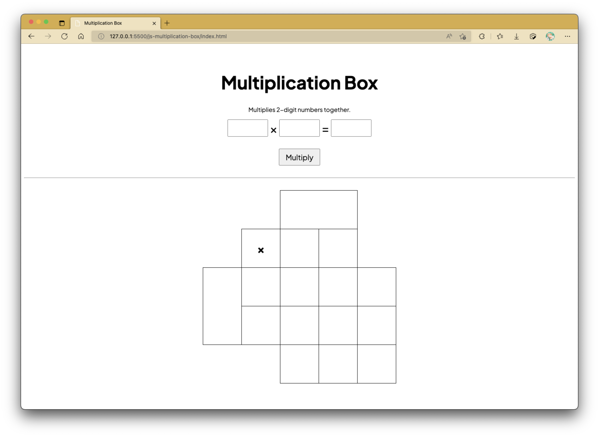
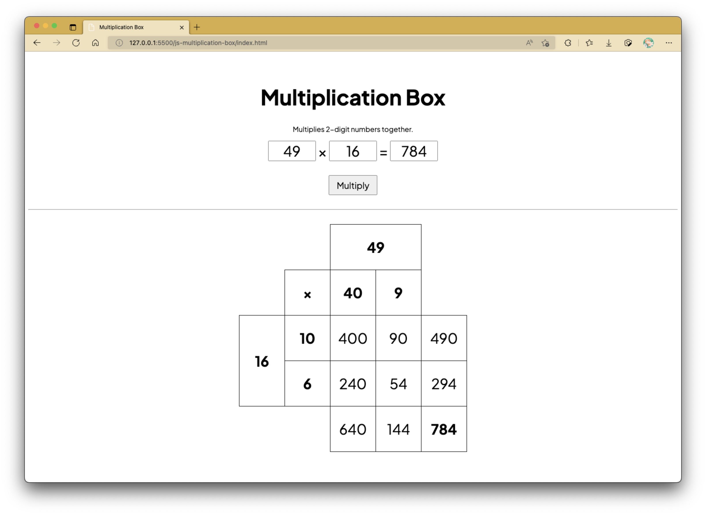
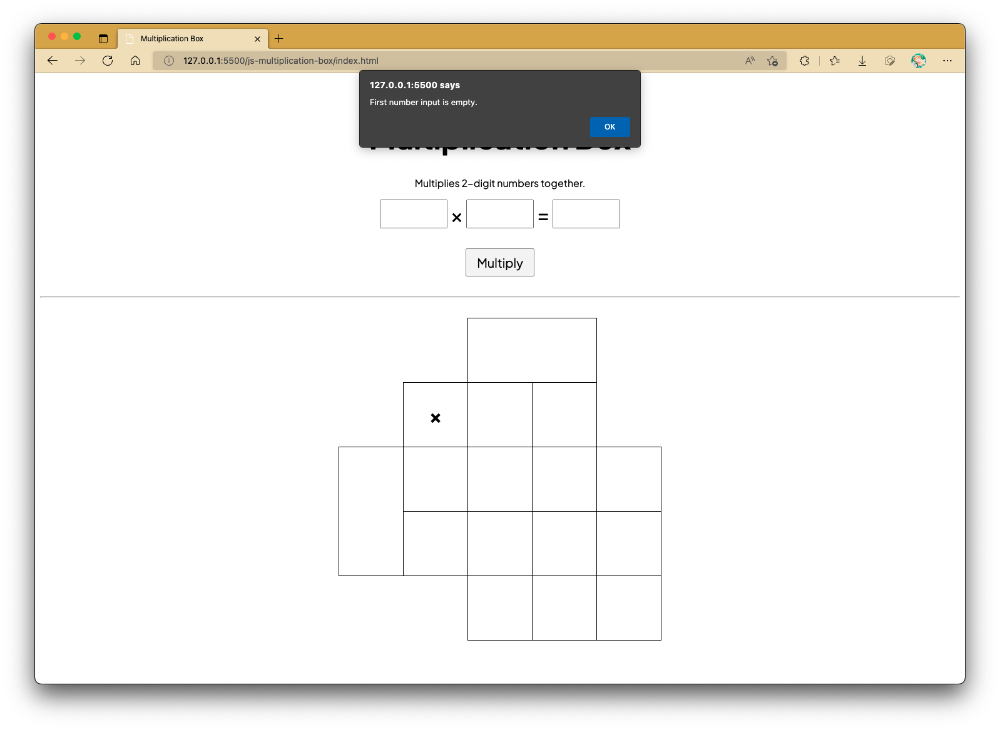
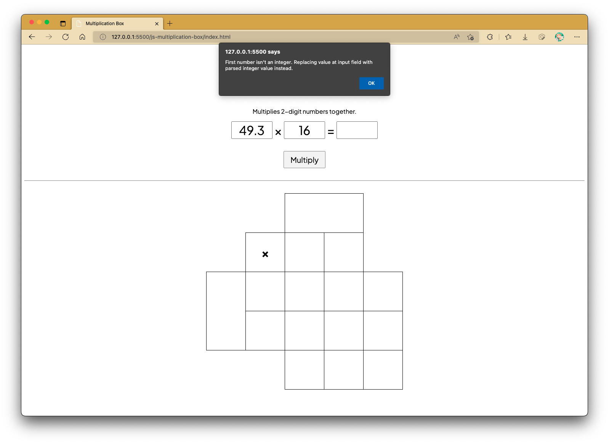
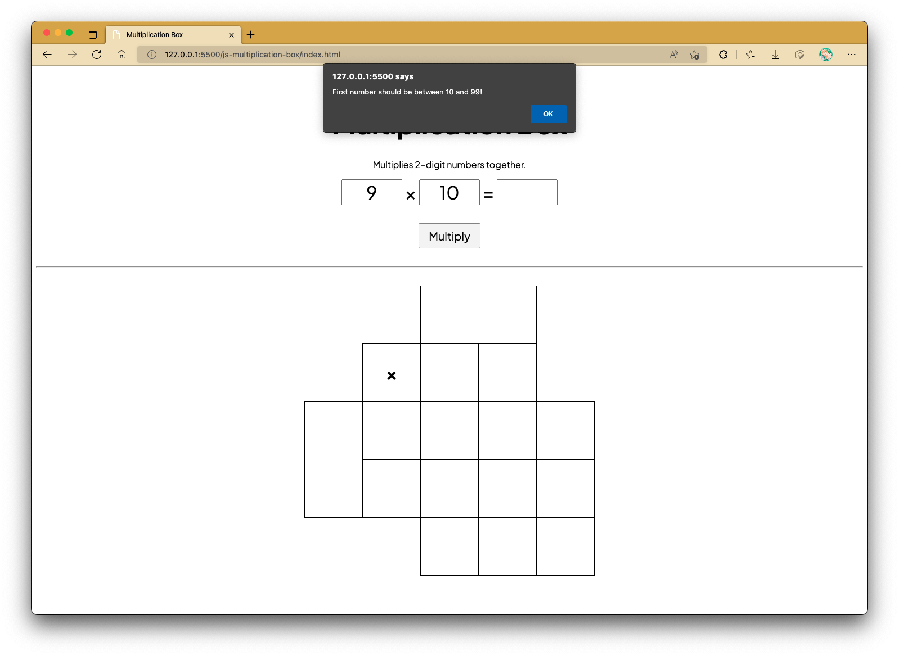
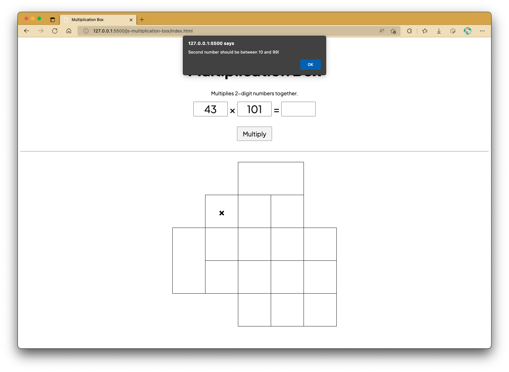
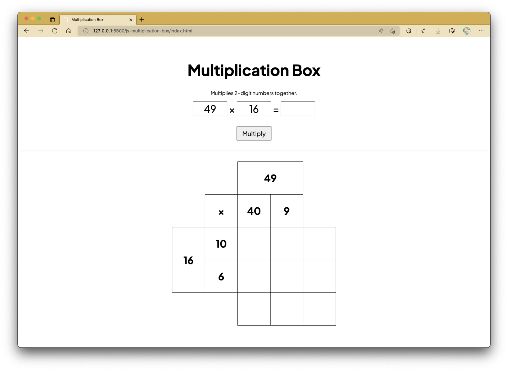
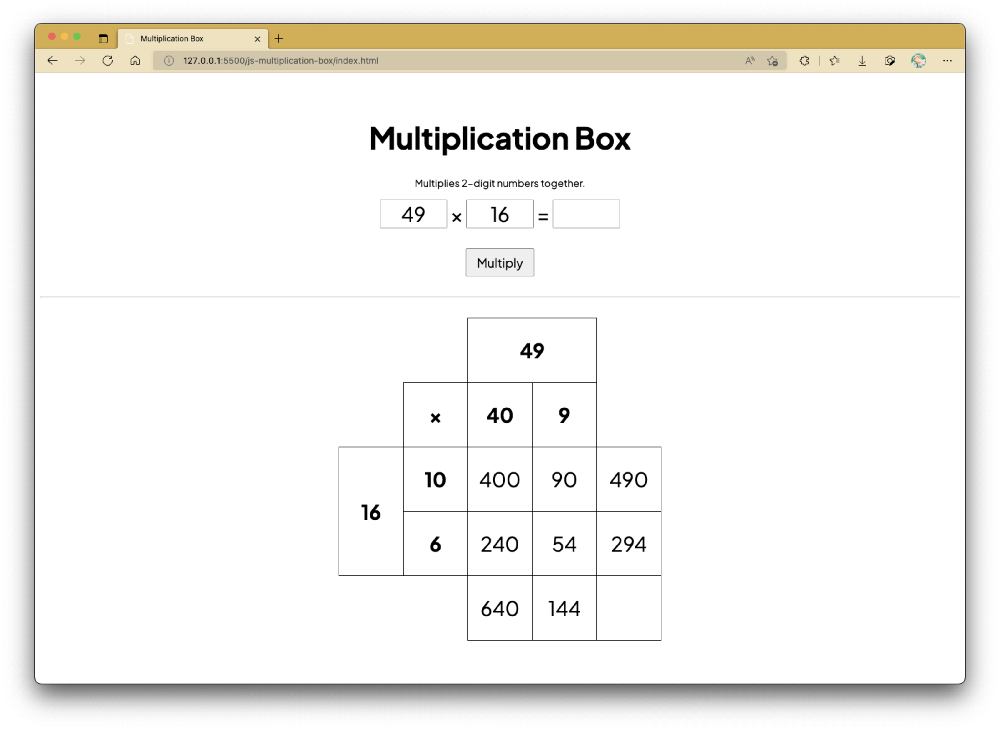

# Practical 07 (Activity 1): Multiplication Table

!!! question "The original Practical 7 has moved!"

    _For instructions on installing XAMPP for the upcoming lessons, click [HERE](xampp.md)._

## Preparation

CSS and JS files are to be kept in their own separate subfolders.

```css linenums="1" title="css/style.css"
@import url("https://fonts.googleapis.com/css2?family=Plus+Jakarta+Sans:ital,wght@0,200;0,300;0,400;0,500;0,600;0,700;0,800;1,200;1,300;1,400;1,500;1,600;1,700;1,800&display=swap");

:root {
	--table-cell-dimension: 100px;
	--text-size: 32px;
}

* {
	font-family: "Plus Jakarta Sans", sans-serif;
}

body {
	padding-top: 2rem;
	text-align: center;
}

h1 {
	font-size: 48px;
}

#num_entry,
#num_entry input[type="number"] {
	font-size: var(--text-size);
	margin-bottom: 1rem;
}

#num_entry input[type="number"] {
	text-align: center;
	width: var(--table-cell-dimension);
}

input[type="number"]:disabled {
	background-color: white;
	border: 2px solid black;
	cursor: not-allowed;
}

/* For Chrome, Safari, Edge, Opera */
input::-webkit-outer-spin-button,
input::-webkit-inner-spin-button {
	-webkit-appearance: none;
	margin: 0;
}

/* For Firefox */
input[type="number"] {
	-moz-appearance: textfield;
}

input[type="button"] {
	font-size: 20px;
	padding: 0.5rem 1rem;
}

hr {
	margin: 2rem 0;
}

table#multiplication-box {
	/* border: 1px solid black; */
	border-collapse: collapse;
	display: inline-block;
	margin-left: auto;
}

table#multiplication-box th,
table#multiplication-box td:not(.td-hidden) {
	border: 1px solid black;
	font-size: var(--text-size);
	height: var(--table-cell-dimension);
	width: var(--table-cell-dimension);
}
```

```html linenums="1" title="index.html"
<!DOCTYPE html>
<html lang="en">
	<head>
		<meta charset="UTF-8" />
		<meta http-equiv="X-UA-Compatible" content="IE=edge" />
		<meta name="viewport" content="width=device-width, initial-scale=1.0" />
		<title>Multiplication Box</title>

		<link rel="stylesheet" href="css/style.css" />
	</head>
	<body>
		<h1>Multiplication Box</h1>

		<p>Multiplies 2-digit numbers together.</p>

		<section id="num_entry">
			<input type="number" name="num1" id="num1" min="10" max="99" />
			&times;
			<input type="number" name="num2" id="num2" min="10" max="99" />
			=
			<input type="number" name="answer" id="numAns" min="10" max="99" readonly />
		</section>
		<!-- /section#num_entry -->

		<input type="button" value="Multiply" onclick="multiply();" />

		<hr />

		<table id="multiplication-box">
			<tr>
				<td class="td-hidden"></td>
				<td class="td-hidden"></td>
				<th id="num1_show" colspan="2"></th>
			</tr>
			<tr>
				<td class="td-hidden"></td>
				<th>&times;</th>
				<th id="num1a"></th>
				<th id="num1b"></th>
			</tr>
			<tr>
				<th id="num2_show" rowspan="2"></th>
				<th id="num2a"></th>
				<td id="m1"></td>
				<td id="m2"></td>
				<td id="m1_m2"></td>
			</tr>
			<tr>
				<th id="num2b"></th>
				<td id="m3"></td>
				<td id="m4"></td>
				<td id="m3_m4"></td>
			</tr>
			<tr>
				<td class="td-hidden" colspan="2"></td>
				<td id="m1_m3"></td>
				<td id="m2_m4"></td>
				<th id="m_total"></th>
			</tr>
		</table>

		<!-- /table#multiplication-box -->

		<script src="js/times-box.js"></script>
	</body>
</html>
```

```js linenums="1" title="times-box.js"
function multiply() {
	// to include code here
}
```

You should be able to see the following in your web browser:

<figure markdown>
  
  <figcaption>Multiplication Box Page</figcaption>
</figure>

## Motivation

School teachers are often advised to look for creative methods into their lessons in order to help engage with students better or help students learn concepts easier with different methods.
The multiplication box is one of many creative methods concocted by elementary school math teachers to help students understand multiplication between two-digit numbers (i.e., integer values).

This method involves separating both numbers into tens and units, and then multiplying them separately before adding their horizontal and vertical totals up.
The cell at the bottom right denotes the eventual product between the two numbers.
For instance, with \(49 \times 16\), both numbers are separated as the pairs (40, 9) and (10, 6) respectively.
The following multiplication operations are then carried out first:

- \(40 \times 10 = 400\)
- \(40 \times 6 = 240\)
- \(9 \times 10 = 90\)
- \(9 \times 6 = 54\)

The numbers are populated as shown in the figure below, where their horizontal totals and vertical totals are calculated and displayed.
Between both sets of totals, they produce the same correct product after being added together (i.e., \(490 + 294 = 640 + 144 = 784\)).

<figure markdown>
  
  <figcaption>Multiplication Box Page</figcaption>
</figure>

Take note that the only input fields of concern are the three which make up the equation on top of the multiply button, which is associated with the JavaScript `multiply()` function we will be completing in this activity.
Only the first two are allowed to be populated manually by the user.
The third representing the calculated product is set to be `read-only`.

## Step 1: Obtaining Values from Input Fields

Let's work on obtaining the values entered into the first two input fields.
The first two lines in the `multiply()` function is used to obtain the values from input fields `input#num1` and `input#num2`.

```js linenums="1" hl_lines="2-3" title="times-box.js"
function multiply() {
	let num1 = parseInt(document.querySelector("#num1").value);
	let num2 = parseInt(document.querySelector("#num2").value);
}
```

!!! tip "TIP: Using `.innerHTML` or `.value` When Retrieving Values"

    **TL;DR:** In nearly all cases, `.value` is only used with `<input>` whilst `.innerHTML` is for getting values from any non-self-closing tags.

    Let's take a `<p>` element, for example.

    ```html
    <p>
    	Content/text/etc. inside here
    </p>
    ```

    The content placed in between the opening `<p>` and closing `</p>` tags is what we refer to as inner HTML.
    Therefore, we use `.innerHTML` to obtain values that are stored in between similarly structured HTML tags.

    ```js
    document.querySelector("p").innerHTML
    ```

    However, when it comes to `<input>` elements, these are represented with self-closing tags.
    Thus, there isn't really any inner HTML to target.
    `<input>` elements do have the a `value` attribute that contains entered text, though.
    In this case, it only makes sense to use `.value` to elicit values out of `<input>` fields.

    ```js
    document.querySelector("input").innerHTML	// does not work
    document.querySelector("input").value // use this for <input> elements instead
    ```

Here, we observe that the `parseInt()` function is applied surrounding the expression used to obtain the value from `input#num1` and `input#num2`.
This function ensures that an integer is obtained from the `<input>` elements, as the value obtained from them typically defaults to being of a `"string"` type.

Before we proceed to use these values we've entered, we're going to implement a few checks to see if the numbers entered are two-digit **integers**.
This means that:

- none of the two input fields (i.e., `input#num1` and `input#num2`) should be empty
- no non-integer values or any value outside of the 10-99 range can be entered

The first criterion is pretty straightforward - we check to see if the value of `input#num1` and/or `input#num2` results in an empty string (i.e., `""`).

To implement the second criterion, we'll be using the sister variant function of `parseInt()` called `parseFloat()`.
While `parseInt()` obtains an integer from the passed in string (in this case the value of the `<input>` field), `parseFloat()` obtains any number (with decimal points) from the passed in string.
In summary,

|    Function    | "17" | "17.5" | "17as" | "17.5as" | "as17" | "asap" |
| :------------: | :--: | :----: | :----: | :------: | :----: | :----: |
|  `parseInt()`  |  17  |   17   |   17   |    17    | `NaN`  | `Nan`  |
| `parseFloat()` |  17  |  17.5  |   17   |   17.5   | `NaN`  | `Nan`  |

From the table above, we can probably tell that `parseFloat("17.5") !== parseInt("17.5")`.
We use this idea here to determine if the input number in either `input#num1` or `input#num2` or both are not integers, and then we proceed to replace them with the integer obtained after using the `parseInt()` function.

For both criteria, we use an alert box to alert the user of any problems found.

```js linenums="1" hl_lines="5-22" title="times-box.js"
function multiply() {
	let num1 = parseInt(document.querySelector("#num1").value);
	let num2 = parseInt(document.querySelector("#num2").value);

	// replace num1 and num2 with parsed integer (if not integers)
	// alert user when number is replaced
	if (parseFloat(document.querySelector("#num1").value) !== parseInt(document.querySelector("#num1").value)) {
		if (document.querySelector("#num1").value == "") {
			alert("First number input is empty.");
		} else {
			alert("First number isn't an integer. Replacing value at input field with parsed integer value instead.");
			document.querySelector("#num1").value = num1;
		}
	}
	if (parseFloat(document.querySelector("#num2").value) !== parseInt(document.querySelector("#num2").value)) {
		if (document.querySelector("#num2").value == "") {
			alert("Second number input is empty.");
		} else {
			alert("Second number isn't an integer. Replacing value at input field with parsed integer value instead.");
			document.querySelector("#num2").value = num2;
		}
	}
}
```

<figure markdown>
  
  <figcaption>Alert box pop-up if first number has not been entered.</figcaption>
</figure>

<figure markdown>
  
  <figcaption>Alert box pop-up if second number has not been entered.</figcaption>
</figure>

<figure markdown>
  
  <figcaption>Alert box pop-up if first number is not an integer.</figcaption>
</figure>

<figure markdown>
  
  <figcaption>Alert box pop-up if second number is not an integer.</figcaption>
</figure>

## Step 2: Checking Validity of Input Integers

Now, onward to checking whether the input integers (i.e., `num1` and `num2`) are within the correct range.
A two-digit integer can only be either one of the numbers between 10 and 99; the rest of which simply will not fit.
For the sake of simplicity, we will only consider positive values.

We implement this check using a compound condition of 4 conditions to be met simultaneously:

- `num1 >= 10`
- `num1 <= 99`
- `num2 >= 10`
- `num2 <= 99`

If all four of these conditions are met, we proceed to display `num1` and `num2` in `td#num1_show` and `td#num2_show` respectively.
We will expand on the further logic to be implemented from here.

Otherwise, we check to see either `num1 < 10 || num1 > 99` or `num2 < 10 || num2 > 99`, and display an appropriate error message in an alert box.

```js linenums="1" hl_lines="24-43" title="times-box.js"
function multiply() {
	let num1 = parseInt(document.querySelector("#num1").value);
	let num2 = parseInt(document.querySelector("#num2").value);

	// replace num1 and num2 with parsed integer (if not integers)
	// alert user when number is replaced
	if (parseFloat(document.querySelector("#num1").value) !== parseInt(document.querySelector("#num1").value)) {
		if (document.querySelector("#num1").value == "") {
			alert("First number input is empty.");
		} else {
			alert("First number isn't an integer. Replacing value at input field with parsed integer value instead.");
			document.querySelector("#num1").value = num1;
		}
	}
	if (parseFloat(document.querySelector("#num2").value) !== parseInt(document.querySelector("#num2").value)) {
		if (document.querySelector("#num2").value == "") {
			alert("Second number input is empty.");
		} else {
			alert("Second number isn't an integer. Replacing value at input field with parsed integer value instead.");
			document.querySelector("#num2").value = num2;
		}
	}

	// check if num1 and num2 is between 10 and 99 (inclusive)
	if (num1 >= 10 && num1 <= 99 && num2 >= 10 && num2 <= 99) {
		// show number in num?_show
		document.querySelector("#num1_show").innerHTML = num1;
		document.querySelector("#num2_show").innerHTML = num2;

		// to continue more here
	} else {
		// if first number is not between 10 and 99 (inclusive)
		if (num1 < 10 || num1 > 99) {
			alert("First number should be between 10 and 99!");
			document.querySelector("#num1").value = ""; // empty first input field
		}

		// if secondnumber is not between 10 and 99 (inclusive)
		if (num2 < 10 || num2 > 99) {
			alert("Second number should be between 10 and 99!");
			document.querySelector("#num2").value = ""; // empty second input field
		}
	}
}
```

<figure markdown>
  
  <figcaption>Alert box pop-up if first number is not between 10 and 99 (inclusive).</figcaption>
</figure>

<figure markdown>
  
  <figcaption>Alert box pop-up if second number is not between 10 and 99 (inclusive).</figcaption>
</figure>

<figure markdown>
  
  <figcaption>Otherwise, your multiplication table should start being populated from here.</figcaption>
</figure>

## Step 3: Populating the Table: Tens and Units Split

The key ideas behind using the multiplication box/table as shown here is to split the two-digit numbers into the tens and units places.
In order to elicit the tens digit from the number, we simply obtain the quotient after dividing it by 10.
This quotient is then passed into one of the `Math` functions, namely the `floor()` function which rounds down a number to the lower boundary (e.g., 3.4 to 3, and 4.9 to 4).
The units digit is obtained simply by using the modulo operator on the number; basically, what the remainder is after dividing the number by 10.
These values are then stored contiguously in an array for each number (e.g., \(49 \times 16\) produces `[4, 9]` and `[1, 6]`).
Each of these digit are then placed in the respective cells: `td#num1a`, `td#num1b`, `td#num2a`, `td#num2b`.

```js linenums="1" hl_lines="30-39" title="times-box.js"
function multiply() {
	let num1 = parseInt(document.querySelector("#num1").value);
	let num2 = parseInt(document.querySelector("#num2").value);

	// replace num1 and num2 with parsed integer (if not integers)
	// alert user when number is replaced
	if (parseFloat(document.querySelector("#num1").value) !== parseInt(document.querySelector("#num1").value)) {
		if (document.querySelector("#num1").value == "") {
			alert("First number input is empty.");
		} else {
			alert("First number isn't an integer. Replacing value at input field with parsed integer value instead.");
			document.querySelector("#num1").value = num1;
		}
	}
	if (parseFloat(document.querySelector("#num2").value) !== parseInt(document.querySelector("#num2").value)) {
		if (document.querySelector("#num2").value == "") {
			alert("Second number input is empty.");
		} else {
			alert("Second number isn't an integer. Replacing value at input field with parsed integer value instead.");
			document.querySelector("#num2").value = num2;
		}
	}

	// check if num1 and num2 is between 10 and 99 (inclusive)
	if (num1 >= 10 && num1 <= 99 && num2 >= 10 && num2 <= 99) {
		// show number in num?_show
		document.querySelector("#num1_show").innerHTML = num1;
		document.querySelector("#num2_show").innerHTML = num2;

		// split number into digits based on tens and units value
		let arr_num1 = [Math.floor(num1 / 10) * 10, num1 % 10];
		let arr_num2 = [Math.floor(num2 / 10) * 10, num2 % 10];

		// show digits in num?a or num?b
		document.querySelector("#num1a").innerHTML = arr_num1[0];
		document.querySelector("#num1b").innerHTML = arr_num1[1];
		document.querySelector("#num2a").innerHTML = arr_num2[0];
		document.querySelector("#num2b").innerHTML = arr_num2[1];
		// to continue more here
	} else {
		// if first number is not between 10 and 99 (inclusive)
		if (num1 < 10 || num1 > 99) {
			alert("First number should be between 10 and 99!");
			document.querySelector("#num1").value = ""; // empty first input field
		}

		// if secondnumber is not between 10 and 99 (inclusive)
		if (num2 < 10 || num2 > 99) {
			alert("Second number should be between 10 and 99!");
			document.querySelector("#num2").value = ""; // empty second input field
		}
	}
}
```

<figure markdown>
  
  <figcaption>Your function should now produce this result after clicking the button.</figcaption>
</figure>

## Step 4: Populating the Table: Calculating Intermediary Products

By splitting both numbers into the tens and units digits, we can now carry out the following intermediary multiplications operations (taking \(49 \times 16\) for example):

- \(40 \times 10 = 400\)
- \(40 \times 6 = 240\)
- \(9 \times 10 = 90\)
- \(9 \times 6 = 54\)

Each of these products are placed like as shown in the following output.

```js linenums="1" hl_lines="40-59" title="times-box.js"
function multiply() {
	let num1 = parseInt(document.querySelector("#num1").value);
	let num2 = parseInt(document.querySelector("#num2").value);

	// replace num1 and num2 with parsed integer (if not integers)
	// alert user when number is replaced
	if (parseFloat(document.querySelector("#num1").value) !== parseInt(document.querySelector("#num1").value)) {
		if (document.querySelector("#num1").value == "") {
			alert("First number input is empty.");
		} else {
			alert("First number isn't an integer. Replacing value at input field with parsed integer value instead.");
			document.querySelector("#num1").value = num1;
		}
	}
	if (parseFloat(document.querySelector("#num2").value) !== parseInt(document.querySelector("#num2").value)) {
		if (document.querySelector("#num2").value == "") {
			alert("Second number input is empty.");
		} else {
			alert("Second number isn't an integer. Replacing value at input field with parsed integer value instead.");
			document.querySelector("#num2").value = num2;
		}
	}

	// check if num1 and num2 is between 10 and 99 (inclusive)
	if (num1 >= 10 && num1 <= 99 && num2 >= 10 && num2 <= 99) {
		// show number in num?_show
		document.querySelector("#num1_show").innerHTML = num1;
		document.querySelector("#num2_show").innerHTML = num2;

		// split number into digits based on tens and units value
		let arr_num1 = [Math.floor(num1 / 10) * 10, num1 % 10];
		let arr_num2 = [Math.floor(num2 / 10) * 10, num2 % 10];

		// show digits in num?a or num?b
		document.querySelector("#num1a").innerHTML = arr_num1[0];
		document.querySelector("#num1b").innerHTML = arr_num1[1];
		document.querySelector("#num2a").innerHTML = arr_num2[0];
		document.querySelector("#num2b").innerHTML = arr_num2[1];

		/**
		 * Calculate intermediary multiplication values
		 *
		 * Key:
		 * m1 = num1a * num2a
		 * m2 = num1b * num2a
		 * m3 = num1a * num2b
		 * m4 = num1b * num2b
		 */
		const m1 = arr_num1[0] * arr_num2[0];
		const m2 = arr_num1[1] * arr_num2[0];
		const m3 = arr_num1[0] * arr_num2[1];
		const m4 = arr_num1[1] * arr_num2[1];

		// Display intermediary multiplication values
		document.querySelector("#m1").innerHTML = m1;
		document.querySelector("#m2").innerHTML = m2;
		document.querySelector("#m3").innerHTML = m3;
		document.querySelector("#m4").innerHTML = m4;
		// to continue more here
	} else {
		// if first number is not between 10 and 99 (inclusive)
		if (num1 < 10 || num1 > 99) {
			alert("First number should be between 10 and 99!");
			document.querySelector("#num1").value = ""; // empty first input field
		}

		// if secondnumber is not between 10 and 99 (inclusive)
		if (num2 < 10 || num2 > 99) {
			alert("Second number should be between 10 and 99!");
			document.querySelector("#num2").value = ""; // empty second input field
		}
	}
}
```

<figure markdown>
  
  <figcaption>Each of the four separate products should now populate the center table cells.</figcaption>
</figure>

## Step 5: Populating the Table: Obtaining Horizontal and Vertical Totals

Now, we focus on getting the horizontal and vertical totals of the intermediary products.
The cell containing the sum across

- the top row (horizontal) is denoted as `#m1_m2`
- the bottom row (horizontal) is denoted as `#m3_m4`
- the left column (vertical) is denoted as `#m1_m3`
- the right column (vertical) is denoted as `#m2_m4`

```js linenums="1" hl_lines="60-67" title="times-box.js"
function multiply() {
	let num1 = parseInt(document.querySelector("#num1").value);
	let num2 = parseInt(document.querySelector("#num2").value);

	// replace num1 and num2 with parsed integer (if not integers)
	// alert user when number is replaced
	if (parseFloat(document.querySelector("#num1").value) !== parseInt(document.querySelector("#num1").value)) {
		if (document.querySelector("#num1").value == "") {
			alert("First number input is empty.");
		} else {
			alert("First number isn't an integer. Replacing value at input field with parsed integer value instead.");
			document.querySelector("#num1").value = num1;
		}
	}
	if (parseFloat(document.querySelector("#num2").value) !== parseInt(document.querySelector("#num2").value)) {
		if (document.querySelector("#num2").value == "") {
			alert("Second number input is empty.");
		} else {
			alert("Second number isn't an integer. Replacing value at input field with parsed integer value instead.");
			document.querySelector("#num2").value = num2;
		}
	}

	// check if num1 and num2 is between 10 and 99 (inclusive)
	if (num1 >= 10 && num1 <= 99 && num2 >= 10 && num2 <= 99) {
		// show number in num?_show
		document.querySelector("#num1_show").innerHTML = num1;
		document.querySelector("#num2_show").innerHTML = num2;

		// split number into digits based on tens and units value
		let arr_num1 = [Math.floor(num1 / 10) * 10, num1 % 10];
		let arr_num2 = [Math.floor(num2 / 10) * 10, num2 % 10];

		// show digits in num?a or num?b
		document.querySelector("#num1a").innerHTML = arr_num1[0];
		document.querySelector("#num1b").innerHTML = arr_num1[1];
		document.querySelector("#num2a").innerHTML = arr_num2[0];
		document.querySelector("#num2b").innerHTML = arr_num2[1];

		/**
		 * Calculate intermediary multiplication values
		 *
		 * Key:
		 * m1 = num1a * num2a
		 * m2 = num1b * num2a
		 * m3 = num1a * num2b
		 * m4 = num1b * num2b
		 */
		const m1 = arr_num1[0] * arr_num2[0];
		const m2 = arr_num1[1] * arr_num2[0];
		const m3 = arr_num1[0] * arr_num2[1];
		const m4 = arr_num1[1] * arr_num2[1];

		// Display intermediary multiplication values
		document.querySelector("#m1").innerHTML = m1;
		document.querySelector("#m2").innerHTML = m2;
		document.querySelector("#m3").innerHTML = m3;
		document.querySelector("#m4").innerHTML = m4;

		// add horizontal row values and display the sums
		document.querySelector("#m1_m2").innerHTML = m1 + m2;
		document.querySelector("#m3_m4").innerHTML = m3 + m4;

		// add vertical column values and display the sums
		document.querySelector("#m1_m3").innerHTML = m1 + m3;
		document.querySelector("#m2_m4").innerHTML = m2 + m4;
		// to continue more here
	} else {
		// if first number is not between 10 and 99 (inclusive)
		if (num1 < 10 || num1 > 99) {
			alert("First number should be between 10 and 99!");
			document.querySelector("#num1").value = ""; // empty first input field
		}

		// if secondnumber is not between 10 and 99 (inclusive)
		if (num2 < 10 || num2 > 99) {
			alert("Second number should be between 10 and 99!");
			document.querySelector("#num2").value = ""; // empty second input field
		}
	}
}
```

<figure markdown>
  
  <figcaption>The table should now contain the horizontal and vertical totals as shown.</figcaption>
</figure>

## Step 6: Retrieving and Displaying the Final Product

Finally, we get to displaying the final product from multiplying the integers in the input fields.
The vertical sum between values in cells `#m1_m2` and `#m3_m4` or `#m1_m3` and `#m2_m4` will suffice in this case.

We first store this sum in a variable first before displaying them in the table cell `#m_total` and the `#numAns` input field.

```js linenums="1" hl_lines="68-79" title="times-box.js"
function multiply() {
	let num1 = parseInt(document.querySelector("#num1").value);
	let num2 = parseInt(document.querySelector("#num2").value);

	// replace num1 and num2 with parsed integer (if not integers)
	// alert user when number is replaced
	if (parseFloat(document.querySelector("#num1").value) !== parseInt(document.querySelector("#num1").value)) {
		if (document.querySelector("#num1").value == "") {
			alert("First number input is empty.");
		} else {
			alert("First number isn't an integer. Replacing value at input field with parsed integer value instead.");
			document.querySelector("#num1").value = num1;
		}
	}
	if (parseFloat(document.querySelector("#num2").value) !== parseInt(document.querySelector("#num2").value)) {
		if (document.querySelector("#num2").value == "") {
			alert("Second number input is empty.");
		} else {
			alert("Second number isn't an integer. Replacing value at input field with parsed integer value instead.");
			document.querySelector("#num2").value = num2;
		}
	}

	// check if num1 and num2 is between 10 and 99 (inclusive)
	if (num1 >= 10 && num1 <= 99 && num2 >= 10 && num2 <= 99) {
		// show number in num?_show
		document.querySelector("#num1_show").innerHTML = num1;
		document.querySelector("#num2_show").innerHTML = num2;

		// split number into digits based on tens and units value
		let arr_num1 = [Math.floor(num1 / 10) * 10, num1 % 10];
		let arr_num2 = [Math.floor(num2 / 10) * 10, num2 % 10];

		// show digits in num?a or num?b
		document.querySelector("#num1a").innerHTML = arr_num1[0];
		document.querySelector("#num1b").innerHTML = arr_num1[1];
		document.querySelector("#num2a").innerHTML = arr_num2[0];
		document.querySelector("#num2b").innerHTML = arr_num2[1];

		/**
		 * Calculate intermediary multiplication values
		 *
		 * Key:
		 * m1 = num1a * num2a
		 * m2 = num1b * num2a
		 * m3 = num1a * num2b
		 * m4 = num1b * num2b
		 */
		const m1 = arr_num1[0] * arr_num2[0];
		const m2 = arr_num1[1] * arr_num2[0];
		const m3 = arr_num1[0] * arr_num2[1];
		const m4 = arr_num1[1] * arr_num2[1];

		// Display intermediary multiplication values
		document.querySelector("#m1").innerHTML = m1;
		document.querySelector("#m2").innerHTML = m2;
		document.querySelector("#m3").innerHTML = m3;
		document.querySelector("#m4").innerHTML = m4;

		// add horizontal row values and display the sums
		document.querySelector("#m1_m2").innerHTML = m1 + m2;
		document.querySelector("#m3_m4").innerHTML = m3 + m4;

		// add vertical column values and display the sums
		document.querySelector("#m1_m3").innerHTML = m1 + m3;
		document.querySelector("#m2_m4").innerHTML = m2 + m4;

		// calculate product
		const product =
			parseInt(document.querySelector("#m1_m2").innerHTML) + parseInt(document.querySelector("#m3_m4").innerHTML);
		// or
		// const product =
		// 	parseInt(document.querySelector("#m1_m3").innerHTML) + parseInt(document.querySelector("#m2_m4").innerHTML);

		// display full product in table
		document.querySelector("#m_total").innerHTML = product;

		// display full product in answer input field
		document.querySelector("#numAns").value = product;
	} else {
		// if first number is not between 10 and 99 (inclusive)
		if (num1 < 10 || num1 > 99) {
			alert("First number should be between 10 and 99!");
			document.querySelector("#num1").value = ""; // empty first input field
		}

		// if secondnumber is not between 10 and 99 (inclusive)
		if (num2 < 10 || num2 > 99) {
			alert("Second number should be between 10 and 99!");
			document.querySelector("#num2").value = ""; // empty second input field
		}
	}
}
```

<figure markdown>
  
  <figcaption>And.. it's complete. Well done!</figcaption>
</figure>

And voila, we've just created a replica of the multiplication box/table used by some teachers to help teach children about multiplication between two-digit numbers!

## Challenge

Try to recreate the same table, but dealing with multiplication between **three-digit integers** instead of two.
