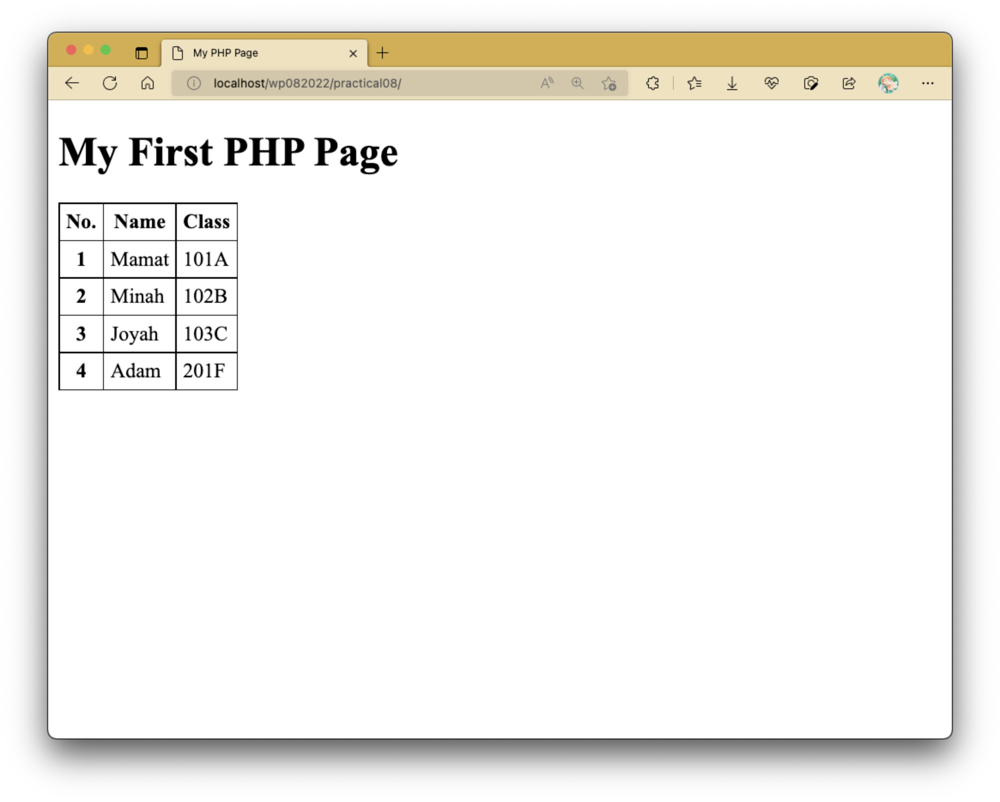
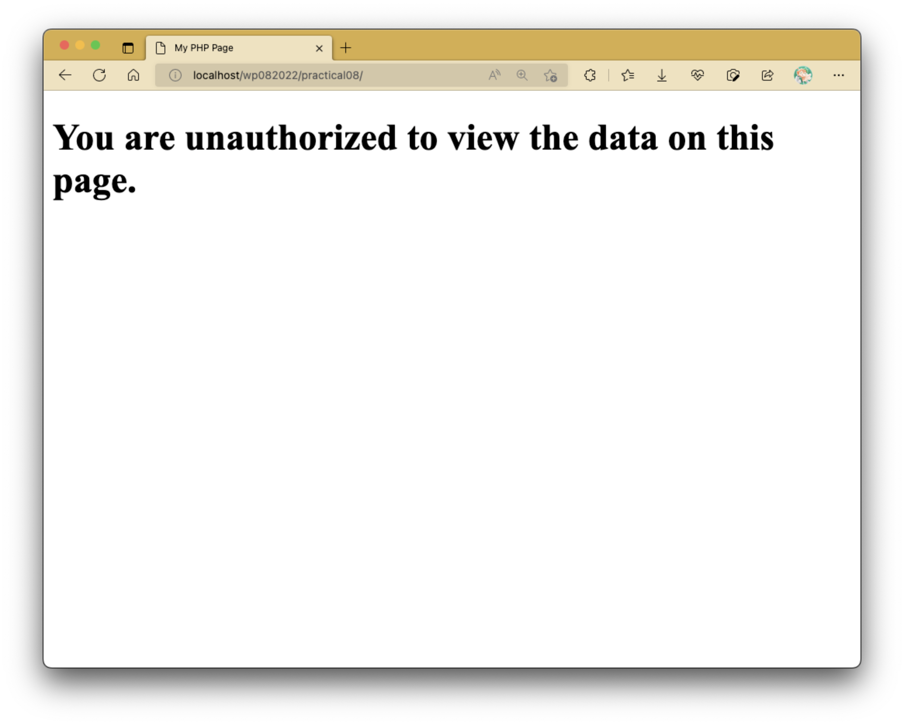

# Practical 08: Introducing PHP into HTML

In this practical activity, we will be utilizing different sets of data in PHP variables to modify how a webpage appears.
We will only be dabbling with one PHP file, namely `index.php`.
Additional styles are provided as embedded CSS here.

???+ note

    If you're not sure how to set up your machine for PHP development, or where to place your files and how to open the files from that location, I strongly advise you to check out [setting up XAMPP here](./guide-xampp.md).
    You may need to look elsewhere if you have anything else other than XAMPP or MAMP.

## Activity

Prepare `index.php` like as follows:

```html linenums="1" title="index.php"
<!DOCTYPE html>
<html lang="en">
	<head>
		<meta charset="UTF-8" />
		<meta http-equiv="X-UA-Compatible" content="IE=edge" />
		<meta name="viewport" content="width=device-width, initial-scale=1.0" />
		<title>My PHP Page</title>

		<style>
			table,
			th,
			td {
				border: 1px solid black;
			}

			table {
				border-collapse: collapse;
			}

			th,
			td {
				padding: 5px;
			}
		</style>
	</head>
	<body>
		<table>
			<thead>
				<tr>
					<th>No.</th>
					<th>Name</th>
					<th>Class</th>
				</tr>
			</thead>
			<tbody></tbody>
		</table>
	</body>
</html>
```

You should see the following output:


Note that the table as shown here does not have any other rows displayed aside from the header row.

We will now have PHP utilize the array values as stored in the following PHP code block to populate the table.
Place the following PHP block on top of `index.php`:

```php linenums="1"
<?php
	$students = ["Mamat", "Minah", "Joyah", "Adam"];
	$ids = ["101A", "102B", "103C", "201F"];
?>
```

Add the following code block in between the `<tbody></tbody>` tags:

```php linenums="1" hl_lines="3-9"
<?php
	for ($i = 0; $i < sizeof($students); $i++) {
		?>
		<tr>
			<th><?= $i + 1; ?></th>
			<td><?= $students[$i]; ?></td>
			<td><?= $ids[$i]; ?></td>
		</tr>
		<?php
	}
?>
```

The code block that's provided here makes use of a for loop to iterate over the elements in the array.
The for loop as shown here makes it so that a new `<tr>` row element along with its `<th>` and `<td>` elements are created during each iteration.
Since there are 4 items in the array, the for loop ends up creating 4 rows of data.

The highlighted lines show that a PHP block can be prematurely broken to encapsulate HTML code as part of your program control structure's block.
This will apply for all loop structures and conditional statements.

You may also notice that in between lines 5 to 7, they make use of special expression tags that are purposed to print out the values of expressions and/or PHP variables.
Let's see this in action again.

### Task 1

Create an empty `<h1></h1>` tag before the table in your HTML, and add the following variable in the top PHP block:

```php linenums="1" hl_lines="2"
<?php
	$heading = "My First PHP Page";
	$students = ["Mamat", "Minah", "Joyah", "Adam"];
	$ids = ["101A", "102B", "103C", "201F"];
?>
```

Hence or otherwise, add the value of `$heading` in the newly-created `<h1></h1>` element. You should now see something like as follows:



??? success "Solution"

    ```php linenums="1"
    <h1><?= $heading; ?></h1>
    ```

### Back to the Activity Narrative

With PHP, you can also create different views with conditional statements.
Add one more PHP variable in the top PHP block:

```php linenums="1" hl_lines="2"
<?php
	$forbidden = true;
	$heading = "My First PHP Page";
	$students = ["Mamat", "Minah", "Joyah", "Adam"];
	$ids = ["101A", "102B", "103C", "201F"];
?>
```

### Task 2

Modify the webpage so that the heading and table only appear if `$forbidden` is `false`.
Otherwise, the webpage should display this message in a single (and separate) `<h1>` element:



??? success "Solution"

    ```php linenums="1"
    <?php if (!$forbidden) { ?>
    	<h1><?= $heading; ?></h1>
    	<table>
    		<thead>
    			<tr>
    				<th>No.</th>
    				<th>Name</th>
    				<th>Class</th>
    			</tr>
    		</thead>
    		<tbody>
    			<?php
    			for ($i = 0; $i < sizeof($students); $i++) {
    			?>
    			<tr>
    				<th><?= $i + 1; ?></th>
    				<td><?= $students[$i]; ?></td>
    				<td><?= $ids[$i]; ?></td>
    			</tr>
    			<?php
    			}
    			?>
    		</tbody>
    	</table>
    <?php } else { ?>
    	<h1>You are unauthorized to view the data on this page.</h1>
    <?php } ?>
    ```

We will use program control structures more extensively in the next practical exercise.
By now, hopefully you understand how to leverage PHP to prepare different views based on conditions.
