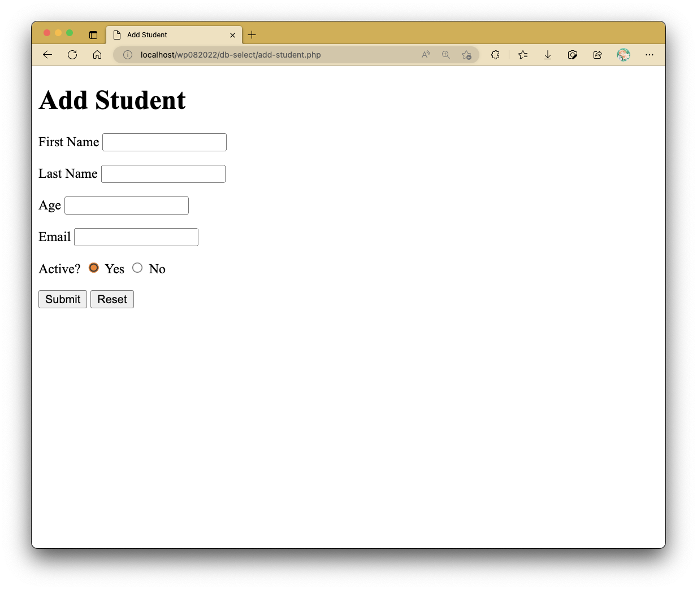
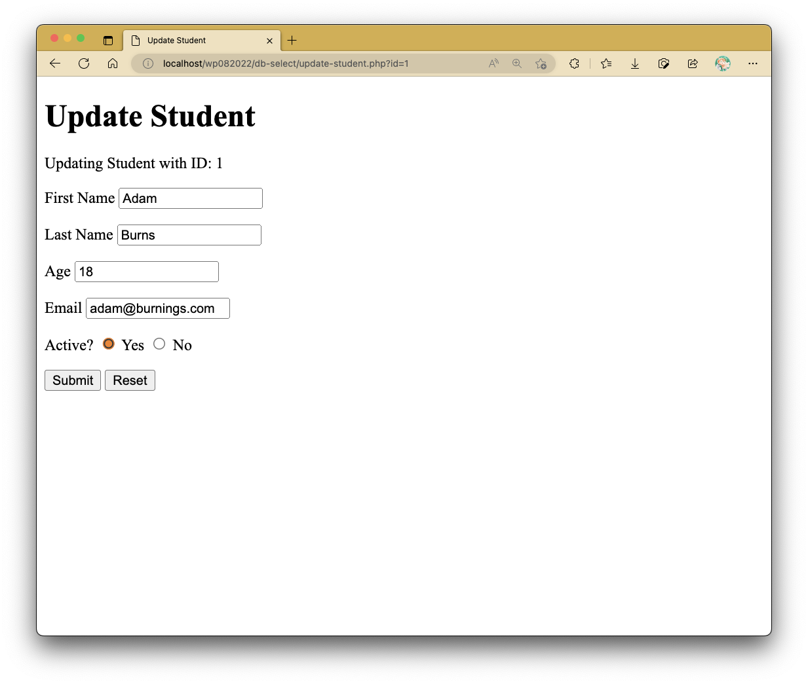
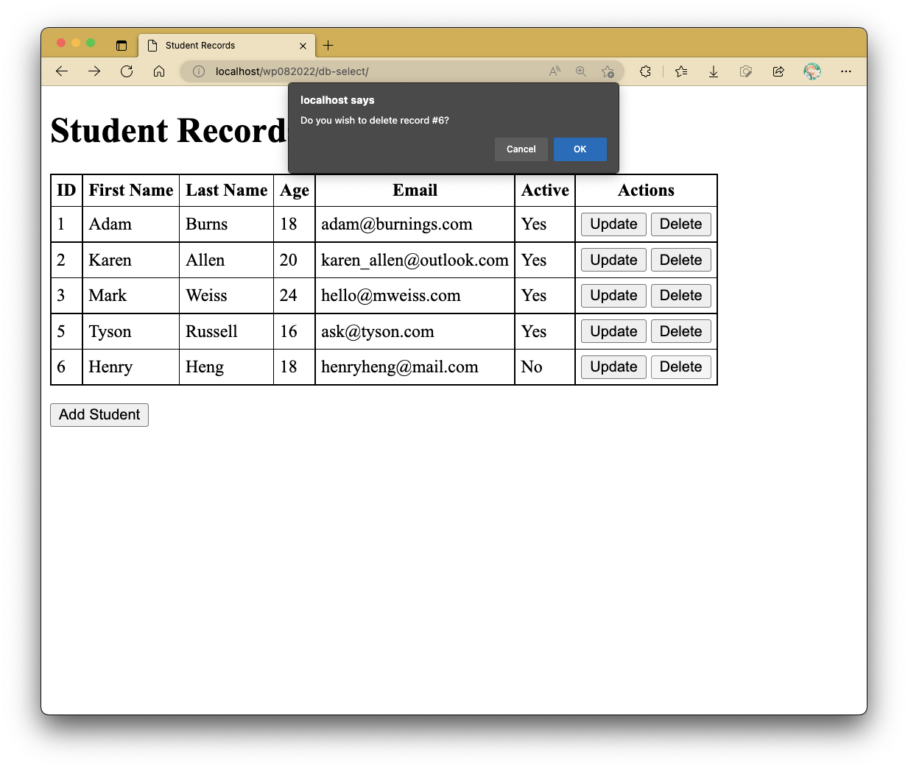
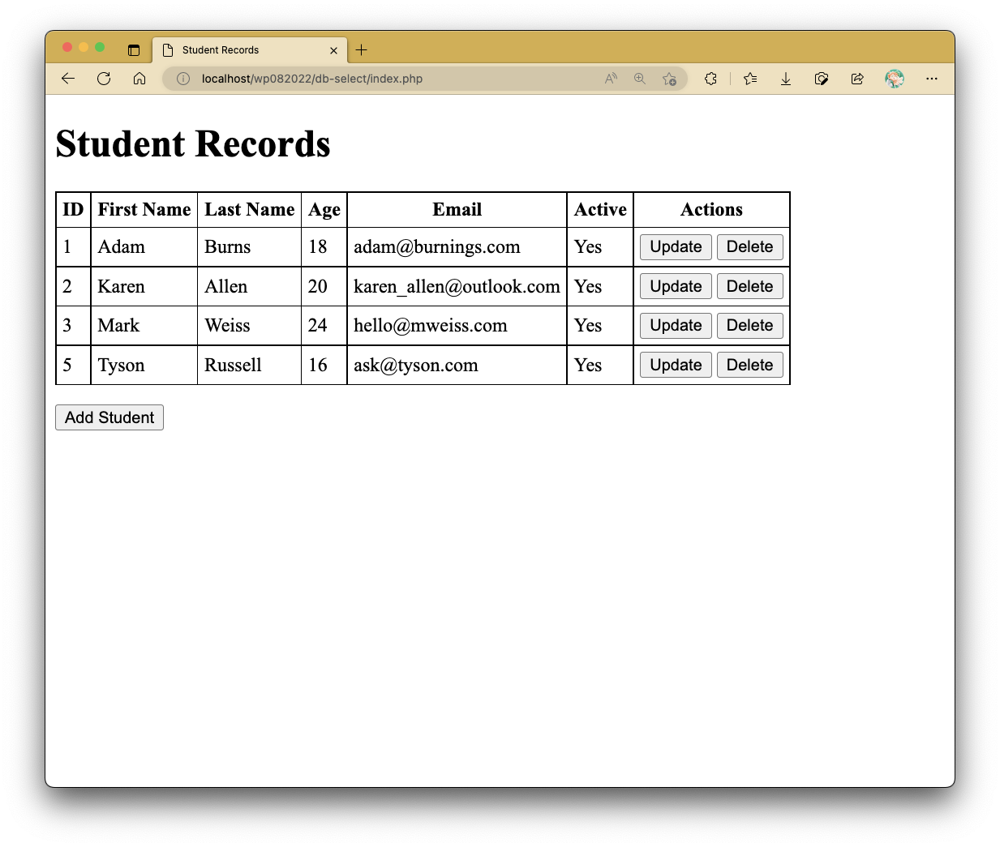

# Practical 12: Linking MySQL Database with PHP Files

This practical will give a rundown on how to utilize the CREATE, INSERT, UPDATE and DELETE functionalities of your MySQL database via PHP.
This continues on from where we left off from [Practical 11: Databases Part 1](lab11.md).
Throughout this practical, you may boot up PHPMyAdmin to check and see if the intended database server modifications are applied correctly.
However, we are to assume that we do not have the luxury of using it when developing database(s) and its/their table(s).

## Creating or Dropping Database from PHP

Before we get into the meat and potatoes of the lab work, we will prepare some files that can enable creation of the database and required table(s) via PHP.
In this practical, we will attempt to prepare the same database and table from the last one, namely the `exercise_db` database.

The first thing that should be dealt with should be based on whether or not the MySQL database server can be reached.
Provided if your database connection is set properly and you are able to access PHPMyAdmin, the following file should be able to tell that a connection to the database server is established.

```php linenums="1" title="db-connect-test.php"
<?php
$servername = "localhost";
$username = "root";
$password = "";	// password for you should be empty if XAMPP or MAMP is used

$conn = new mysqli($servername, $username, $password);

// Check connection; if error occurs, display error message and force exit
if ($conn->error) {
	die("Connection failed: " . $conn->connect_error);
}
?>
```

The `mysqli` object is key here to establish a connection to the database server.
It takes in the server name (that being `localhost` or `127.0.0.1` by default if you are working on your local machine) and your database server credentials - the username (`root` by default), and your password.

!!! warning "NOTE"

    For those who installed each component of the LAMP stack individually including the MySQL database, ensure you remember your root user password.
    You will need to fill up `$password` with that same password or it will throw an error stating that you have incorrect credentials.
    Those who proceeded with XAMPP or MAMP should proceed with an empty string as the password value.

With this test file, we can use it to create or drop a database from the MySQL server.
For simplicity sake, we will be attaching `db-connect-test.php` as like a header attachment with a **require** statement in the next two PHP files.
The first one creates the database whilst the second one drops the database.

```php linenums="1" title="create-db.php"
<?php
require "db-connect-test.php";

$sql = "CREATE DATABASE IF NOT EXISTS `exercise_db`"; // create SQL statement to be executed by MySQL

// $conn->query($sql) runs the SQL statement inside $sql, returns TRUE if successful
if ($conn->query($sql)) {
	echo "Database created successfully.";
} else {
	echo "Error creating database: " . $conn->error;
	// $conn->error retrieves the latest error message generated from the MySQL server
}

$conn->close(); // closes the database connection
```

```php linenums="1" title="drop-db.php"
<?php
require "db-connect-test.php";

$sql = "DROP DATABASE IF EXISTS `exercise_db`"; // create SQL statement to be executed by MySQL

// $conn->query($sql) runs the SQL statement inside $sql, returns TRUE if successful
if ($conn->query($sql)) {
	echo "Database dropped successfully.";
} else {
	echo "Error dropping database: " . $conn->error;
	// $conn->error retrieves the latest error message generated from the MySQL server
}

$conn->close(); // closes the database connection
```

Here, `$conn->query($sql)` executes the statement in `$sql` in the established database server connection.
Should the statement fail to run due to syntax errors, database constraints, etc., the result of this will render **FALSE**.
The converse is not always the case, but all except the `SELECT` statements should render a **TRUE** value.

!!! danger "CHECKPOINT: ARE YOU LOST?"

    If any of the used SQL statements do not make sense to you, head back into [Practical 11: Databases Part 1](lab11.md) to familiarize yourselves with the required database commands before proceeding with the rest of this practical activity.

## Creating or Dropping Table from PHP

After creating the database, we can now establish a more complete connection to it.
The following shows a variant of the `db-connect-test.php` file, but notably with changes to the creation of the `mysqli` object.
More specifically, the `mysqli` object should now include the database name as a fourth parameter.

```php linenums="1" hl_lines="5 7" title="db-connect.php"
<?php
$servername = "localhost";
$username = "root";
$password = "";	// password for you should be empty
$dbName = "exercise_db"; // database name here, fourth value required

$conn = new mysqli($servername, $username, $password, $dbName);

// Check connection; if error occurs, display error message and force exit
if ($conn->error) {
	die("Connection failed: " . $conn->connect_error);
}
?>
```

In the same fashion as before, `db-connect.php` will be added as a header attachment to the rest of the PHP files in this practical exercise.

The next two files deal with creating and dropping the `Student` table.

```php linenums="1" title="create-table.php"
<?php
/* copy PHP code from db-connect.php, or include it as follows: */
require "db-connect.php"; 	// db-connect.php is treated like an attachment

$sql = "CREATE TABLE IF NOT EXISTS `Student` (
	`id`                INT NOT NULL AUTO_INCREMENT,
	`first_name`        VARCHAR(50) NOT NULL,
	`last_name`         VARCHAR(50) NOT NULL,
	`age`               INT(3) NOT NULL,
	`email`             VARCHAR(255),
	`active`            BOOLEAN NOT NULL DEFAULT TRUE,

	PRIMARY KEY(`id`)
);";

// Run the SQL statement
if ($conn->query($sql)) echo "Table `Student` created successfully";
else echo "Error creating table: " . $conn->error;

$conn->close();
```

```php linenums="1" title="drop-table.php"
<?php
/* copy PHP code from db-connect.php, or include it as follows: */
require "db-connect.php"; 	// db-connect.php is treated like an attachment

$sql = "DROP TABLE IF EXISTS `Student`;";

// Run the SQL statement
if ($conn->query($sql)) echo "Table `Student` dropped successfully";
else echo "Error dropping table: " . $conn->error;

$conn->close();
```

## Displaying Data from Database Table

Let's start displaying some data from the `Student` table.
In the following index file, observe the highlighted lines.

```php linenums="1" hl_lines="38-77" title="index.php"
<?php
require "db-connect.php";
?>

<!DOCTYPE html>
<html lang="en">

	<head>
		<meta charset="UTF-8">
		<meta http-equiv="X-UA-Compatible" content="IE=edge">
		<meta name="viewport" content="width=device-width, initial-scale=1.0">
		<title>Student Records</title>

		<style>
		table {
			border-collapse: collapse;
		}

		th,
		td {
			border: 1px solid black;
			padding: 5px;
		}

		</style>

		<script>
		function confirmDelete(id) {
			const CONFIRM_RESULT = confirm(`Do you wish to delete record #${id}?`);
			if (CONFIRM_RESULT) window.location.href = `delete-student.php?id=${id}`;
		}
		</script>
	</head>

	<body>
		<h1>Student Records</h1>

		<?php
	$sql = "SELECT * FROM `Student`";
	$result = $conn->query($sql);

	if ($result) {	// check to see if query was successful
		if ($result->num_rows > 0) {	// $result->num_rows returns the number of row results
	?>
		<table>
			<tr>
				<th>ID</th>
				<th>First Name</th>
				<th>Last Name</th>
				<th>Age</th>
				<th>Email</th>
				<th>Active</th>
				<th>Actions</th>
			</tr>
			<?php
				while ($row = $result->fetch_assoc()) {
				?>
			<tr>
				<td><?= $row["id"]; ?></td>
				<td><?= $row["first_name"]; ?></td>
				<td><?= $row["last_name"]; ?></td>
				<td><?= $row["age"]; ?></td>
				<td><?= $row["email"]; ?></td>
				<td><?= $row["active"] == 1 ? "Yes" : "No"; ?></td>
				<td>
					<button onclick="window.location.href='update-student.php?id=<?= $row['id']; ?>';">Update</button>
					<button onclick="confirmDelete(<?= $row['id']; ?>)">Delete</button>
				</td>
			</tr>
			<?php
				}
				?>
		</table>
		<?php
		} else echo "No data found.";	// $result->num_rows = 0 (no rows of results are retrieved)
	} else echo "Error retrieving results: " . $conn->error; // database selection query not successful
	?>

		<p><button onclick="window.location.href='add-student.php'">Add Student</button></p>
	</body>

</html>
```

On line 40, the result after querying the SQL statement into the MySQL server is stored in a variable named `$result`.
In here, a successful database query does not produce the **TRUE** value, but rather a query result often stored as an associative array.
An unsuccessful one will still produce **FALSE**.

Here, `$result` is checked to see if it is not false before proceeding.
Following this, we check to see if there are any selected rows by retrieving the `num_rows` attribute from `$result`.
It is important to know that not all SELECT statements will produce the intended results, let alone the intended number of selected rows.
No row retrieval can mean a wrong SQL statement has been used to be executed in the database server.
Should this happen, do check back in PHPMyAdmin to see if there are any discrepancies in the produced SQL statement.
You may need to print out `$sql` to retrieve the statement used in this case.

In each of the aforementioned checks, appropriate error messages are produced in the browser.

Once all of these checks have been successfully performed and nothing is amiss, we iterate through the array of rows retrieved using a for loop.
In each iteration, we store the current row temporarily in a variable named `$row` using the `fetch_assoc()` method.
From here, selecting row data can be performed.
In our index page here, each iteration produces a new `<tr>` in the `<table>` element, thus automating something that would have required quite a number of duplicated HTML lines but with different data portrayal.


At the end of each row, an update and delete button is produced to allow editing and/or deletion of the rows starting from the `index.php` page itself.
We will look into those later.

## Adding Records to Table

Underneath the produced table, there is a button which should link to a PHP form page responsible for collecting information from the user.

```html linenums="1" title="add-student.php"
<!DOCTYPE html>
<html lang="en">
	<head>
		<meta charset="UTF-8" />
		<meta http-equiv="X-UA-Compatible" content="IE=edge" />
		<meta name="viewport" content="width=device-width, initial-scale=1.0" />
		<title>Add Student</title>
	</head>

	<body>
		<h1>Add Student</h1>

		<form action="add-to-db.php" method="post">
			<p>
				<label for="first_name">First Name</label>
				<input type="text" name="first_name" id="first_name" required />
			</p>
			<p>
				<label for="last_name">Last Name</label>
				<input type="text" name="last_name" id="last_name" required />
			</p>
			<p>
				<label for="age">Age</label>
				<input type="number" name="age" id="age" required />
			</p>
			<p>
				<label for="email">Email</label>
				<input type="email" name="email" id="email" required />
			</p>
			<p>
				<label for="active">Active?</label>
				<input type="radio" name="active" value="1" id="active-yes" checked /> Yes
				<input type="radio" name="active" value="0" id="active-no" /> No
			</p>

			<p>
				<input type="submit" value="Submit" />
				<input type="reset" value="Reset" />
			</p>
		</form>
	</body>
</html>
```



A simple form can be seen, where information is sent to `add-to-db.php` as the appropriate form handler.

```php linenums="1" title="add-to-db.php"
<?php
require "db-connect.php";

// var_dump($_POST);

$first_name = $_POST["first_name"];
$last_name = $_POST["last_name"];
$age = $_POST["age"];
$email = $_POST["email"];
$active = $_POST["active"];

if ($age <= 0) {
	echo "<script>
	alert('Invalid age, must be positive!');
	window.location.href = 'add-student.php';
	</script>";
} else {

	$sql = "INSERT INTO `Student` (`first_name`, `last_name`, `age`, `email`, `active`) VALUES
	('" . $first_name . "', '" . $last_name . "', " . $age . ", '" . $email . "', " . $active . ");";

	// echo $sql;

	// Run the SQL statement
	if ($conn->query($sql)) {
		echo "Inserted new record successfully";

		// Redirect to index.php after successful entry
		header("Location: index.php");
	} else echo "Error inserting record: " . $conn->error;
}
```

The retrieved data from the form (ensure that your `name` attributes in your form elements are present and aptly named) stored inside the `$_POST` superglobal variable can then be appended to the `$sql` statement to be executed in the database server.
An added check for `$age` is added in order to prevent erroneous age entry into the database.
If the information entry into the database table is successful, the user should be redirected back to `index.php` where the newly entered data should be reflected in the table.

!!! note

    While it is right to prepare cautionary measures to prevent erroneous or illegal data entry into the database, the database is often not the place to consider implementing such restrictions.
    Very often, it falls under the role of other back-end files interacting with it (and in charge of information retrieval).

## Updating Records in Table

```php linenums="1" title="update-student.php"
<?php
if (!isset($_GET["id"])) header("Location: index.php");

require "db-connect.php";

$sql = "SELECT * FROM `Student` WHERE `id` = " . $_GET["id"];
$result = $conn->query($sql);

?>

<!DOCTYPE html>
<html lang="en">

	<head>
		<meta charset="UTF-8">
		<meta http-equiv="X-UA-Compatible" content="IE=edge">
		<meta name="viewport" content="width=device-width, initial-scale=1.0">
		<title>Update Student</title>
	</head>

	<body>
		<h1>Update Student</h1>

		<?php
	if ($result) {
		if ($result->num_rows > 0) {
			$row = $result->fetch_assoc();
	?>

		<form action="update-db.php" method="post">
			<input type="hidden" name="id" value="<?= $row["id"]; ?>">

			<p>Updating Student with ID: <?= $row["id"]; ?></p>

			<p>
				First Name
				<input type="text" name="first_name" id="first_name" value="<?= $row["first_name"]; ?>" required>
			</p>
			<p>
				Last Name
				<input type="text" name="last_name" id="last_name" value="<?= $row["last_name"]; ?>" required>
			</p>
			<p>
				Age
				<input type="number" name="age" id="age" value="<?= $row["age"]; ?>" required>
			</p>
			<p>
				Email
				<input type="email" name="email" id="email" value="<?= $row["email"]; ?>" required>
			</p>
			<p>
				Active?
				<input type="radio" name="active" value="1" id="active-yes" <?= ($row["active"] == 1) ? " checked" : ""; ?>> Yes
				<input type="radio" name="active" value="0" id="active-no" <?= ($row["active"] == 0) ? " checked" : ""; ?>> No
			</p>

			<p>
				<input type="submit" value="Submit">
				<input type="reset" value="Reset">
			</p>
		</form>
		<?php
		} else echo "No data found.";				// $result->num_rows = 0 (no rows of results are retrieved)
	} else echo "Error retrieving results: " . $conn->error; // database selection query not successful
	?>
	</body>

</html>
```

Notice that when you try to click on the Update button present in any one of the rows, you would be redirected to this page here with the form data prefilled.
This involves SELECTing the data from the database table and then appropriately appending them as the `value` attributes in the corresponding input fields.
This page involves the use of a GET variable (specifically named `id`), which is checked first before attempting to produce the pre-filled form.
The page redirects you to back to `index.php` otherwise.



The form handler works the same way as the one used for data entry, but with a different SQL statement.

```php linenums="1" title="update-db.php"
<?php
require "db-connect.php";

// var_dump($_POST);

$id = $_POST["id"];
$first_name = $_POST["first_name"];
$last_name = $_POST["last_name"];
$age = $_POST["age"];
$email = $_POST["email"];
$active = $_POST["active"];

if ($age <= 0) {
	echo "<script>
	alert('Invalid age, must be positive!');
	window.location.href = 'update-student.php?id=" . $id . "';
	</script>";
} else {
	$sql = "UPDATE `Student` SET
	`first_name` = '" . $first_name . "',
	`last_name` = '" . $last_name . "',
	`age` = " . $age . ",
	`email` = '" . $email . "',
	`active` = " . $active . "
	WHERE `id` = " . $id;

	// echo $sql;

	// Run the SQL statement
	if ($conn->query($sql)) {
		echo "Updated record with ID " . $id . " successfully";

		// Redirect to index.php after successful update
		header("Location: index.php");
	} else echo "Error updating record " . $id . ": " . $conn->error;
}
```

## Deleting Records from Table

In the `index.php` file, the delete button in each row invokes the JavaScript function to prompt the user first before proceeding with deletion of the data.
Should the user then proceed to do so, the user is redirected to the `delete-student.php` file with the ID as the GET value.
Like `update-student.php`, it redirects the users back to `index.php` if no GET value of name `id` is present.



```php linenums="1" title="delete-student.php"
<?php
if (!isset($_GET["id"])) header("Location: index.php");

require "db-connect.php";

$id = $_GET["id"];
$sql = "DELETE FROM `Student` WHERE `id` = " . $id;

// echo $sql;

// Run the SQL statement
if ($conn->query($sql)) {
	echo "Deleted record with ID " . $id . " successfully";

	// Redirect to index.php after successful update
	header("Location: index.php");
} else echo "Error deleting record " . $id . ": " . $conn->error;

```

After deletion, the table should portray the remaining rows left in the table.



## Challenge?

You may have noticed that in some of the displayed outputs, the IDs do not follow a proper order.
This is mainly due to the fact that they are only reliant on the IDs that are set in the database as per the **AUTO_INCREMENT** constraint on the `id` column.
However, this does not present well for a typical user who may not understand this mechanism.
How would you edit the presented IDs to resemble the typical ascending order flow? (i.e., 1, 2, 3, 4, ...)
