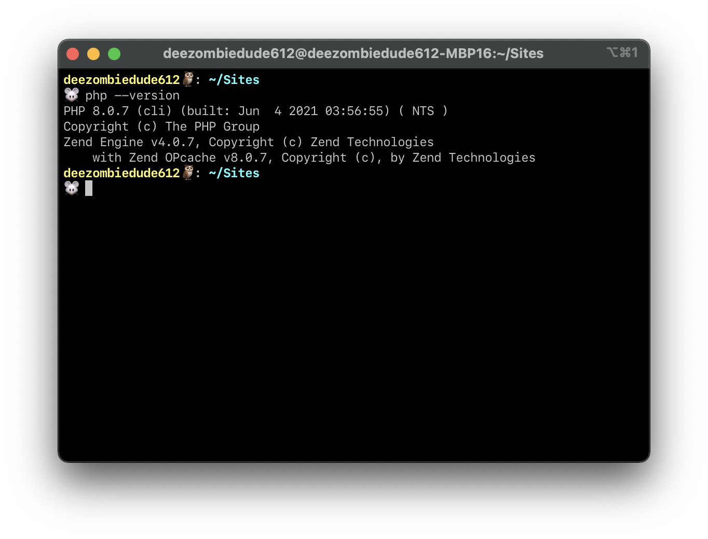
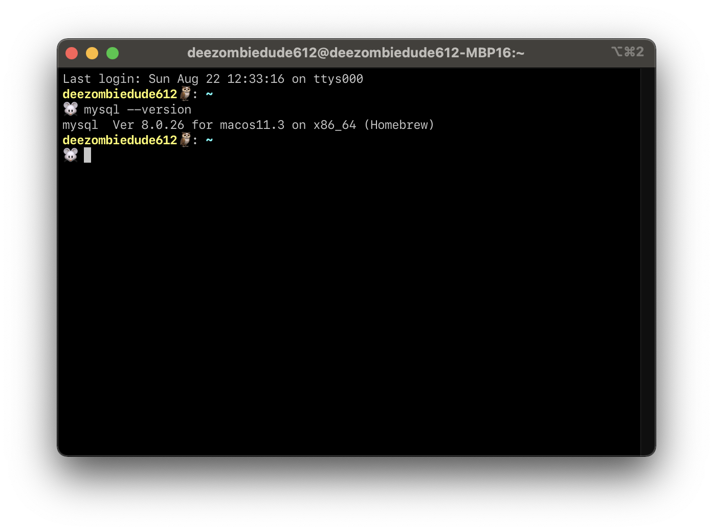
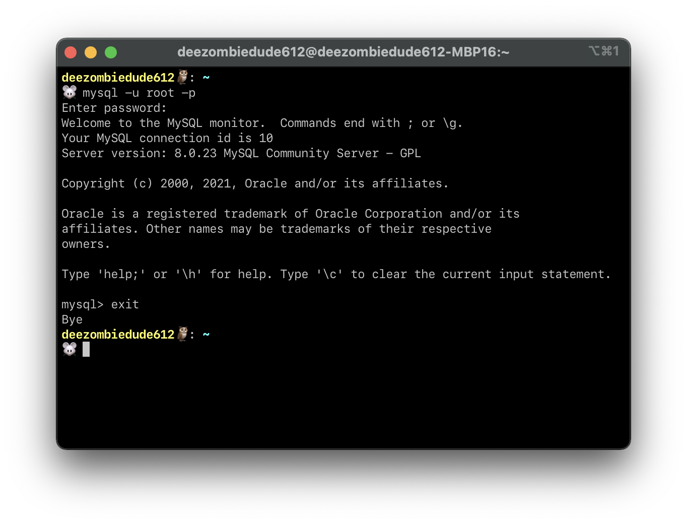

# Setting Up LAMP Stack in macOS (The Hard Way)

So, you're a macOS user who couldn't install or use XAMPP properly... or you decided to be nuts and try things the hard way.
Well, if you decided to open and follow this guide for whatever your reason may be, here's a rundown of what you'll need to do to set up the LAMP stack inside your macOS machine.
Let's get started!

!!! warning "Take Note"

    As of writing this guide, we are using macOS Big Sur (macOS 11.0+), PHP 8.0.9, MySQL Community Server 8.0.25, and phpMyAdmin 5.1.1.
    This guide may get outdated rather quickly, so if you're reading this after at least a year from the publication of this guide, do due diligence and find out if any of the steps no longer apply to you.

## Step 1: Start the Apache Server

macOS comes with the Apache Server by default.
To start the built-in Apache server, open the Terminal app from your Application folder or type **Terminal** in the Spotlight Search (shortcut: ++cmd+space++).

Type `sudo apachectl start` and press Enter.

Open your web browser and type `localhost` or `127.0.0.1` in the address bar.
If the Apache Server has successfully started, you should see this appear in your web browser:


## Step 2: Create Sites Directory

Fancy, yes?
The page you're looking at now is a result of a default web page file that is in the following location:

    /Library/WebServer/Documents

To be precise, this file you're looking at is named `index.html.en`.
However, that's quite a hard-to-remember location if you're not well-versed with the ins and outs of your system.
In addition, this folder's contents cannot be edited without changing a few permissions by default.

As a workaround, we will create a **Sites** directory under your home folder and use that folder to contain all our PHP web files.
At the end of this guide, typing in `localhost` or `127.0.0.1` in your web browser's address bar will source the web files from this folder for view.

1.  Heawd over to your account folder.
    This one should be the folder with your computer's name on it.

    The full location of this folder is:

        Macintosh HD/Users/<your_account_folder>

2.  Create a folder named Sites. Upon creating the folder, the folder icon should now have a compass image appear on top of it like as shown below:

    

For easier access, I have it as a shortcut in the Finder window's left-hand menu (just drag this `Sites` folder over to the left menu).
You can also drag it to the dock if you so desire.

## Step 3: Create username.conf File

To be able to recognize the files stashed inside the `Sites` directory, you will require setting up a configuration file called `<username>.conf`
(i.e., if the account username I'm using in my machine is `henryheng612`, my configuration file should be called `henryheng612.conf`).

1.  If you're not sure what your account username is, type `whoami` in the Terminal and hit Enter.
    This UNIX command will reveal it inside your Terminal window.
    **Remember to note that name down, we will be using it shortly.**

2.  Right now, the Terminal window is currently inside your account folder.
    We will need to create this configuration file in a different location.
    Type the following command line and press Enter.

        cd /etc/apache2/users

    Extra Note: `cd` is the command in UNIX to navigate out of your current directory to a new one.

3.  Type `ls` and press Enter again.
    This command displays all visible files in the current file directory (to include ones hidden by default, type `ls -a` instead).

4.  Check to see if there is an existing `<username>.conf` file (it will appear in the Terminal window if it exists).
    If so, make a backup copy by entering the following command:

        sudo cp <username>.conf <username>.conf.bak

    Remember to replace all instances of `<username>` with your own account username!

    Extra Note: `sudo` is used to request administrator access in a UNIX system.
    Often if you use `sudo`, you'll be prompted to enter your password.
    Don't worry, this is normal.

5.  We are now ready to create/edit our configuration file.
    Type `sudo nano <username>.conf` in the Terminal window and press Enter.
    If the file does not exist, you should see a blank window space.

    Extra Note: `nano` is a text editor used in UNIX command line interface (CLI) systems that functions like any regular text editor you've used before, just without mousr support and some nice-to-have features.
    Frequent UNIX users will find themselves using it often.
    Alternatives are `vi` and `vim`, and I think there's a debate among some nerds about which is best.
    Unless this piques your interest, you need not know the details behind it.

6.  Copy and paste the following configuration.

        <Directory "Users/<username>/Sites/">
        AllowOverride All
        Options Indexes MultiViews FollowSymLinks
        Require all granted
        </Directory>

    A gentle reminder: Remember to replace all instances of `<username>` with your account username!

7.  Press ++ctrl+o++ and press Enter to save the file.

8.  Press ++ctrl+x++ and press Enter to exit the nano editor.

## Step 4: Configure the httpd.conf File

Now there's also another configuration file we'll need to modify, namely the `httpd.conf` file.

1.  In your Terminal window, enter in

        cd /etc/apache2

2.  Type `ls` and press Enter again.
    You should see `httpd.conf` being listed as one of the files inside the current directory.

3.  Type `sudo cp httpd.conf httpd.conf.bak` and press Enter.
    This will create a backup of this configuration file in case something goes awry.

4.  Type `sudo nano httpd.conf` and press Enter.
    You should see something like this appear in the nano text editor in your Terminal window.

    

5.  Press ++ctrl+w++, type in `LoadModule authz_core_module` and press Enter.
    We are using a search feature in the nano text editor to look for specific lines inside this file.

    

6.  Uncomment the following modules.
    The `#` you see in front of each line means that line is commented out (i.e., that specific line or module will be ignored).
    What we want to do is to enable these modules in our Apache server.

        LoadModule authn_core_module libexec/apache2/mod_authn_core.so

        LoadModule authz_host_module libexec/apache2/mod_authz_host.so

        LoadModule userdir_module libexec/apache2/mod_userdir.so

        LoadModule include_module libexec/apache2/mod_include.so

        LoadModule rewrite_module libexec/apache2/mod_rewrite.so

7.  Uncomment the following line for the User home directories.

        Include /private/etc/apache2/extra/httpd-userdir.conf

8.  Press ++ctrl+w++, search up `DocumentRoot` and press Enter.
    We want to edit the following two lines – this shows `DocumentRoot` configuration in `httpd.conf` which dictates the folder where your machine will source its web files to be used inside localhost.

    ```
    ...
    DocumentRoot "/Library/WebServer/Documents"
    <Directory "/Library/WebServer/Documents">
    ...
    ```

    You may choose to replace them completely with these two lines or add them after commenting the latter.

    ```
    ...
    DocumentRoot "/Users/<username>/Sites/"
    <Directory "/Users/<username>/Sites/">
    ...
    ```

    A gentle reminder: Remember to replace all instances of `<username>` with your account username!

9.  Press ++ctrl+w++, search up `AllowOverride None` and press Enter.
    Here, replace this line with `AllowOVerride All`.

    Your DocumentRoot configuration in `httpd.conf` should look like as follows:

    

10. For extra measure, we can set the Apache Server to serve an index.php file instance first before an index.html.
    Press ++ctrl+w++, search up `DirectoryIndex` and press Enter.
    You should see the following:

    

    From the line where it says

        DirectoryIndex index.html

    Add index.php so it now says

        DirectoryIndex index.php index.html

11. Press ++ctrl+o++ and press Enter to save the file.

12. Press ++ctrl+x++ and press Enter to exit the nano editor.

## Step 5: Configure the httpd-userdir.conf File

1.  In yuor Terminal window, enter in `cd /etc/apache2/extra`.

2.  Type `ls` and press Enter again.
    You should see `httpd-userdir.conf` being listed as one of the files inside the current directory.

3.  Type `sudo cp httpd-userdir.conf httpd-userdir.conf.bak` and press Enter.
    This will create a backup of this configuration file in case something goes awry.

4.  Type `sudo nano httpd-userdir.conf` and press Enter.
    You should see something like this appear in the nano text editor in your Terminal window:

    

5.  Uncomment the following line.

        Include /private/etc/apache2/users/*.conf

6.  Press ++ctrl+o++ and press Enter to save the file.

7.  Press ++ctrl+x++ and press Enter to exit the nano editor.

After carrying out the previous 5 steps, type in `sudo apachectl restart` amd press Enter.
If you type in localhost or 127.0.0.1 in your web browser's address bar now, it should show a 403 Forbidden Access error akin to the following:


Not to worry!
It means everything's been set up properly so far.
This error is caused due to the Sites folder we created not having an `index.php` or `index.html` file to display.

## Step 6: Enable PHP 8.0

macOS has PHP built in (at least in macOS Big Sur and earlier).
The PHP shipped with Big Sur is PHP version 7.3.22, which Apple hints on removing in one of the upcoming future versions of macOS.
Regardless, we will be using a fresh install of PHP 8.0 using an installation package manager called Homebrew.

1.  Head over to [https://brew.sh](https://brew.sh).
    You will be greeted with Homebrew's home page as follows:

    

2.  The first section you should see is "Install Homebrew", where there's a Terminal command line following the title.
    Copy that command line and run it in a Terminal window.
    This will install Homebrew inside your Mac.
    Give it time, it will be ready for use shortly.

3.  After installing Homebrew, type in `brew install php`.
    This will install PHP as well as any other software dependencies required into your Mac (think of software dependencies as pre-requisites).

4.  Open a new tab in the Terminal (or reboot the Terminal application).
    If you enter in `php --version`, you should view the PHP version being used like as follows:

    

    ???+ info "NOTE ABOUT THIS TERMINAL WINDOW INTERFACE"

        I'm currently using Oh My Zsh in my terminal, this is not required for you to follow this whole guide.
        If you would like to try out my not-so-custom Oh My Zsh Terminal theme, look up how to install Oh My Zsh first, then head over to the following link to download my theme.
        Have fun either way!

        [My Custom Theme Here](https://github.com/deezombiedude612/macOS-Init/blob/master/dzd612.zsh-theme)

5.  Now that PHP's been installed in your Mac, we will need Apache to use this PHP by default.
    To do this, we will have to return to our `httpd.conf` file once more to make some further changes.

6.  In your Terminal window, enter in `sudo nano /etc/apache2/httpd.conf`.

7.  You may have noticed that after successfully installing PHP with Homebrew.
    If you've missed it, you can type in `brew info php` and the instructions will reappear again.

    

    Refer to the part under **Caveats**.
    This part details what is required to add into your `httpd.conf` file.

    Depending on your Mac (from what I've known from M1 Mac users, the file locations may vary), you may be asked to insert the following or a variant of it:

         LoadModule php_module /usr/local/opt/php/lib/httpd/modules/libphp.so

         <FilesMatch \.php$>
             SetHandler application/x-httpd-php
         </FilesMatch>

    That is all which will be needed

8.  Press ++ctrl+w++, search up `LoadModule php` and press Enter.
    After the last LoadModule line, paste the required lines as mentioned in Line 7.

    !!! danger CAUTION

        **Do not uncomment the following line!**

        ```
        #LoadModule php7_module libexec/apache2/libphp7.so
        ```

        Uncommenting this will get Apache to run the outdated PHP that came with your Mac, we don't want this.

9.  Press ++ctrl+o++ and press Enter to save the file.

10. Press ++ctrl+x++ and press Enter to exit the nano editor.

11. Type in `sudo apachectl restart` and press Enter.
    This should enable the changes we made to have Apache run PHP 8.0 in your Mac.

### Is PHP working properly now?

To check if PHP is working on your local Mac's web server, we will be creating a phpinfo() file to load into your browser.

1.  Go to your `Sites` folder and create a file called `phpinfo.php`.

2.  In `phpinfo.php`, put in the following code and save the file:

        <?php phpinfo(); ?>

3.  If you type in `localhost/phpinfo.php` or `127.0.0.1/phpinfo.php` in your web browser's address bar, you should see something like this:

    

    Congratulations, you're now running a current version of PHP on your local web server!

## Step 7: Install MySQL

You will also require a MySQL or mariaDB database server.
This step will involve installing MySQL's Community Server inside your Mac to use – if you plan on learning more on MySQL databases, consider this a way to kill two birds with one stone! 😁

Like with PHP, you can install MySQL or mariaDB with Homebrew.
However, the following instructions will focus more towards not interacting with the Terminal as much as possible.

1.  Head over to the following link and download the DMG Archive installer.

    [https://dev.mysql.com/downloads/mysql/](https://dev.mysql.com/downloads/mysql/)

2.  Proceed with the installation up until you reach **Configuration** stage (this should be the second last part of the installation process).

3.  At the **Configuration** stage, you will be required to select a Password Encryption type.
    We will be installing one more piece of software to access our MySQL database later, but it will not work well if we choose the Strong Password Encryption option.
    In this case, select Use Legacy Password Encryption.

    

4.  Enter in your MySQL database password.

    

!!! failure "OOPS!"

    If you proceeded with the Strong Password Encryption by mistake during installation, don't worry.
    Head over to System Preferences, and you should see MySQL as one of the last options in the window as follows:

    

    Select the MySQL option and you will be greeted with a dashboard like as follows:

    

    Select **Initialize Database** and you'll be greeted with this screen.

    

    Select **Use Legacy Password Encryption** and enter your password again. Crisis averted!! :relieved:

5.  Open up a **NEW** Terminal window and type in `ls -a`.
    Look and see if either a file called `.zshrc` or `.bashrc` exists inside your account folder.
    In this example, my machine has `.zshrc`.

    

6.  If you have `.zshrc` like in my case (this should be true for all those running macOS Cataline or later), type the following command:

        echo "export PATH=${PATH}:/usr/local/mysql/bin/" >> ~/.zshrc

    If you're using `.bashrc` instead, type the following command:

        echo "export PATH=${PATH}:/usr/local/mysql/bin/" >> ~/.bashrc

7.  Open a new Terminal window and enter in `mysql --version`.
    It should print out the version of MySQL installed in your machine.

    

8.  Type in `mysql -u root -p`.
    You should be prompted to enter the password you've set for MySQL.
    Once you've entered the correct password, you should see a CLI nterface to enter MySQL commands.
    We don't need to do anything here for now, so just type in `exit` and press Enter to exit this interface.

    

If you like, you can also proceed to install MySQL Workbench.
It is an IDE that is primarily used to create and test MySQL scripts.
However, we will be using something else instead for this module.. and that is phpMyAdmin.

## Step 8: Install phpMyAdmin

Alright, the last thing you'll need to install and/or configure.. I promise!
Also like PHP, you can install phpMyAdmin using Homebrew, but we will again avoid using the Terminal like for MySQL in the following instructions.

1. Head over to the following link to download phpMyAdmin (which is in a zip file): [https://phpmyadmin.net](https://phpmyadmin.net)

2. Unzip the zip file.
   Rename the folder to just "phpmyadmin" and move it to the `Sites` folder.

3. If you type in `localhost/phpinfo.php` or `127.0.0.1/phpinfo.php` in your browser's address bar, you should be greeted with a login page like this:
   

4. Type in **root** as your username and enter the password you set when installing MySQL earlier.
   You should now be greeted with a control panel like this:
   

And... you're done!
That is all you need to install and configure to prepare a LAMP stack from scratch.
I hope you've gained a sense of accomplishment from going through these steps, it's a fruitful one!

If you have any more questions, you know where to reach me. :wink:

## References

1. \[Tech CookBook\] Setting Up Your Local Web Server on macOS Big Sur 11.0.1 (2020) | MAMP | macOS, Apache, MySQL, PHP. Link:
   [https://tech-cookbook.com/2020/11/14/setting-up-your-local-web-server-on-macos-big-sur-11-0-1-2020-mamp-macos-apache-mysql-php/](https://tech-cookbook.com/2020/11/14/setting-up-your-local-web-server-on-macos-big-sur-11-0-1-2020-mamp-macos-apache-mysql-php/)

2. \[YouTube\] How To Set Up phpMyAdmin With MySQL 8.0+ on MacOS. Link:
   [https://youtu.be/SVNbRXUEDUg](https://youtu.be/SVNbRXUEDUg)
