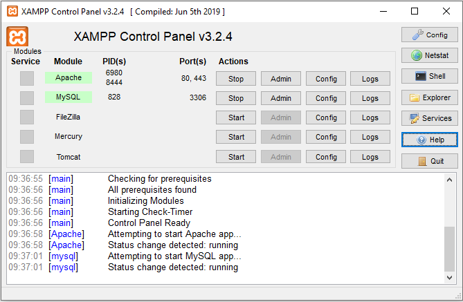
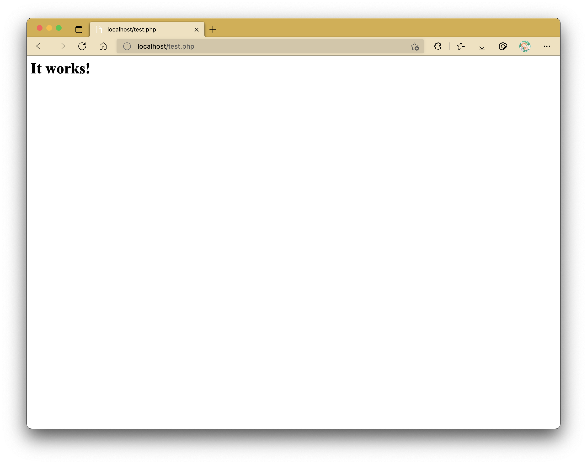

# Introduction to PHP and LAMP Web Server

Unlike JavaScript, PHP is a back-end scripting language that involves interacting with a server for information exchange.
One of the useful applications of using PHP in web development includes form data collection and processing.

## Getting Started

To carry on with programming in PHP, you will require an Apache server installed in your local machine.
Not only that, this server will also need to contain PHP and a few database software.
In short, you will need what is often referred as a LAMP stack.

Fortunately, one may find the LAMP stack already bundled in various packages like XAMPP.
XAMPP is available across multiple platforms, including Windows, macOS and Linux.

Head here to obtain the XAMPP installer: [XAMPP Installer](https://sourceforge.net/projects/xampp/files/)

Head here to obtain the MAMP installer: [MAMP Installer](https://www.mamp.info/en/downloads/)

!!! info "M1 Macs Incompatibility"

    As of now, I think that M1 Macs are incompatible with XAMPP.
    If you're part of the demographic that uses an M1 Mac, you may want to look for alternatives like MAMP.

    Still, I haven't tested this out (mostly because I don't own one just yet), but perhaps if you want to try brute force your way into getting XAMPP to work, this may help:
    [How to get Xampp working on your M1 chip Macbook pro](https://dev.to/deborahtrez/how-to-get-xampp-to-work-on-m1-macbook-pro-47gi)

### Installing LAMP Stack from Scratch (for macOS Users only)

If you're feeling adventurous or if all the LAMP stack packages are giving you problems during installation, head over to my guide on how to install each component separately on your machine here: [Setting Up LAMP Stack in macOS (The Hard Way)](/wp-labs/lamp_macos)

!!! warning

    Should you choose this route for installing your LAMP stack, don't follow the rest of this practical's guide.
    The separate guide will detail different steps to testing everything you install.

### XAMPP Control Panel

The XAMPP Control Panel should look something like this:

<figure markdown>
  
  <figcaption>XAMPP Control Panel</figcaption>
</figure>

The only two items that you need turned on is `Apache` and `MySQL`.
The rest are not necessary.

### IMPORTANT: Location of Project Files for PHP Development

Upon installation, the location of the XAMPP web server files in Windows is in `C:\xampp` by default.
On macOS, XAMPP acts like an external volume that has to be mounted each time you need to use it.

Pay close attention to where a folder called `htdocs` is.
Unlike previously when you can basically open your HTML files from just about anywhere in your local machine, PHP files will only work within the server file directory.
In particular, you will need to stash your project files inside a folder named `htdocs` from now on.

### First PHP Script

Ensure that both the Apache server and the MySQL are running as according to the contol panel.

Inside the `htdocs` folder, create a PHP file named `test.php`.
In this file, enter the following script:

```php linenums="1" title="test.php"
<?php
	echo "<h1>It works!</h1>";
```

If you type in `localhost/test.php` into the browser's address bar, you should see the following:



In order to access pages from the `htdocs` folder from your web browser, you will need to start with `localhost` before the filename.
The method of accessing files in subfolders still apply (to get into `index.php` in a subfolder called `test` in `htdocs`, type `localhost/test/index.php`).
